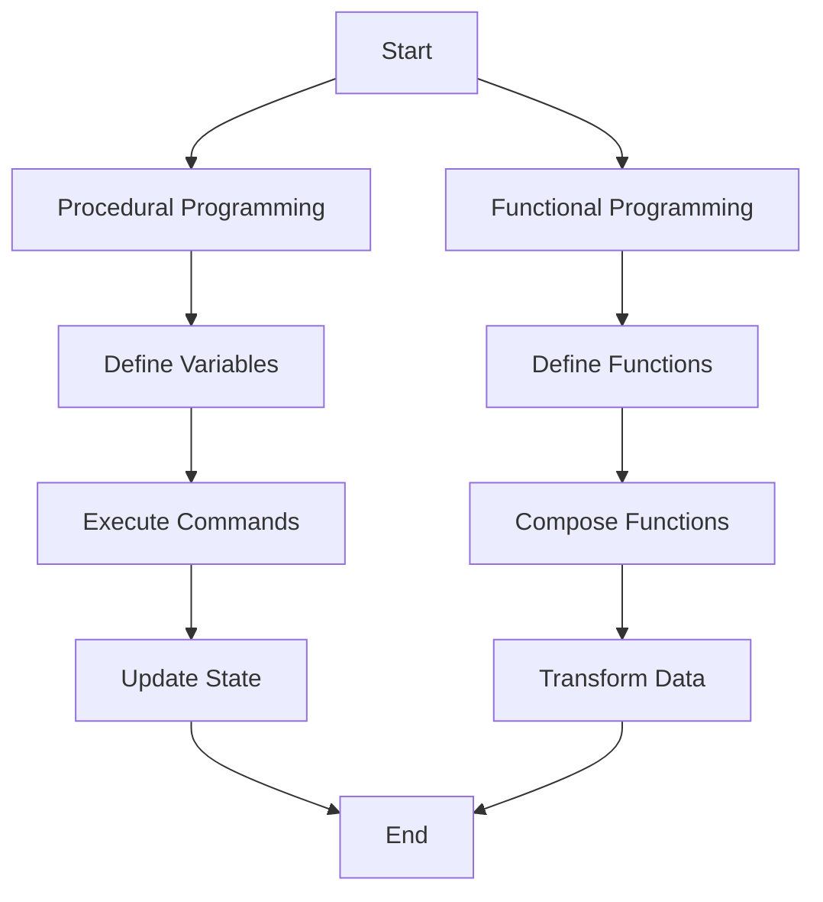

## 1.1. What is Functional Programming?

Functional Programming (FP) is a programming paradigm that treats computation as the evaluation of mathematical functions and avoids changing state or mutable data. It emphasizes the application of functions, in contrast to the procedural programming paradigm, which focuses on changes in state and the execution of sequences of commands.

### Definition and Core Principles

At its core, Functional Programming is built on several key principles that distinguish it from other paradigms:

- **Pure Functions:** Functions that have no side effects and return the same output given the same input. This property is known as referential transparency.
- **Immutability:** Data is immutable, meaning once it is created, it cannot be changed. This leads to more predictable and reliable code.
- **Function Composition:** The process of combining simple functions to build more complex ones. This encourages code reuse and modularity.
- **First-Class and Higher-Order Functions:** Functions are treated as first-class citizens, meaning they can be passed as arguments, returned from other functions, and assigned to variables. Higher-order functions are those that take other functions as arguments or return them as results.

These principles lead to a declarative style of programming, where the focus is on what to solve rather than how to solve it, contrasting with the imperative style of procedural programming.

### Functional vs. Procedural Programming

To better understand Functional Programming, it's helpful to compare it with Procedural Programming:

- **State Management:** In procedural programming, state is often managed through variables that can be updated. In contrast, FP avoids mutable state, using immutable data structures and pure functions to manage state transitions.
- **Code Organization:** Procedural programming organizes code into procedures or routines, while FP organizes code into functions that can be composed together.
- **Problem-Solving Approach:** Procedural programming focuses on the sequence of steps to achieve a task, whereas FP focuses on the transformation of data through functions.

Below is a visual representation of the workflows in Functional and Procedural Programming:



### Code Snippets

To illustrate the concept of pure functions, let's look at a simple example of an `add` function implemented in Haskell, JavaScript, and Scala:

- **Haskell:**

  ```haskell
  add :: Int -> Int -> Int
  add x y = x + y
  ```

  In Haskell, the `add` function takes two integers and returns their sum. It is a pure function because it does not modify any state or produce side effects.

- **JavaScript:**

  ```javascript
  const add = (x, y) => x + y;
  ```

  In JavaScript, the `add` function is defined using an arrow function, which is a concise way to write functions. It also adheres to the principles of purity.

- **Scala:**

  ```scala
  def add(x: Int, y: Int): Int = x + y
  ```

  In Scala, the `add` function is defined similarly, taking two integers and returning their sum. Scala's strong typing system ensures that the function's behavior is predictable.

### References

For further reading and a deeper understanding of Functional Programming, consider the following resources:

- "Introduction to Functional Programming" by Richard Bird.
- "Functional Programming in Scala" by Paul Chiusano and Rúnar Bjarnason.

These texts provide comprehensive insights into the principles and applications of Functional Programming, offering both theoretical and practical perspectives.

## Quiz Time!



### What is a pure function in Functional Programming?

- [x] A function that returns the same output given the same input and has no side effects.
- [ ] A function that can modify global variables.
- [ ] A function that relies on external state.
- [ ] A function that uses loops and conditionals.

> **Explanation:** Pure functions are deterministic and do not cause side effects, making them predictable and reliable.

### Which of the following is NOT a core principle of Functional Programming?

- [ ] Immutability
- [ ] Pure Functions
- [x] Global State Management
- [ ] Function Composition

> **Explanation:** Functional Programming avoids global state management, focusing instead on immutability and pure functions.

### How does Functional Programming handle state changes?

- [x] By using immutable data structures and pure functions.
- [ ] By updating variables directly.
- [ ] By using loops and conditionals.
- [ ] By relying on external state.

> **Explanation:** FP uses immutable data and pure functions to manage state transitions, avoiding direct updates to variables.

### What is function composition?

- [x] Combining simple functions to build more complex ones.
- [ ] Writing functions that modify global state.
- [ ] Using loops to iterate over data.
- [ ] Defining functions with side effects.

> **Explanation:** Function composition involves creating complex functions by combining simpler ones, promoting code reuse and modularity.

### In which programming paradigm is state often managed through variables that can be updated?

- [ ] Functional Programming
- [x] Procedural Programming
- [ ] Object-Oriented Programming
- [ ] Logic Programming

> **Explanation:** Procedural Programming often manages state through mutable variables, unlike Functional Programming, which uses immutable data.

### What is the focus of declarative programming, as seen in Functional Programming?

- [x] What to solve
- [ ] How to solve
- [ ] When to solve
- [ ] Where to solve

> **Explanation:** Declarative programming focuses on specifying what needs to be done, rather than detailing the steps to achieve it.

### Which of the following languages is known for its strong support of Functional Programming?

- [x] Haskell
- [ ] C++
- [ ] Java
- [ ] Python

> **Explanation:** Haskell is a language designed with strong support for Functional Programming principles.

### What does it mean for functions to be first-class citizens in Functional Programming?

- [x] Functions can be passed as arguments, returned from other functions, and assigned to variables.
- [ ] Functions can only be used within their own scope.
- [ ] Functions cannot be nested within other functions.
- [ ] Functions must always return void.

> **Explanation:** In FP, functions are first-class citizens, meaning they can be used like any other data type.

### Which of the following is a benefit of using pure functions?

- [x] Easier testing and debugging
- [ ] Increased complexity
- [ ] More side effects
- [ ] Less predictable code

> **Explanation:** Pure functions are easier to test and debug due to their predictable behavior and lack of side effects.

### True or False: Functional Programming encourages the use of mutable data structures.

- [ ] True
- [x] False

> **Explanation:** Functional Programming discourages mutable data structures, favoring immutability to ensure predictability and reliability.


