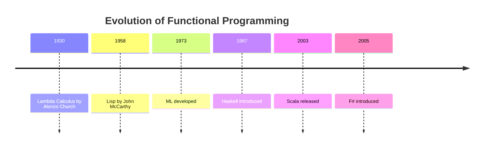

## 1.2. History and Evolution of Functional Programming

Functional programming (FP) has a rich and storied history that traces back to the very foundations of computer science. Understanding this history not only provides context for the principles of FP but also highlights its enduring influence on modern software development. In this section, we will explore the origins of functional programming, its development over the decades, and the impact of modern functional languages.

### Early Beginnings: Lisp and Lambda Calculus

The roots of functional programming can be traced back to the 1930s with the development of lambda calculus by Alonzo Church. Lambda calculus is a formal mathematical system that uses function abstraction and application to perform computation. It laid the groundwork for many of the concepts that underpin functional programming today, such as higher-order functions and recursion.

Lambda calculus is a simple yet powerful system that can express any computation. It uses function definitions and applications as its primary constructs, which directly influenced the design of functional programming languages.

#### Lisp: The First Functional Language

In the late 1950s, John McCarthy developed Lisp (short for "LISt Processing"), one of the first programming languages to incorporate functional programming concepts. Lisp was designed for symbolic computation and quickly became popular in artificial intelligence research due to its powerful abstraction capabilities.

Here's a simple example of a function in Lisp:

```lisp
(defun add (x y)
  (+ x y))
```

This Lisp function `add` takes two arguments, `x` and `y`, and returns their sum. The use of functions as first-class citizens and the emphasis on recursion are hallmarks of Lisp and functional programming.

### Development Through the Decades

As computing evolved, so did functional programming languages. The 1970s and 1980s saw the development of several influential languages that expanded on the ideas introduced by Lisp.

#### ML and Its Descendants

ML (short for "Meta Language") was developed in the 1970s as a tool for theorem proving. It introduced features such as type inference and pattern matching, which have become staples of modern functional languages. ML's influence is seen in languages like OCaml and Standard ML.

#### The Rise of Haskell

In the late 1980s, Haskell was created as a standardized, purely functional programming language. Haskell emphasized lazy evaluation, strong static typing, and purity, making it a powerful tool for both academic research and practical applications.

Here's a simple example of a function in Haskell:

```haskell
add :: Int -> Int -> Int
add x y = x + y
```

This Haskell function `add` is similar to the Lisp example but includes type annotations, showcasing Haskell's strong type system.

#### Incorporation into Mainstream Languages

As functional programming concepts proved their worth, they began to be incorporated into mainstream languages. Languages like JavaScript, Python, and even Java have adopted features such as first-class functions, closures, and higher-order functions, bringing functional programming to a wider audience.

### Modern Functional Languages and Their Impact

Today, functional programming is more relevant than ever, with languages like Haskell, Scala, and F# leading the charge. These languages have influenced software development practices by promoting immutability, concurrency, and modularity.

#### Haskell

Haskell remains a popular choice for those seeking a purely functional language. Its strong type system and lazy evaluation model make it ideal for complex data processing and concurrent applications.

#### Scala

Scala combines object-oriented and functional programming paradigms, making it a versatile language for building scalable applications. Its compatibility with Java and its powerful type system have made it a favorite in the enterprise world.

#### F#

F# is a functional-first language on the .NET platform. It offers seamless integration with existing .NET libraries and tools, making it an attractive option for developers in the Microsoft ecosystem.

### Visual Aids

To better understand the evolution of functional programming, let's look at a timeline chart showcasing key milestones:



### Conclusion

The history of functional programming is a testament to the power and versatility of its concepts. From its mathematical origins in lambda calculus to its modern implementations in languages like Haskell and Scala, functional programming continues to shape the way we think about and write software. As we move forward, the principles of FP will undoubtedly continue to influence the development of new languages and paradigms.

### References

- "Purely Functional Data Structures" by Chris Okasaki.
- "History of Programming Languages" by Bent Bruun Kristensen et al.

## Quiz Time!



### Which mathematical system laid the foundation for functional programming?

- [x] Lambda Calculus
- [ ] Boolean Algebra
- [ ] Set Theory
- [ ] Predicate Logic

> **Explanation:** Lambda calculus, developed by Alonzo Church, is the mathematical foundation of functional programming.

### What was the first programming language to incorporate functional programming concepts?

- [x] Lisp
- [ ] Fortran
- [ ] COBOL
- [ ] BASIC

> **Explanation:** Lisp, developed by John McCarthy, was one of the first languages to incorporate functional programming concepts.

### Which language introduced type inference and pattern matching?

- [x] ML
- [ ] Haskell
- [ ] Scala
- [ ] F#

> **Explanation:** ML introduced features like type inference and pattern matching, which are now common in many functional languages.

### What is a key feature of Haskell?

- [x] Lazy Evaluation
- [ ] Object Orientation
- [ ] Dynamic Typing
- [ ] Procedural Programming

> **Explanation:** Haskell is known for its lazy evaluation model, which delays computation until necessary.

### Which language combines object-oriented and functional programming paradigms?

- [x] Scala
- [ ] Haskell
- [ ] Lisp
- [ ] F#

> **Explanation:** Scala combines object-oriented and functional programming paradigms, making it versatile for various applications.

### What is a benefit of functional programming?

- [x] Immutability
- [ ] Global State
- [ ] Side Effects
- [ ] Mutable Variables

> **Explanation:** Functional programming emphasizes immutability, which helps in writing predictable and reliable code.

### Which language is a functional-first language on the .NET platform?

- [x] F#
- [ ] C#
- [ ] Java
- [ ] Python

> **Explanation:** F# is a functional-first language on the .NET platform, offering seamless integration with .NET libraries.

### What is a hallmark of Lisp?

- [x] First-Class Functions
- [ ] Object Orientation
- [ ] Dynamic Typing
- [ ] Procedural Programming

> **Explanation:** Lisp is known for its use of first-class functions and symbolic computation.

### Which language is known for its strong type system and lazy evaluation?

- [x] Haskell
- [ ] Scala
- [ ] F#
- [ ] JavaScript

> **Explanation:** Haskell is known for its strong type system and lazy evaluation, making it ideal for complex applications.

### True or False: Functional programming concepts are only applicable in purely functional languages.

- [ ] True
- [x] False

> **Explanation:** Functional programming concepts are applicable in many languages, including those that are not purely functional, such as JavaScript and Python.


