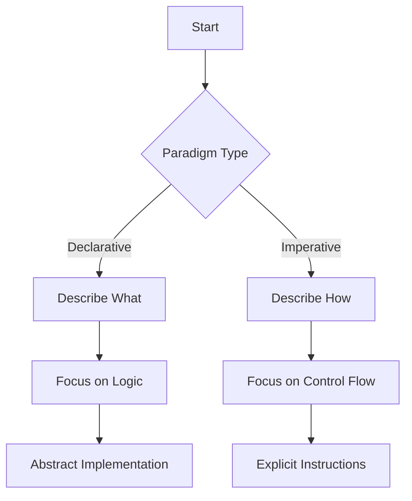

## 1.3. Functional Programming Paradigm

Functional programming (FP) is a paradigm that emphasizes the use of functions to build software. It is fundamentally different from the imperative programming paradigm, which focuses on explicit sequences of commands to change a program's state. Understanding the functional programming paradigm is crucial for leveraging its benefits, such as improved modularity, testability, and parallelism. This section will explore the declarative nature of FP, its advantages, and address common misconceptions.

### Declarative vs. Imperative Paradigms

In the world of programming, paradigms dictate how we think about and structure our code. The two primary paradigms are declarative and imperative programming.

#### Declarative Programming

Declarative programming, which includes functional programming, focuses on the "what" rather than the "how." It allows developers to express the logic of computation without describing its control flow. This approach leads to code that is often more readable and concise, as it abstracts the underlying implementation details.

**Example in Haskell (Declarative):**

```haskell
filterEven :: [Int] -> [Int]
filterEven = filter even
```

In this Haskell example, the `filterEven` function is defined to filter even numbers from a list. The `filter` function takes a predicate (`even`) and a list, returning a new list containing only the elements that satisfy the predicate. The code succinctly describes what needs to be done without detailing the steps involved.

#### Imperative Programming

Imperative programming, on the other hand, is about the "how." It involves writing sequences of instructions that change the program's state. This paradigm is more about giving explicit commands to the computer.

**Example in Python (Imperative):**

```python
def filter_even(numbers):
    evens = []
    for num in numbers:
        if num % 2 == 0:
            evens.append(num)
    return evens
```

In this Python example, the `filter_even` function explicitly iterates over the list, checks each number, and appends even numbers to a new list. It describes the step-by-step process to achieve the desired outcome.

#### Visual Aid: Declarative vs. Imperative

Below is a flowchart illustrating the differences between declarative and imperative paradigms:



### Benefits of Functional Programming

Functional programming offers several advantages that make it an attractive choice for modern software development:

1. **Easier Reasoning About Code:**
   - FP encourages writing pure functions, which are deterministic and have no side effects. This makes it easier to understand and predict the behavior of code.

2. **Better Modularity:**
   - Functions are first-class citizens in FP, allowing for greater modularity. Code can be organized into small, reusable functions that can be composed to build complex systems.

3. **Enhanced Testability:**
   - Pure functions are inherently easier to test because they depend only on their inputs and produce predictable outputs. This reduces the complexity of writing and maintaining tests.

4. **Superior Support for Parallelism:**
   - Immutability and the absence of side effects in FP make it easier to parallelize code. Since functions do not alter shared state, they can be executed concurrently without the risk of race conditions.

### Common Misconceptions

Despite its benefits, functional programming is often misunderstood. Here are some common misconceptions:

- **FP is Solely Theoretical:**
  - While FP has strong theoretical foundations, it is highly practical and used in many real-world applications, from web development to data analysis.

- **FP is Less Efficient:**
  - Although FP can introduce overhead due to immutability and function calls, modern compilers and runtime environments optimize functional code effectively, often resulting in competitive performance.

- **FP is Difficult to Learn:**
  - While FP requires a shift in thinking, many developers find it intuitive once they become familiar with its principles. The focus on pure functions and immutability can simplify complex problems.

### References

For those interested in delving deeper into functional programming, consider the following resources:

- "Functional Programming in Scala" by Paul Chiusano and Rúnar Bjarnason.
- "Structure and Interpretation of Computer Programs" by Harold Abelson and Gerald Jay Sussman.

These books provide comprehensive insights into functional programming concepts and their applications.

## Quiz Time!



### Which of the following best describes declarative programming?

- [x] Focuses on what needs to be achieved
- [ ] Focuses on how to achieve a task
- [ ] Involves step-by-step instructions
- [ ] Requires explicit state management

> **Explanation:** Declarative programming emphasizes what needs to be achieved, abstracting the implementation details.

### What is a key advantage of functional programming?

- [x] Easier reasoning about code
- [ ] Requires more lines of code
- [ ] Increases side effects
- [ ] Focuses on mutable state

> **Explanation:** Functional programming's use of pure functions makes it easier to reason about code.

### Which of the following is a common misconception about functional programming?

- [x] It is solely theoretical
- [ ] It is practical and widely used
- [ ] It supports parallelism
- [ ] It enhances testability

> **Explanation:** A common misconception is that functional programming is only theoretical, whereas it is practical and widely used.

### In the imperative paradigm, what is the primary focus?

- [ ] What needs to be achieved
- [x] How to achieve a task
- [ ] Abstracting implementation details
- [ ] Avoiding explicit instructions

> **Explanation:** The imperative paradigm focuses on how to achieve a task through explicit instructions.

### Which of the following is true about pure functions?

- [x] They have no side effects
- [ ] They depend on external state
- [x] They are deterministic
- [ ] They alter shared state

> **Explanation:** Pure functions are deterministic and have no side effects, making them predictable and reliable.

### What does immutability in functional programming help with?

- [x] Easier parallelism
- [ ] Increasing side effects
- [ ] Making code mutable
- [ ] Reducing testability

> **Explanation:** Immutability helps with easier parallelism as it avoids issues with shared mutable state.

### Which language is used in the example to demonstrate declarative programming?

- [x] Haskell
- [ ] Python
- [ ] Java
- [ ] C++

> **Explanation:** Haskell is used in the example to demonstrate declarative programming.

### What is a common benefit of using first-class functions?

- [x] Better modularity
- [ ] Increased complexity
- [ ] More side effects
- [ ] Less code reuse

> **Explanation:** First-class functions allow for better modularity and code reuse.

### Which of the following is NOT a benefit of functional programming?

- [ ] Easier reasoning about code
- [ ] Enhanced testability
- [ ] Superior support for parallelism
- [x] Increased reliance on mutable state

> **Explanation:** Functional programming reduces reliance on mutable state, which is not a benefit.

### True or False: Functional programming is inherently less efficient than imperative programming.

- [ ] True
- [x] False

> **Explanation:** Functional programming is not inherently less efficient; modern optimizations make it competitive with imperative programming.


