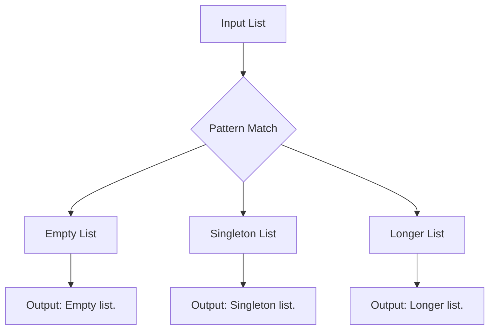

## 1.4. Pattern Matching

Pattern matching is a cornerstone feature in many functional programming languages, offering a powerful mechanism for deconstructing data structures and executing code based on their shape and content. This section delves into the intricacies of pattern matching, its practical applications, and how it is implemented across different functional programming languages.

### Overview of Pattern Matching

Pattern matching allows developers to concisely express complex conditional logic by matching values against patterns. It is akin to a more powerful and expressive switch-case statement found in imperative languages, but with the ability to deconstruct data structures directly.

#### Key Features of Pattern Matching:
- **Deconstruction:** Break down complex data structures into their constituent parts.
- **Conciseness:** Reduce boilerplate code by handling multiple conditions in a streamlined manner.
- **Readability:** Enhance code clarity by aligning the structure of the code with the structure of the data.

### Use Cases in Functional Programming

Pattern matching is widely used in functional programming for various purposes:

1. **Handling Different Data Variants:**
   - It simplifies the process of working with algebraic data types, such as sum types, by allowing direct access to the data contained within each variant.

2. **Simplifying Conditional Logic:**
   - By matching patterns, developers can replace nested if-else statements with more readable and maintainable code.

3. **Enhancing Code Readability:**
   - The declarative nature of pattern matching aligns closely with the data being processed, making the code easier to understand and reason about.

### Examples in Different Languages

Let's explore how pattern matching is implemented in Haskell, Scala, and JavaScript using the Ramda library.

#### Haskell Example

In Haskell, pattern matching is a fundamental feature, seamlessly integrated into the language's syntax:

```haskell
describeList :: [a] -> String
describeList xs = case xs of
    [] -> "Empty list."
    [x] -> "Singleton list."
    xs -> "Longer list."
```

- **Explanation:** This function, `describeList`, takes a list and returns a description based on its length. It uses pattern matching to differentiate between an empty list, a singleton list, and a longer list.

#### Scala Example

Scala, a hybrid functional programming language, also supports pattern matching with a syntax similar to Haskell:

```scala
def describeList[A](xs: List[A]): String = xs match {
  case Nil => "Empty list."
  case x :: Nil => "Singleton list."
  case _ => "Longer list."
}
```

- **Explanation:** The `describeList` function in Scala uses the `match` keyword to perform pattern matching on a list, identifying whether it is empty, contains a single element, or has multiple elements.

#### JavaScript Example (Using Ramda)

JavaScript, while not inherently a functional language, can leverage libraries like Ramda to achieve pattern matching-like behavior:

```javascript
const R = require('ramda');
const describeList = R.cond([
  [R.isEmpty, R.always("Empty list.")],
  [R.pipe(R.length, R.equals(1)), R.always("Singleton list.")],
  [R.T, R.always("Longer list.")]
]);
```

- **Explanation:** Using Ramda's `cond` function, this JavaScript example mimics pattern matching by evaluating conditions sequentially and returning corresponding results.

### Visual Aids

To better understand how pattern matching works with different data structures, consider the following diagram:



- **Diagram Explanation:** This flowchart illustrates the decision-making process in pattern matching, where an input list is evaluated against different patterns to produce specific outputs.

### Practical Exercises

To solidify your understanding of pattern matching, try the following exercises:

1. **Exercise 1:** Implement a function in Haskell that uses pattern matching to determine if a number is positive, negative, or zero.

2. **Exercise 2:** Write a Scala function that matches a tuple containing a person's name and age, returning a greeting message based on the age group.

3. **Exercise 3:** Use Ramda in JavaScript to create a function that classifies a string as short, medium, or long based on its length.

### Summary of Key Points

- Pattern matching is a powerful feature in functional programming that enhances code readability and reduces complexity.
- It is widely used for handling different data variants, simplifying conditional logic, and improving code maintainability.
- Haskell, Scala, and JavaScript (with libraries) offer robust support for pattern matching, each with its unique syntax and capabilities.

### References

- "Programming in Haskell" by Graham Hutton.
- "Functional Programming in Scala" by Paul Chiusano and Rúnar Bjarnason.

### Further Reading

- Explore the official documentation of Haskell, Scala, and Ramda for more in-depth examples and advanced pattern matching techniques.
- Consider reading "Learn You a Haskell for Great Good!" by Miran Lipovača for a beginner-friendly introduction to Haskell.

## Quiz Time!



### What is pattern matching primarily used for in functional programming?

- [x] Deconstructing data structures and executing code based on their shape and content
- [ ] Performing arithmetic operations
- [ ] Managing memory allocation
- [ ] Compiling code into machine language

> **Explanation:** Pattern matching is used to deconstruct data structures and execute code based on their shape and content, making it a powerful feature in functional programming.

### Which language does not natively support pattern matching but can achieve similar functionality using libraries?

- [ ] Haskell
- [ ] Scala
- [x] JavaScript
- [ ] Python

> **Explanation:** JavaScript does not natively support pattern matching but can achieve similar functionality using libraries like Ramda.

### In Haskell, what does the pattern `[x]` match?

- [ ] An empty list
- [x] A singleton list
- [ ] A list with two elements
- [ ] A list with more than one element

> **Explanation:** The pattern `[x]` in Haskell matches a singleton list, which contains exactly one element.

### What keyword does Scala use for pattern matching?

- [ ] case
- [x] match
- [ ] switch
- [ ] cond

> **Explanation:** Scala uses the `match` keyword for pattern matching, allowing developers to match values against patterns.

### Which Ramda function is used to mimic pattern matching in JavaScript?

- [ ] R.match
- [ ] R.case
- [x] R.cond
- [ ] R.switch

> **Explanation:** Ramda's `cond` function is used to mimic pattern matching in JavaScript by evaluating conditions sequentially.

### What is a common use case for pattern matching in functional programming?

- [x] Simplifying conditional logic
- [ ] Performing database queries
- [ ] Rendering graphics
- [ ] Managing network connections

> **Explanation:** Pattern matching is commonly used to simplify conditional logic, making code more readable and maintainable.

### In the provided Haskell example, what does the pattern `[]` match?

- [x] An empty list
- [ ] A singleton list
- [ ] A list with two elements
- [ ] A list with more than one element

> **Explanation:** The pattern `[]` in Haskell matches an empty list.

### What does the `R.always` function do in the Ramda example?

- [ ] Executes a function repeatedly
- [x] Returns a constant value
- [ ] Matches a pattern
- [ ] Filters a list

> **Explanation:** The `R.always` function in Ramda returns a constant value, which is used in conjunction with `cond` to provide specific outputs.

### Which of the following is a benefit of using pattern matching?

- [x] Enhances code readability
- [ ] Increases code complexity
- [ ] Requires more lines of code
- [ ] Decreases code performance

> **Explanation:** Pattern matching enhances code readability by aligning the structure of the code with the structure of the data.

### True or False: Pattern matching can only be used with lists.

- [ ] True
- [x] False

> **Explanation:** False. Pattern matching can be used with various data structures, not just lists, including tuples, records, and custom data types.


