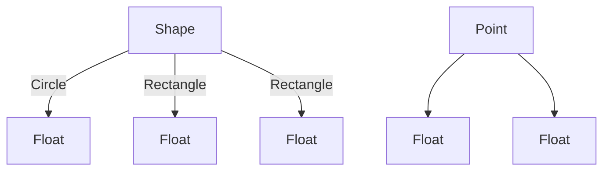

## 1.5. Algebraic Data Types

Algebraic Data Types (ADTs) are a cornerstone of functional programming, offering a powerful way to model complex data structures with precision and clarity. By understanding ADTs, you can write more expressive, type-safe, and maintainable code. In this section, we will delve into the concepts of sum types and product types, explore how they facilitate error handling through Option/Maybe and Either types, and provide examples in various functional programming languages.

### Sum Types and Product Types

Algebraic Data Types are composed of two fundamental constructs: sum types and product types. These constructs allow developers to define complex data structures in a way that is both expressive and type-safe.

#### Sum Types

Sum types, also known as variant types or tagged unions, represent a choice between different types. They are particularly useful for modeling data that can take on multiple forms. Each form is a distinct variant of the type.

**Example in Haskell:**

```haskell
data Shape = Circle Float
           | Rectangle Float Float
```

In this Haskell example, `Shape` is a sum type with two variants: `Circle` and `Rectangle`. A `Shape` can either be a `Circle` with a radius or a `Rectangle` with width and height.

**Example in Scala:**

```scala
sealed trait Shape
case class Circle(radius: Float) extends Shape
case class Rectangle(width: Float, height: Float) extends Shape
```

Scala uses a similar approach, where `Shape` is a sealed trait, and `Circle` and `Rectangle` are case classes extending this trait.

**Example in TypeScript:**

```typescript
type Shape = 
  | { kind: "circle"; radius: number }
  | { kind: "rectangle"; width: number; height: number };
```

In TypeScript, sum types are represented using union types, where each variant is distinguished by a `kind` field.

#### Product Types

Product types, on the other hand, are combinations of multiple types. They are used to group related data together, similar to tuples or records.

**Example in Haskell:**

```haskell
data Point = Point Float Float
```

Here, `Point` is a product type consisting of two `Float` values representing coordinates.

**Example in Scala:**

```scala
case class Point(x: Float, y: Float)
```

Scala's case class `Point` combines two `Float` values, similar to the Haskell example.

**Example in TypeScript:**

```typescript
type Point = { x: number; y: number };
```

In TypeScript, product types are represented using object types with multiple fields.

### Option/Maybe Types for Error Handling

Option/Maybe types are a special kind of sum type used to represent optional values. They encapsulate the presence or absence of a value, reducing the risk of null-related errors.

**Example in Haskell:**

```haskell
data Maybe a = Nothing | Just a
```

The `Maybe` type in Haskell can either be `Nothing` (indicating absence) or `Just a` (indicating presence of a value).

**Example in Scala:**

```scala
val maybeValue: Option[Int] = Some(42)
val noValue: Option[Int] = None
```

Scala's `Option` type works similarly, with `Some` representing a value and `None` representing absence.

**Example in TypeScript:**

```typescript
type Maybe<T> = T | null;
```

In TypeScript, optional values can be represented using union types with `null`.

### Either Types and Result Handling

Either types are another form of sum type used for computations that can result in either success or failure. They provide a structured approach to error handling.

**Example in Haskell:**

```haskell
data Either a b = Left a | Right b
```

The `Either` type in Haskell can be `Left a` (representing failure) or `Right b` (representing success).

**Example in Scala:**

```scala
val result: Either[String, Int] = Right(42)
val error: Either[String, Int] = Left("Error occurred")
```

Scala's `Either` type is used similarly, with `Right` for success and `Left` for failure.

**Example in TypeScript:**

```typescript
type Either<L, R> = { kind: "left"; value: L } | { kind: "right"; value: R };
```

In TypeScript, Either types can be represented using union types with a `kind` field to distinguish between success and failure.

### Benefits of Algebraic Data Types

Algebraic Data Types offer several benefits:

- **Type Safety:** By encoding possible states and transitions explicitly, ADTs help prevent invalid states and reduce runtime errors.
- **Expressive Power:** ADTs allow for clear and concise representation of complex data structures, making code easier to understand and maintain.
- **Maintainability:** With ADTs, changes to data structures are localized, reducing the risk of introducing bugs when modifying code.

### Implementation in Various Languages

Let's see how algebraic data types are implemented across different functional programming languages:

- **Haskell:** Uses `data` keyword to define ADTs, with pattern matching for deconstruction.
- **Scala:** Utilizes sealed traits and case classes to define ADTs, with powerful pattern matching capabilities.
- **TypeScript:** Employs union types and discriminated unions to achieve similar functionality.

### Visual Aids

Below is a Mermaid.js diagram illustrating sum and product types:



This diagram shows `Shape` as a sum type with `Circle` and `Rectangle` variants, and `Point` as a product type with two `Float` values.

### References

- "Type-Driven Development with Idris" by Edwin Brady.
- "Functional Programming in Scala" by Paul Chiusano and Rúnar Bjarnason.

## Quiz Time!



### What is a sum type?

- [x] A type that represents a choice between different types.
- [ ] A type that combines multiple types into one.
- [ ] A type that only represents numeric values.
- [ ] A type that is used exclusively for error handling.

> **Explanation:** Sum types, also known as variant types, represent a choice between different types, allowing for multiple forms of data.

### What is a product type?

- [ ] A type that represents a choice between different types.
- [x] A type that combines multiple types into one.
- [ ] A type that only represents numeric values.
- [ ] A type that is used exclusively for error handling.

> **Explanation:** Product types combine multiple types into one, grouping related data together.

### How do Option/Maybe types enhance safety?

- [x] By encapsulating the presence or absence of values.
- [ ] By allowing null values to be used safely.
- [ ] By providing a default value for all types.
- [ ] By eliminating the need for error handling.

> **Explanation:** Option/Maybe types encapsulate the presence or absence of values, reducing the risk of null-related errors.

### What does the Either type represent?

- [ ] A type that only represents successful computations.
- [ ] A type that only represents failed computations.
- [x] A type that can represent either success or failure.
- [ ] A type that is used for numeric calculations.

> **Explanation:** Either types represent computations that can result in either success (Right) or failure (Left).

### Which language uses the `data` keyword to define ADTs?

- [x] Haskell
- [ ] Scala
- [ ] TypeScript
- [ ] JavaScript

> **Explanation:** Haskell uses the `data` keyword to define algebraic data types.

### In Scala, what is used to define ADTs?

- [ ] Interfaces and classes
- [x] Sealed traits and case classes
- [ ] Abstract classes and methods
- [ ] Modules and functions

> **Explanation:** Scala uses sealed traits and case classes to define algebraic data types.

### How are Either types represented in TypeScript?

- [ ] Using classes and interfaces
- [x] Using union types with a `kind` field
- [ ] Using arrays and objects
- [ ] Using functions and closures

> **Explanation:** In TypeScript, Either types are represented using union types with a `kind` field to distinguish between success and failure.

### What is a key benefit of using ADTs?

- [x] They provide type safety and reduce runtime errors.
- [ ] They eliminate the need for any type checking.
- [ ] They allow for dynamic typing in functional languages.
- [ ] They simplify syntax for complex operations.

> **Explanation:** ADTs provide type safety by encoding possible states explicitly, reducing runtime errors.

### Which of the following is a product type in Haskell?

- [ ] `data Shape = Circle Float | Rectangle Float Float`
- [x] `data Point = Point Float Float`
- [ ] `data Maybe a = Nothing | Just a`
- [ ] `data Either a b = Left a | Right b`

> **Explanation:** `data Point = Point Float Float` is a product type, combining two `Float` values.

### True or False: ADTs are only useful in functional programming languages.

- [ ] True
- [x] False

> **Explanation:** While ADTs are a fundamental concept in functional programming, they can be useful in any language that supports them, enhancing type safety and expressiveness.


