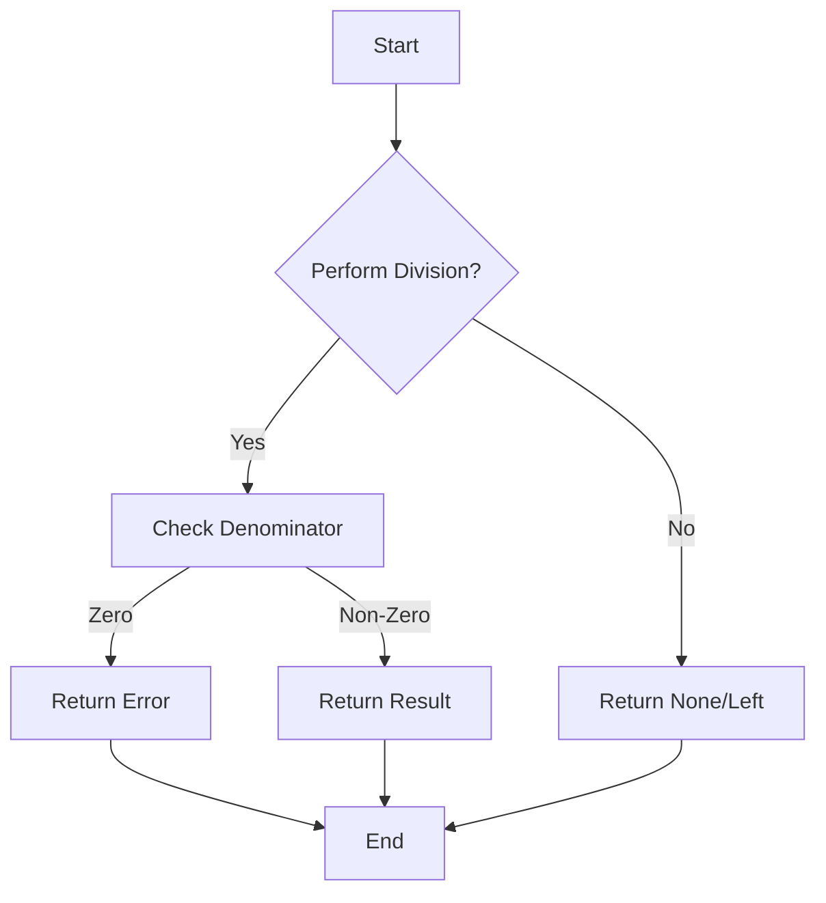

## 10.1. Principles of Functional Error Handling

In the realm of functional programming, error handling is approached with a distinct philosophy that emphasizes predictability, safety, and clarity. Unlike traditional imperative programming, where exceptions are often used to manage errors, functional programming leverages the power of type systems to represent errors explicitly. This approach not only minimizes the use of exceptions but also enhances the robustness and maintainability of code. In this section, we will delve into the principles of functional error handling, focusing on avoiding exceptions and using types to represent success and failure.

### Avoiding Exceptions

Functional programming aims to minimize or eliminate the use of exceptions, which are often seen as a form of hidden control flow that can lead to unpredictable behavior. Instead, functional languages encourage the use of explicit error handling mechanisms that make potential failure states part of the function's type signature. This approach provides several benefits:

- **Predictability:** By avoiding exceptions, functions become more predictable, as all possible outcomes are explicitly defined in their types.
- **Composability:** Functions that handle errors explicitly can be more easily composed, as their behavior is clear and consistent.
- **Safety:** Explicit error handling reduces the risk of unhandled exceptions, leading to safer and more reliable code.

### Using Types to Represent Success and Failure

Functional programming languages often use algebraic data types to encapsulate success and failure states within the type system. Two common types used for this purpose are `Option`/`Maybe` and `Either`.

#### Option/Maybe Types

The `Option` (or `Maybe` in some languages) type is used to represent a value that may or may not be present. It is a safer alternative to using `null` or throwing exceptions for missing values. An `Option` type can either be `Some(value)` (indicating the presence of a value) or `None` (indicating the absence of a value).

**Haskell Example:**

```haskell
safeDivide :: Int -> Int -> Maybe Int
safeDivide _ 0 = Nothing
safeDivide x y = Just (x `div` y)

-- Usage
result = safeDivide 10 2 -- Just 5
resultError = safeDivide 10 0 -- Nothing
```

In this Haskell example, `safeDivide` returns a `Maybe Int`, which can be `Just` a result or `Nothing` if division by zero occurs.

#### Either Types

The `Either` type is used to represent a computation that can result in either a success or a failure. It is a more expressive alternative to `Option`, as it can carry information about the failure. An `Either` type can be `Left(error)` (indicating failure) or `Right(value)` (indicating success).

**Scala Example:**

```scala
def safeDivide(x: Int, y: Int): Either[String, Int] = {
  if (y == 0) Left("Division by zero error")
  else Right(x / y)
}

// Usage
val result = safeDivide(10, 2) // Right(5)
val resultError = safeDivide(10, 0) // Left("Division by zero error")
```

In this Scala example, `safeDivide` returns an `Either[String, Int]`, where `Left` contains an error message and `Right` contains the result.

**JavaScript Example (Using Folktale library):**

```javascript
const { Either } = require('folktale/data/either');

const safeDivide = (x, y) => {
  if (y === 0) return Either.Left('Division by zero error');
  return Either.Right(x / y);
};

// Usage
const result = safeDivide(10, 2); // Right(5)
const resultError = safeDivide(10, 0); // Left("Division by zero error")
```

In JavaScript, using the Folktale library, `safeDivide` returns an `Either` type, providing a functional way to handle errors.

### Visualizing Error Handling with Types

To better understand how `Option`/`Maybe` and `Either` types work in functional error handling, let's visualize the flow using a Mermaid.js diagram.



This diagram illustrates the decision-making process in a function that uses `Option`/`Maybe` or `Either` types to handle division operations safely.

### Conclusion

Functional error handling offers a robust alternative to traditional exception-based error handling by leveraging type systems to represent errors explicitly. By using types like `Option`/`Maybe` and `Either`, functional programming ensures that all potential outcomes of a function are accounted for, leading to more predictable, composable, and safe code. As you continue to explore functional programming, consider how these principles can be applied to enhance the reliability and maintainability of your code.

### Further Reading

For those interested in exploring functional error handling further, consider the following resources:

- "Functional Programming in Scala" by Paul Chiusano and Rúnar Bjarnason.
- "Purely Functional Data Structures" by Chris Okasaki.

## Quiz Time!



### What is a key advantage of avoiding exceptions in functional programming?

- [x] Predictability
- [ ] Increased complexity
- [ ] More runtime errors
- [ ] Less readable code

> **Explanation:** Avoiding exceptions leads to more predictable code, as all possible outcomes are explicitly defined.

### Which type is commonly used to represent a value that may or may not be present?

- [x] Option/Maybe
- [ ] Either
- [ ] List
- [ ] Tuple

> **Explanation:** The Option/Maybe type is used to represent a value that may or may not be present.

### What does the `Left` constructor in an `Either` type represent?

- [x] Failure
- [ ] Success
- [ ] Absence of value
- [ ] Presence of value

> **Explanation:** The `Left` constructor in an `Either` type represents a failure case.

### In Haskell, what does the `safeDivide` function return when dividing by zero?

- [x] Nothing
- [ ] Just 0
- [ ] Left("Division by zero error")
- [ ] Right(0)

> **Explanation:** The `safeDivide` function returns `Nothing` when dividing by zero.

### What is the purpose of using types like `Option` and `Either` in functional programming?

- [x] To represent success and failure explicitly
- [ ] To increase code complexity
- [ ] To handle exceptions
- [ ] To reduce type safety

> **Explanation:** Types like `Option` and `Either` are used to represent success and failure explicitly, enhancing type safety.

### Which library in JavaScript provides functional types like `Either`?

- [x] Folktale
- [ ] Lodash
- [ ] Ramda
- [ ] jQuery

> **Explanation:** The Folktale library provides functional types like `Either` in JavaScript.

### What is the result of `safeDivide(10, 2)` in Scala using `Either`?

- [x] Right(5)
- [ ] Left("Division by zero error")
- [ ] Nothing
- [ ] Just 5

> **Explanation:** The result of `safeDivide(10, 2)` is `Right(5)` in Scala using `Either`.

### What does the `Right` constructor in an `Either` type represent?

- [x] Success
- [ ] Failure
- [ ] Absence of value
- [ ] Error message

> **Explanation:** The `Right` constructor in an `Either` type represents a success case.

### In functional programming, what is a common alternative to using `null`?

- [x] Option/Maybe
- [ ] Either
- [ ] List
- [ ] Tuple

> **Explanation:** The Option/Maybe type is a common alternative to using `null`.

### True or False: Functional programming encourages the use of exceptions for error handling.

- [ ] True
- [x] False

> **Explanation:** Functional programming discourages the use of exceptions, favoring explicit error handling through types.


