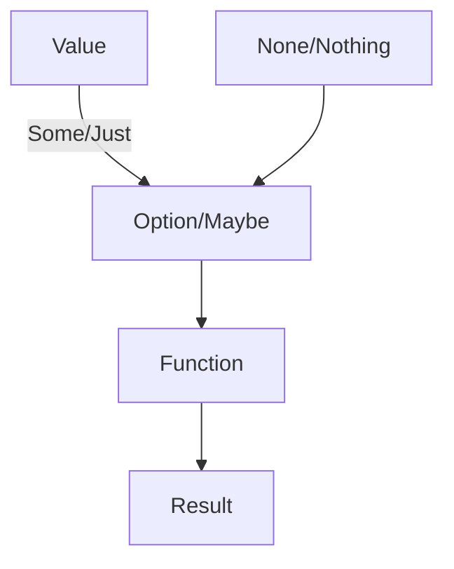

## 10.2. Option/Maybe Types

In the realm of functional programming, handling nullability and missing values is a crucial aspect of writing robust and error-free code. The Option/Maybe type is a powerful tool that allows developers to manage optional values gracefully, reducing the risk of null reference errors that can lead to runtime crashes. This section delves into the concept of Option/Maybe types, providing practical examples and usage patterns across different functional programming languages.

### Handling Nullability and Missing Values

Null reference errors are a common source of bugs in software development. They occur when a program attempts to access or modify an object that is null, leading to unexpected behavior or crashes. Functional programming addresses this issue by using Option/Maybe types, which encapsulate the presence or absence of a value in a type-safe manner.

#### What are Option/Maybe Types?

Option/Maybe types are algebraic data types used to represent optional values. They can either contain a value (Some/Just) or no value (None/Nothing). This explicit representation of optionality forces developers to handle both cases, thereby reducing the likelihood of null reference errors.

**Key Benefits:**
- **Type Safety:** By using Option/Maybe types, you ensure that the presence or absence of a value is explicitly handled, reducing runtime errors.
- **Improved Code Clarity:** Code that uses Option/Maybe types is often more readable and easier to maintain, as it clearly indicates where values may be optional.
- **Functional Composition:** Option/Maybe types integrate seamlessly with other functional constructs, enabling elegant and concise code.

### Practical Examples and Usage Patterns

Let's explore how Option/Maybe types are used in real-world applications to handle optional values gracefully.

#### Haskell Example

In Haskell, the `Maybe` type is used to represent optional values. It can be either `Just a` (indicating the presence of a value) or `Nothing` (indicating the absence of a value).

```haskell
findElement :: Int -> [Int] -> Maybe Int
findElement _ [] = Nothing
findElement x (y:ys)
  | x == y    = Just y
  | otherwise = findElement x ys

-- Usage
result = findElement 3 [1, 2, 3, 4] -- Just 3
resultNone = findElement 5 [1, 2, 3, 4] -- Nothing
```

In this example, `findElement` searches for an integer in a list and returns `Just` the element if found, or `Nothing` if not.

#### Scala Example

Scala provides the `Option` type, which can be `Some(value)` or `None`.

```scala
def findElement(x: Int, list: List[Int]): Option[Int] = list match {
  case Nil => None
  case head :: tail => if (head == x) Some(head) else findElement(x, tail)
}

// Usage
val result = findElement(3, List(1, 2, 3, 4)) // Some(3)
val resultNone = findElement(5, List(1, 2, 3, 4)) // None
```

Here, `findElement` returns an `Option[Int]`, encapsulating the presence or absence of the searched element.

#### JavaScript Example with Ramda

In JavaScript, libraries like Ramda can be used to mimic functional patterns. While JavaScript doesn't have a built-in Option type, we can simulate it using constructs like `Either`.

```javascript
const R = require('ramda');

const findElement = (x, list) => {
  const result = R.find(R.equals(x))(list);
  return result !== undefined ? Either.Right(result) : Either.Left('Element not found');
};

// Usage
console.log(findElement(3, [1, 2, 3, 4])); // Right(3)
console.log(findElement(5, [1, 2, 3, 4])); // Left("Element not found")
```

In this example, `findElement` uses Ramda's `find` function to search for an element, returning an `Either` type to indicate success or failure.

### Visual Aids

To better understand how Option/Maybe types encapsulate values, consider the following diagram:



This diagram illustrates how a value or the absence of a value is encapsulated by an Option/Maybe type, which is then processed by a function to produce a result.

### References

- "Functional Programming in Scala" by Paul Chiusano and Rúnar Bjarnason.
- "Scala for the Impatient" by Cay S. Horstmann.

These resources provide further insights into the use of Option/Maybe types in functional programming.

## Quiz Time!



### What is the primary purpose of Option/Maybe types in functional programming?

- [x] To handle nullability and missing values safely
- [ ] To improve performance of the code
- [ ] To replace all data types in a program
- [ ] To enforce strict typing in all scenarios

> **Explanation:** Option/Maybe types are used to safely handle scenarios where data may or may not be present, reducing the risk of null reference errors.

### In Haskell, what does the `Maybe` type represent?

- [x] An optional value that can be `Just a` or `Nothing`
- [ ] A mandatory value that must always be present
- [ ] A type that only holds integers
- [ ] A type that automatically converts to a string

> **Explanation:** The `Maybe` type in Haskell represents an optional value that can either be `Just a` (a value is present) or `Nothing` (no value is present).

### How does Scala's `Option` type differ from Haskell's `Maybe` type?

- [ ] It does not handle optional values
- [ ] It only works with strings
- [x] It is similar, using `Some` and `None` to represent presence or absence of a value
- [ ] It requires explicit null checks

> **Explanation:** Scala's `Option` type is similar to Haskell's `Maybe` type, using `Some` to represent a value and `None` to represent the absence of a value.

### In the provided JavaScript example, what library is used to mimic functional patterns?

- [ ] Lodash
- [x] Ramda
- [ ] Underscore
- [ ] jQuery

> **Explanation:** The JavaScript example uses the Ramda library to mimic functional patterns.

### What does the `findElement` function return in the Scala example when the element is not found?

- [ ] Some(0)
- [ ] Just 0
- [x] None
- [ ] Nothing

> **Explanation:** In the Scala example, when the element is not found, the `findElement` function returns `None`.

### Which of the following is a benefit of using Option/Maybe types?

- [x] They improve code clarity by explicitly handling optional values
- [ ] They automatically optimize code performance
- [ ] They eliminate the need for any error handling
- [ ] They are only useful in object-oriented programming

> **Explanation:** Option/Maybe types improve code clarity by explicitly handling optional values, making the code more readable and maintainable.

### What is the result of `findElement(3, [1, 2, 3, 4])` in the Haskell example?

- [x] Just 3
- [ ] Nothing
- [ ] Some 3
- [ ] None

> **Explanation:** The result of `findElement(3, [1, 2, 3, 4])` in the Haskell example is `Just 3`, indicating that the element was found.

### In the JavaScript example, what does the function return if the element is not found?

- [ ] Just("Element not found")
- [ ] Some("Element not found")
- [x] Left("Element not found")
- [ ] None

> **Explanation:** In the JavaScript example, if the element is not found, the function returns `Left("Element not found")`.

### What does the `Option` type in Scala use to represent the presence of a value?

- [ ] Just
- [ ] Nothing
- [x] Some
- [ ] Left

> **Explanation:** The `Option` type in Scala uses `Some` to represent the presence of a value.

### True or False: Option/Maybe types eliminate the need for null checks in functional programming.

- [x] True
- [ ] False

> **Explanation:** True. Option/Maybe types eliminate the need for null checks by explicitly representing the presence or absence of a value.


