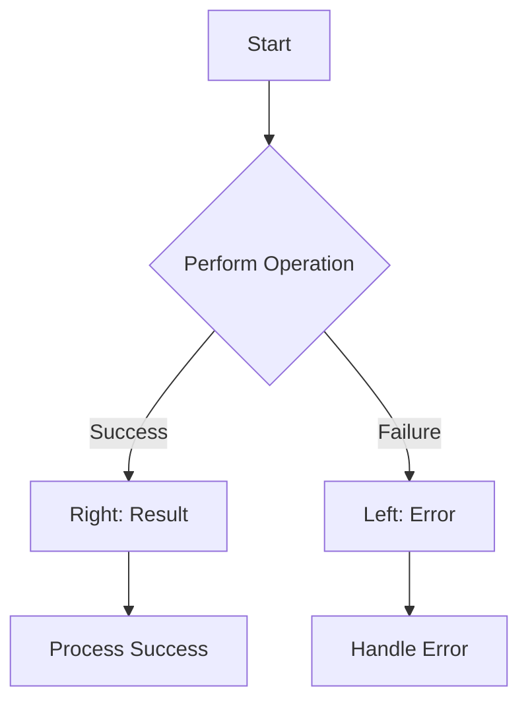

## 10.3. Either Types and Result Handling

In the realm of functional programming, handling errors gracefully and predictably is a crucial aspect of writing robust and maintainable code. Traditional error handling mechanisms, such as exceptions, can often lead to unpredictable control flow and make reasoning about code more difficult. Enter the `Either` type—a powerful construct that allows developers to represent computations that may fail, providing a structured way to handle errors without resorting to exceptions.

### Representing Success and Failure Cases

The `Either` type is a fundamental tool in functional programming for representing a value that can be one of two possible types. Typically, `Either` is used to encapsulate a computation that can result in either a success or a failure. The `Either` type is parameterized with two types: `Left` and `Right`. By convention, `Left` is used to represent failure, while `Right` represents success.

This duality allows functions to return more informative error messages compared to `Option` or `Maybe` types, which only indicate the presence or absence of a value. With `Either`, you can provide detailed error information, making it easier to diagnose and handle failures.

### Error Handling Without Exceptions

Using `Either` types, you can handle errors in a functional way, avoiding the pitfalls of using exceptions for control flow. This approach encourages explicit handling of both success and failure cases, leading to more predictable and reliable code.

Let's explore how `Either` types can be implemented in different functional programming languages through practical examples.

### Visual Aids

To better understand the flow of data through `Either` types, consider the following diagram:



This diagram illustrates how a computation can branch into a `Right` (success) or `Left` (failure) path, each handled appropriately.

### Code Snippets

#### Haskell Either Type Example

In Haskell, the `Either` type is a standard way to handle computations that may fail. Here's an example of a safe division function:

```haskell
safeDivide :: Int -> Int -> Either String Int
safeDivide _ 0 = Left "Division by zero error"
safeDivide x y = Right (x `div` y)

-- Usage
result = safeDivide 10 2 -- Right 5
resultError = safeDivide 10 0 -- Left "Division by zero error"
```

In this example, `safeDivide` returns an `Either` type, with `Left` indicating a division by zero error and `Right` providing the result of the division.

#### Scala Either Type Example

Scala also provides a robust implementation of the `Either` type. Here's how you can implement a similar safe division function:

```scala
def safeDivide(x: Int, y: Int): Either[String, Int] = {
  if (y == 0) Left("Division by zero error")
  else Right(x / y)
}

// Usage
val result = safeDivide(10, 2) // Right(5)
val resultError = safeDivide(10, 0) // Left("Division by zero error")
```

Scala's `Either` type allows you to handle errors without exceptions, making your code more predictable and easier to maintain.

#### JavaScript Example (Using Folktale library)

In JavaScript, libraries like Folktale provide functional constructs such as `Either`. Here's how you can use it:

```javascript
const { Either } = require('folktale/data/either');

const safeDivide = (x, y) => {
  if (y === 0) return Either.Left('Division by zero error');
  return Either.Right(x / y);
};

// Usage
console.log(safeDivide(10, 2)); // Right(5)
console.log(safeDivide(10, 0)); // Left("Division by zero error")
```

Using `Either` in JavaScript with Folktale allows you to handle errors functionally, avoiding the use of exceptions for control flow.

### Practical Exercises

To reinforce your understanding of `Either` types, try the following exercises:

1. **Implement a Safe Square Root Function:**
   - Write a function that calculates the square root of a number, returning an `Either` type to handle negative inputs.

2. **Chain Multiple Either Operations:**
   - Create a series of computations that use `Either` types, chaining them together to handle errors at each step.

3. **Refactor Existing Code:**
   - Take a piece of code that uses exceptions for error handling and refactor it to use `Either` types instead.

### Summary of Key Points

- The `Either` type is a powerful tool for representing computations that may fail, providing a structured way to handle errors without exceptions.
- By using `Either`, you can provide more detailed error information compared to `Option` or `Maybe` types.
- Implementing `Either` types in various languages, such as Haskell, Scala, and JavaScript, allows for functional error handling across different programming environments.

### References

- "Scala for the Impatient" by Cay S. Horstmann.
- "Functional Programming in Scala" by Paul Chiusano and Rúnar Bjarnason.

## Quiz Time!



### What is the primary purpose of the Either type in functional programming?

- [x] To represent computations that may result in either success or failure
- [ ] To handle asynchronous operations
- [ ] To replace all conditional logic
- [ ] To manage stateful computations

> **Explanation:** The Either type is used to represent computations that can result in either a success (Right) or a failure (Left), providing a structured way to handle errors.

### In the Either type, what does the Left value typically represent?

- [x] Failure or error
- [ ] Success
- [ ] A default value
- [ ] A placeholder for future computation

> **Explanation:** By convention, the Left value in an Either type represents a failure or error case.

### How does the Either type improve error handling compared to exceptions?

- [x] It makes error handling explicit and predictable
- [ ] It automatically retries failed operations
- [ ] It logs errors to a file
- [ ] It prevents all runtime errors

> **Explanation:** The Either type makes error handling explicit and predictable by requiring the programmer to handle both success and failure cases.

### Which of the following languages does not natively support the Either type?

- [ ] Haskell
- [ ] Scala
- [x] JavaScript
- [ ] F#

> **Explanation:** JavaScript does not natively support the Either type, but it can be implemented using libraries like Folktale.

### What is the result of `safeDivide(10, 0)` in the provided Haskell example?

- [ ] Right 0
- [x] Left "Division by zero error"
- [ ] Right 10
- [ ] Left "Invalid operation"

> **Explanation:** The function returns Left "Division by zero error" because dividing by zero is an error case.

### In Scala, how do you represent a successful computation using Either?

- [ ] Left(value)
- [x] Right(value)
- [ ] Success(value)
- [ ] Ok(value)

> **Explanation:** In Scala, a successful computation is represented by Right(value) in the Either type.

### What library is used in the JavaScript example to implement Either types?

- [ ] Lodash
- [ ] Ramda
- [x] Folktale
- [ ] Immutable.js

> **Explanation:** The Folktale library is used in the JavaScript example to implement Either types.

### Which of the following is a benefit of using Either types over exceptions?

- [x] They provide more detailed error information
- [ ] They automatically fix errors
- [ ] They eliminate all runtime errors
- [ ] They make code execution faster

> **Explanation:** Either types provide more detailed error information and make error handling explicit, unlike exceptions which can be less predictable.

### What does the Right value in an Either type signify?

- [x] Success
- [ ] Failure
- [ ] A default value
- [ ] An unknown state

> **Explanation:** The Right value in an Either type signifies a successful computation.

### True or False: Either types can only be used in purely functional languages.

- [ ] True
- [x] False

> **Explanation:** Either types can be used in both purely functional and multi-paradigm languages, as demonstrated by their implementation in JavaScript using libraries.


