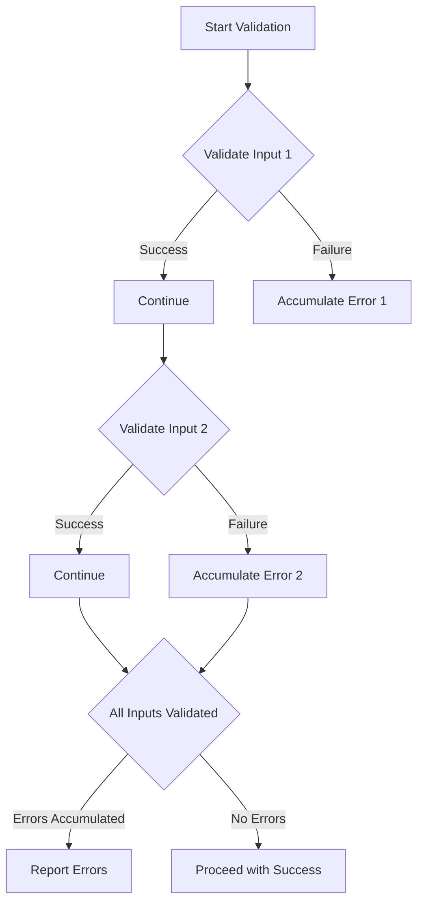

## 10.4. Validation and Error Accumulation

In functional programming, handling errors effectively is crucial for building robust applications. Unlike traditional approaches that rely heavily on exceptions, functional programming emphasizes using types to represent errors, enabling more predictable and manageable error handling. This section delves into techniques for combining multiple error-prone computations and accumulating errors in a functional manner, ensuring that all potential issues are captured and reported comprehensively.

### Combining Multiple Error-Prone Computations

When dealing with multiple computations that may fail, it's essential to have a strategy for combining these operations while accumulating any errors that occur. This approach allows us to validate all inputs and gather all errors, rather than stopping at the first failure. This is particularly useful in scenarios where you want to provide users with a complete list of issues to address.

#### The Validation Pattern

The validation pattern is a common functional programming technique used to handle multiple error-prone computations. It involves creating a data structure that can represent both success and failure, with the ability to accumulate errors.

**Haskell Validation Example:**

In Haskell, we can define a `Validation` type that uses the `Applicative` interface to accumulate errors:

```haskell
data Validation e a = Failure e | Success a

instance Functor (Validation e) where
  fmap f (Success a) = Success (f a)
  fmap _ (Failure e) = Failure e

instance Semigroup e => Applicative (Validation e) where
  pure = Success
  Success f <*> Success a = Success (f a)
  Failure e1 <*> Failure e2 = Failure (e1 <> e2)
  Failure e <*> _ = Failure e
  _ <*> Failure e = Failure e
```

In this example, the `Validation` type can either be a `Success` containing a value or a `Failure` containing an error. The `Applicative` instance allows us to apply functions to successful values while accumulating errors using a `Semigroup`.

**Scala Validation Example:**

In Scala, the Cats library provides a `Validated` type that serves a similar purpose:

```scala
import cats.data.Validated
import cats.data.Validated.{Invalid, Valid}
import cats.Semigroup
import cats.syntax.apply._

def validateName(name: String): Validated[String, String] =
  if (name.nonEmpty) Valid(name) else Invalid("Name cannot be empty")

def validateAge(age: Int): Validated[String, Int] =
  if (age >= 0) Valid(age) else Invalid("Age cannot be negative")

val validatedData = (validateName("John"), validateAge(-5)).mapN((name, age) => (name, age))
// Invalid("Age cannot be negative")
```

Here, `Validated` is used to represent validation results. The `mapN` function combines multiple validations, accumulating errors if any validations fail.

### Collecting and Reporting Errors Functionally

Once errors are accumulated, the next step is to collect and report them in a unified manner. This involves transforming the accumulated errors into a format that can be easily understood and acted upon by users or other parts of the system.

#### Functional Error Reporting

Functional error reporting involves mapping accumulated errors into a structured format, such as a list or a custom error type, that can be easily processed and displayed.

**Example in Haskell:**

```haskell
import Data.List (intercalate)

reportErrors :: [String] -> String
reportErrors errors = "Errors: " ++ intercalate ", " errors

-- Example usage
let errors = ["Name cannot be empty", "Age cannot be negative"]
putStrLn $ reportErrors errors
-- Output: Errors: Name cannot be empty, Age cannot be negative
```

**Example in Scala:**

```scala
def reportErrors(errors: List[String]): String =
  s"Errors: ${errors.mkString(", ")}"

// Example usage
val errors = List("Name cannot be empty", "Age cannot be negative")
println(reportErrors(errors))
// Output: Errors: Name cannot be empty, Age cannot be negative
```

### Visual Aids

To better understand the process of validating multiple inputs and accumulating errors, consider the following flowchart:



This flowchart illustrates the process of validating multiple inputs, accumulating errors when failures occur, and reporting the errors once all inputs have been processed.

### Practical Exercises

To reinforce your understanding of validation and error accumulation, try the following exercises:

1. **Implement a Validation System:**
   - Create a validation system in your preferred functional language that validates user input for a registration form (e.g., name, email, password).
   - Ensure that all errors are accumulated and reported to the user.

2. **Extend the Haskell Example:**
   - Modify the Haskell `Validation` example to include additional validations (e.g., email format, password strength).
   - Accumulate and report all errors.

3. **Enhance the Scala Example:**
   - Extend the Scala `Validated` example to handle more complex data structures, such as nested objects.
   - Implement a function to transform accumulated errors into a JSON format for API responses.

### Summary of Key Points

- Validation and error accumulation are essential for handling multiple error-prone computations in functional programming.
- The validation pattern allows for the accumulation of errors, providing comprehensive feedback to users.
- Functional error reporting involves transforming accumulated errors into a structured format for easy processing and display.
- Practical exercises can help solidify your understanding of these concepts.

### References

- "Functional Programming in JavaScript" by Luis Atencio.
- "Functional Programming in Scala" by Paul Chiusano and Rúnar Bjarnason.

## Quiz Time!



### What is the primary advantage of accumulating errors in functional programming?

- [x] It allows for comprehensive feedback by collecting all errors.
- [ ] It stops execution at the first error encountered.
- [ ] It simplifies the code by ignoring errors.
- [ ] It automatically fixes errors.

> **Explanation:** Accumulating errors allows for comprehensive feedback by collecting all errors, rather than stopping at the first one encountered.

### Which Haskell type is used in the example to represent validation results?

- [x] Validation
- [ ] Either
- [ ] Maybe
- [ ] Result

> **Explanation:** The `Validation` type is used to represent validation results, allowing for error accumulation.

### In Scala, which library provides the `Validated` type?

- [x] Cats
- [ ] Scalaz
- [ ] Akka
- [ ] Play

> **Explanation:** The Cats library provides the `Validated` type, which is used for validation and error accumulation.

### What does the `mapN` function in Scala do?

- [x] Combines multiple validations, accumulating errors if any validations fail.
- [ ] Maps a single value to a new value.
- [ ] Transforms a list into a map.
- [ ] Applies a function to each element in a collection.

> **Explanation:** The `mapN` function combines multiple validations, accumulating errors if any validations fail.

### How does the `Applicative` instance in Haskell's `Validation` type accumulate errors?

- [x] By using a `Semigroup` to combine errors.
- [ ] By throwing exceptions.
- [ ] By ignoring errors.
- [ ] By logging errors to a file.

> **Explanation:** The `Applicative` instance uses a `Semigroup` to combine errors, allowing for error accumulation.

### What is the purpose of the `reportErrors` function in the examples?

- [x] To transform accumulated errors into a readable format.
- [ ] To fix errors automatically.
- [ ] To log errors to a database.
- [ ] To ignore errors.

> **Explanation:** The `reportErrors` function transforms accumulated errors into a readable format for easy processing and display.

### Which of the following is a benefit of using functional error handling?

- [x] Predictable and manageable error handling.
- [ ] Automatic error correction.
- [ ] Simplified code by ignoring errors.
- [ ] Increased code complexity.

> **Explanation:** Functional error handling provides predictable and manageable error handling by using types to represent errors.

### What does the flowchart illustrate in the context of validation?

- [x] The process of validating multiple inputs and accumulating errors.
- [ ] The process of fixing errors automatically.
- [ ] The process of ignoring errors.
- [ ] The process of logging errors to a file.

> **Explanation:** The flowchart illustrates the process of validating multiple inputs and accumulating errors.

### Which of the following is a common pattern for handling multiple error-prone computations?

- [x] Validation pattern
- [ ] Exception handling
- [ ] Logging pattern
- [ ] Ignoring pattern

> **Explanation:** The validation pattern is a common pattern for handling multiple error-prone computations by accumulating errors.

### True or False: Functional programming relies heavily on exceptions for error handling.

- [ ] True
- [x] False

> **Explanation:** Functional programming does not rely heavily on exceptions; instead, it uses types to represent errors, enabling more predictable and manageable error handling.


