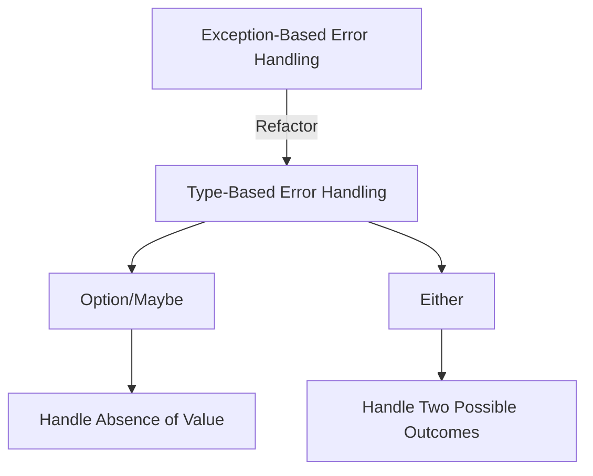

## 10.5. Practical Exercises

In this section, we delve into practical exercises designed to solidify your understanding of error handling in functional programming using algebraic data types. By engaging with these exercises, you'll learn how to implement error handling patterns using `Option/Maybe` and `Either` types, transforming traditional exception-based error handling into a more functional approach. These exercises will be demonstrated across multiple functional programming languages, providing a comprehensive understanding of how these concepts are applied in different contexts.

### Implementing Error Handling with Algebraic Data Types

Algebraic data types like `Option/Maybe` and `Either` provide a robust framework for handling errors in a functional programming paradigm. They allow us to represent the presence or absence of a value (`Option/Maybe`) or the possibility of two outcomes (`Either`), thus avoiding the pitfalls of exceptions.

#### Exercise 1: Refactoring with Either in JavaScript

In this exercise, you'll refactor a function that currently uses exceptions for error handling into one that uses the `Either` type. This transformation will help you understand how to handle errors functionally in JavaScript.

**Original Function Using Exceptions:**

```javascript
const divide = (x, y) => {
  if (y === 0) throw new Error("Division by zero");
  return x / y;
};
```

**Refactored Function Using Either:**

```javascript
// Assuming a simple Either implementation
const Either = {
  Left: (value) => ({ isLeft: true, value }),
  Right: (value) => ({ isRight: true, value }),
};

const safeDivide = (x, y) => {
  if (y === 0) return Either.Left("Division by zero error");
  return Either.Right(x / y);
};

// Usage example
const result = safeDivide(10, 0);
if (result.isLeft) {
  console.error(result.value); // Output: Division by zero error
} else {
  console.log(result.value);
}
```

#### Exercise 2: Refactoring with Either in Scala

Scala's `Either` type is a powerful tool for error handling. In this exercise, you'll refactor a Scala function to use `Either` instead of exceptions.

**Original Function Using Exceptions:**

```scala
def divide(x: Int, y: Int): Int = {
  if (y == 0) throw new ArithmeticException("Division by zero")
  x / y
}
```

**Refactored Function Using Either:**

```scala
def safeDivide(x: Int, y: Int): Either[String, Int] = {
  if (y == 0) Left("Division by zero error")
  else Right(x / y)
}

// Usage example
val result = safeDivide(10, 0)
result match {
  case Left(error) => println(s"Error: $error") // Output: Error: Division by zero error
  case Right(value) => println(s"Result: $value")
}
```

### Refactoring Code to Use Functional Error Handling Patterns

Refactoring existing code to use functional error handling patterns can significantly improve code readability and reliability. By replacing exceptions with algebraic data types, you can make your code more predictable and easier to maintain.

#### Exercise 3: Refactoring with Option/Maybe in Haskell

Haskell's `Maybe` type is an excellent way to handle optional values without resorting to exceptions. In this exercise, you'll refactor a Haskell function to use `Maybe`.

**Original Function Using Exceptions:**

```haskell
divide :: Double -> Double -> Double
divide _ 0 = error "Division by zero"
divide x y = x / y
```

**Refactored Function Using Maybe:**

```haskell
divideSafe :: Double -> Double -> Maybe Double
divideSafe _ 0 = Nothing
divideSafe x y = Just (x / y)

-- Usage example
case divideSafe 10 0 of
  Nothing -> putStrLn "Error: Division by zero"
  Just result -> print result
```

### Visual Aids

To better understand the transformation from exception-based to type-based error handling, consider the following diagram illustrating the process:



### Practical Exercises

#### Exercise 4: Implementing Error Handling in F#

F# provides robust support for functional programming, including error handling with `Option` and `Result` types. In this exercise, you'll implement a function using these types.

**Task:** Implement a function that safely divides two numbers using F#'s `Result` type.

```fsharp
let safeDivide x y =
    if y = 0 then Error "Division by zero error"
    else Ok (x / y)

// Usage example
match safeDivide 10 0 with
| Error msg -> printfn "Error: %s" msg
| Ok result -> printfn "Result: %d" result
```

#### Exercise 5: Transforming JavaScript Code with Functional Patterns

Refactor a JavaScript function that handles errors using traditional try-catch blocks to use functional patterns with `Option`.

**Original Function Using Try-Catch:**

```javascript
function parseNumber(str) {
  try {
    const num = parseInt(str, 10);
    if (isNaN(num)) throw new Error("Invalid number");
    return num;
  } catch (e) {
    return null;
  }
}
```

**Refactored Function Using Option:**

```javascript
const Option = {
  Some: (value) => ({ isSome: true, value }),
  None: () => ({ isNone: true }),
};

const parseNumberSafe = (str) => {
  const num = parseInt(str, 10);
  return isNaN(num) ? Option.None() : Option.Some(num);
};

// Usage example
const result = parseNumberSafe("abc");
if (result.isNone) {
  console.log("Error: Invalid number");
} else {
  console.log("Parsed number:", result.value);
}
```

### References

- "Real World Haskell" by Bryan O'Sullivan, John Goerzen, and Don Stewart.
- "Functional Programming in Scala" by Paul Chiusano and Rúnar Bjarnason.

### Further Reading

- "Learn You a Haskell for Great Good!" by Miran Lipovača
- "Programming in Haskell" by Graham Hutton

## Quiz Time!



### What is the primary advantage of using algebraic data types for error handling in functional programming?

- [x] They provide a type-safe way to handle errors without exceptions.
- [ ] They make the code run faster.
- [ ] They allow for more complex error messages.
- [ ] They reduce the need for documentation.

> **Explanation:** Algebraic data types like `Option/Maybe` and `Either` provide a type-safe way to handle errors, making the code more predictable and reducing runtime exceptions.

### How does the `Either` type differ from the `Option/Maybe` type?

- [x] `Either` can represent two possible outcomes, while `Option/Maybe` represents the presence or absence of a value.
- [ ] `Either` is used for numeric operations, while `Option/Maybe` is used for strings.
- [ ] `Either` is only available in Scala, while `Option/Maybe` is available in all languages.
- [ ] `Either` is more efficient than `Option/Maybe`.

> **Explanation:** `Either` is used to represent two possible outcomes (e.g., success or error), whereas `Option/Maybe` is used to represent the presence or absence of a value.

### In the JavaScript example, what does `Either.Left` represent?

- [x] An error or failure case.
- [ ] A successful computation.
- [ ] A null value.
- [ ] An undefined value.

> **Explanation:** In the `Either` type, `Left` typically represents an error or failure case, while `Right` represents a successful computation.

### What is the purpose of refactoring code to use functional error handling patterns?

- [x] To improve code readability and reliability by avoiding exceptions.
- [ ] To make the code run faster.
- [ ] To reduce the number of lines of code.
- [ ] To make the code compatible with older programming languages.

> **Explanation:** Refactoring code to use functional error handling patterns improves readability and reliability by avoiding exceptions and using type-safe constructs.

### Which of the following is a correct usage of the `Maybe` type in Haskell?

- [x] `Just 5`
- [ ] `Maybe 5`
- [ ] `Nothing 5`
- [ ] `None 5`

> **Explanation:** `Just 5` is the correct usage of the `Maybe` type in Haskell to represent a value. `Nothing` is used to represent the absence of a value.

### What does the `safeDivide` function return when dividing by zero in Scala?

- [x] `Left("Division by zero error")`
- [ ] `Right(0)`
- [ ] `None`
- [ ] `Error`

> **Explanation:** The `safeDivide` function returns `Left("Division by zero error")` to indicate an error when dividing by zero.

### In F#, what does the `Result` type represent?

- [x] A computation that can either succeed with a value or fail with an error.
- [ ] A list of possible outcomes.
- [ ] A boolean value.
- [ ] A string message.

> **Explanation:** The `Result` type in F# represents a computation that can either succeed with a value (`Ok`) or fail with an error (`Error`).

### How does using `Option` in JavaScript improve error handling?

- [x] It provides a clear way to represent the presence or absence of a value without using exceptions.
- [ ] It makes the code run faster.
- [ ] It allows for more complex error messages.
- [ ] It reduces the need for comments.

> **Explanation:** Using `Option` provides a clear and type-safe way to represent the presence or absence of a value, avoiding the need for exceptions.

### What is a common pitfall when using exceptions for error handling?

- [x] They can make the code unpredictable and harder to maintain.
- [ ] They always make the code run slower.
- [ ] They require more memory.
- [ ] They are not supported in functional languages.

> **Explanation:** Using exceptions can make the code unpredictable and harder to maintain, as they can be thrown from anywhere and disrupt the normal flow of the program.

### True or False: Algebraic data types can only be used in purely functional languages.

- [ ] True
- [x] False

> **Explanation:** Algebraic data types can be used in both purely functional languages and multi-paradigm languages that support functional programming concepts.


