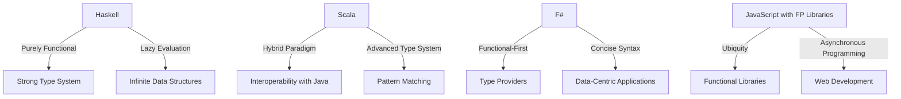

---

linkTitle: "11.1. Choosing a Functional Programming Language"
title: "Choosing a Functional Programming Language: Haskell, Scala, F#, and JavaScript"
description: "Explore the unique features, strengths, and use cases of popular functional programming languages like Haskell, Scala, F#, and JavaScript with FP libraries. Learn how to choose the right language for your project."
categories:
- Functional Programming
- Programming Languages
- Software Development
tags:
- Haskell
- Scala
- F#
- JavaScript
- Functional Programming
date: 2024-10-25
type: docs
nav_weight: 1110000
---

## 11.1. Choosing a Functional Programming Language

In the world of software development, choosing the right programming language is crucial, especially when diving into the functional programming (FP) paradigm. This section provides an overview of popular functional programming languages—Haskell, Scala, F#, and JavaScript with functional programming libraries. We will explore their unique features, strengths, and typical use cases, helping you make an informed decision based on your project requirements and personal preferences.

### Overview of Popular FP Languages

#### Haskell

Haskell is a purely functional programming language known for its strong static typing, lazy evaluation, and emphasis on immutability. It is often used in academic settings and industries where correctness and reliability are paramount, such as finance and data analysis.

- **Unique Features:**
  - **Purely Functional:** Haskell enforces pure functions, which leads to more predictable and maintainable code.
  - **Lazy Evaluation:** Computations are deferred until their results are needed, which can improve performance and enable the creation of infinite data structures.
  - **Strong Type System:** Haskell's type system helps catch errors at compile time, reducing runtime errors.

- **Strengths:**
  - Excellent for prototyping and exploring complex algorithms.
  - Strong community support and a wealth of libraries for various applications.

- **Typical Use Cases:**
  - Academic research and teaching.
  - Financial modeling and analysis.
  - Complex algorithm development.

#### Scala

Scala is a hybrid language that combines object-oriented and functional programming paradigms. It runs on the Java Virtual Machine (JVM), making it a popular choice for enterprises looking to leverage existing Java infrastructure while adopting functional programming practices.

- **Unique Features:**
  - **Hybrid Paradigm:** Supports both object-oriented and functional programming, offering flexibility in design.
  - **Interoperability with Java:** Seamlessly integrates with Java libraries and frameworks.
  - **Advanced Type System:** Supports features like type inference, pattern matching, and higher-order functions.

- **Strengths:**
  - Ideal for large-scale applications and systems.
  - Strong ecosystem with tools like Apache Spark for big data processing.

- **Typical Use Cases:**
  - Enterprise applications.
  - Data processing and analytics.
  - Web development.

#### F#

F# is a functional-first language that is part of the .NET ecosystem. It is known for its concise syntax and ability to handle complex data transformations efficiently. F# is a great choice for developers familiar with the .NET framework who want to explore functional programming.

- **Unique Features:**
  - **Functional-First Approach:** Encourages functional programming while supporting imperative and object-oriented styles.
  - **Type Providers:** Simplifies data access by automatically generating types for external data sources.
  - **Concise Syntax:** Reduces boilerplate code, making it easier to read and maintain.

- **Strengths:**
  - Excellent for data-centric applications and scientific computing.
  - Strong integration with the .NET ecosystem.

- **Typical Use Cases:**
  - Financial services and quantitative analysis.
  - Data science and machine learning.
  - Web and cloud applications.

#### JavaScript with FP Libraries

JavaScript, while not a purely functional language, can be used in a functional style with the help of libraries like Ramda, Lodash/fp, and Immutable.js. This approach allows developers to apply functional programming principles in web development.

- **Unique Features:**
  - **Ubiquity:** Runs in all modern web browsers and on servers via Node.js.
  - **Functional Libraries:** Libraries like Ramda provide utilities for functional programming, such as currying, composition, and immutability.
  - **Asynchronous Programming:** JavaScript's event-driven model is well-suited for handling asynchronous operations.

- **Strengths:**
  - Ideal for web development and building interactive user interfaces.
  - Large community and extensive ecosystem of libraries and frameworks.

- **Typical Use Cases:**
  - Frontend web development.
  - Server-side applications with Node.js.
  - Real-time applications and APIs.

### Criteria for Selecting a Language

When choosing a functional programming language, consider the following factors:

- **Project Requirements:** Determine the specific needs of your project, such as performance, scalability, and integration with existing systems.
- **Ecosystem Support:** Evaluate the availability of libraries, tools, and community support for each language.
- **Performance Considerations:** Consider the performance characteristics of each language, especially if your application requires high throughput or low latency.
- **Learning Curve:** Assess your familiarity with the language and its paradigms. Some languages, like Haskell, may have a steeper learning curve compared to others like JavaScript with FP libraries.
- **Interoperability:** If you need to integrate with existing systems, consider languages that offer seamless interoperability, such as Scala with Java or F# with .NET.

### Visual Aids

Below is a comparison chart highlighting key features of Haskell, Scala, F#, and JavaScript with FP libraries:



### Code Snippets

To illustrate how different functional languages implement a simple function, let's compare Haskell and Scala:

**Haskell:**

```haskell
greet :: String -> String
greet name = "Hello, " ++ name ++ "!"
```

**Scala:**

```scala
def greet(name: String): String = s"Hello, $name!"
```

These examples demonstrate the concise syntax and functional style of both languages, highlighting their ability to handle string manipulation elegantly.

### References

For further reading and to deepen your understanding of these languages, consider the following resources:

- "Programming in Haskell" by Graham Hutton.
- "Scala for the Impatient" by Cay S. Horstmann.
- "Functional Programming in JavaScript" by Luis Atencio.

## Quiz Time!



### Which of the following languages is purely functional?

- [x] Haskell
- [ ] Scala
- [ ] F#
- [ ] JavaScript

> **Explanation:** Haskell is known for being a purely functional programming language, enforcing pure functions and immutability.

### Which language is known for its interoperability with Java?

- [ ] Haskell
- [x] Scala
- [ ] F#
- [ ] JavaScript

> **Explanation:** Scala runs on the Java Virtual Machine (JVM) and is known for its seamless interoperability with Java.

### What feature of F# simplifies data access by automatically generating types for external data sources?

- [ ] Lazy Evaluation
- [ ] Pattern Matching
- [x] Type Providers
- [ ] Currying

> **Explanation:** F#'s Type Providers feature simplifies data access by automatically generating types for external data sources.

### Which language is part of the .NET ecosystem?

- [ ] Haskell
- [ ] Scala
- [x] F#
- [ ] JavaScript

> **Explanation:** F# is part of the .NET ecosystem and integrates well with other .NET languages and tools.

### JavaScript with FP libraries is ideal for which of the following use cases?

- [x] Frontend web development
- [ ] Financial modeling
- [ ] Scientific computing
- [ ] Data processing

> **Explanation:** JavaScript with FP libraries is ideal for frontend web development due to its ubiquity and extensive ecosystem.

### Which language is known for its lazy evaluation feature?

- [x] Haskell
- [ ] Scala
- [ ] F#
- [ ] JavaScript

> **Explanation:** Haskell is known for its lazy evaluation, where computations are deferred until their results are needed.

### What is a common use case for Scala?

- [ ] Academic research
- [x] Enterprise applications
- [ ] Real-time applications
- [ ] Scientific computing

> **Explanation:** Scala is commonly used for enterprise applications due to its hybrid paradigm and JVM compatibility.

### Which language is known for its concise syntax that reduces boilerplate code?

- [ ] Haskell
- [ ] Scala
- [x] F#
- [ ] JavaScript

> **Explanation:** F# is known for its concise syntax, which reduces boilerplate code and enhances readability.

### What is a key feature of JavaScript that makes it suitable for handling asynchronous operations?

- [ ] Strong Type System
- [ ] Lazy Evaluation
- [ ] Type Providers
- [x] Event-Driven Model

> **Explanation:** JavaScript's event-driven model makes it well-suited for handling asynchronous operations.

### True or False: Scala supports both object-oriented and functional programming paradigms.

- [x] True
- [ ] False

> **Explanation:** Scala is a hybrid language that supports both object-oriented and functional programming paradigms.



By understanding the unique features and strengths of these languages, you can make an informed decision about which functional programming language best suits your needs and project requirements.
