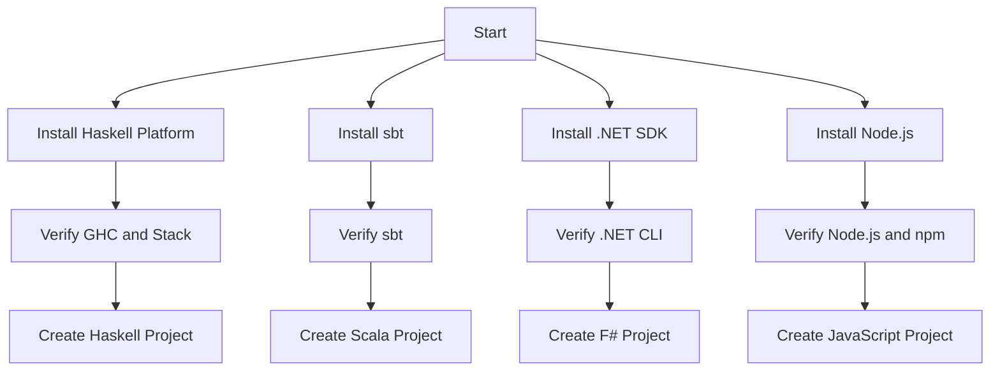

## 11.2. Setting Up the Development Environment

Setting up a development environment is a crucial step in your journey to mastering functional programming. This section provides detailed instructions for installing and configuring the necessary tools for Haskell, Scala, F#, and JavaScript. We will also explore how to enhance your coding experience with popular IDEs and editors.

### Installation Guides for Selected Languages

#### Haskell: GHC and Stack

Haskell is a statically typed, purely functional programming language known for its expressive type system and lazy evaluation. To get started with Haskell, you'll need to install the Glasgow Haskell Compiler (GHC) and Stack, a build tool for Haskell projects.

1. **Install GHC and Stack:**
   - Visit the [Haskell Official Website](https://www.haskell.org/) and download the Haskell Platform, which includes GHC and Stack.
   - Follow the installation instructions for your operating system (Windows, macOS, or Linux).

2. **Verify Installation:**
   - Open a terminal and run the following commands to verify the installation:
     ```bash
     ghc --version
     stack --version
     ```

3. **Create a New Haskell Project:**
   - Use Stack to create a new project:
     ```bash
     stack new my-haskell-project
     cd my-haskell-project
     stack setup
     stack build
     ```

4. **Haskell Stack Configuration Example:**
   - Here is a basic `stack.yaml` configuration:
     ```yaml
     resolver: lts-16.27
     
     packages:
       - .
     
     extra-deps: []
     
     flags: {}
     
     build: {}
     
     haddock: {}
     
     coverage: {}
     
     tests: {}
     
     benchmarks: {}
     ```

#### Scala: sbt

Scala combines object-oriented and functional programming in one concise, high-level language. The primary build tool for Scala is sbt (Simple Build Tool).

1. **Install sbt:**
   - Visit the [sbt website](https://www.scala-sbt.org/) and follow the installation instructions for your operating system.

2. **Verify Installation:**
   - Open a terminal and run:
     ```bash
     sbt sbtVersion
     ```

3. **Create a New Scala Project:**
   - Use sbt to create a new project:
     ```bash
     sbt new scala/scala-seed.g8
     cd <project-name>
     sbt compile
     ```

4. **Scala sbt Configuration Example:**
   - Here is a basic `build.sbt` configuration:
     ```scala
     name := "ScalaProject"
     
     version := "0.1"
     
     scalaVersion := "2.13.6"
     
     libraryDependencies += "org.typelevel" %% "cats-core" % "2.6.1"
     ```

#### F#

F# is a functional-first language that runs on the .NET platform. It is known for its succinct syntax and powerful type inference.

1. **Install .NET SDK:**
   - Visit the [Microsoft .NET website](https://dotnet.microsoft.com/download) and download the .NET SDK.

2. **Verify Installation:**
   - Open a terminal and run:
     ```bash
     dotnet --version
     ```

3. **Create a New F# Project:**
   - Use the .NET CLI to create a new F# console application:
     ```bash
     dotnet new console -lang "F#" -o MyFSharpApp
     cd MyFSharpApp
     dotnet run
     ```

#### JavaScript: Node.js with npm and FP Libraries

JavaScript is a versatile language that supports functional programming paradigms, especially when combined with libraries like Ramda or lodash/fp.

1. **Install Node.js and npm:**
   - Visit the [Node.js website](https://nodejs.org/) and download the latest LTS version, which includes npm.

2. **Verify Installation:**
   - Open a terminal and run:
     ```bash
     node -v
     npm -v
     ```

3. **Set Up a New JavaScript Project:**
   - Initialize a new project and install functional programming libraries:
     ```bash
     mkdir my-js-project
     cd my-js-project
     npm init -y
     npm install ramda lodash
     ```

### Configuring IDEs and Editors for Functional Development

Choosing the right IDE or editor can significantly enhance your productivity and coding experience. Here, we'll discuss setting up Visual Studio Code (VSCode) and IntelliJ IDEA for functional programming.

#### Visual Studio Code (VSCode)

VSCode is a lightweight, open-source editor with a rich ecosystem of extensions.

1. **Install VSCode:**
   - Download and install VSCode from the [official website](https://code.visualstudio.com/).

2. **Install Extensions:**
   - Open VSCode and go to the Extensions view (`Ctrl+Shift+X`).
   - Search for and install the following extensions:
     - **Haskell:** Haskell Syntax Highlighting
     - **Scala:** Metals (Scala language server)
     - **F#:** Ionide-fsharp
     - **JavaScript:** Prettier - Code formatter, ESLint

3. **Configure Settings:**
   - Customize settings for each language by navigating to `File > Preferences > Settings`.

#### IntelliJ IDEA

IntelliJ IDEA is a powerful IDE with excellent support for Scala and other JVM languages.

1. **Install IntelliJ IDEA:**
   - Download and install IntelliJ IDEA from the [JetBrains website](https://www.jetbrains.com/idea/).

2. **Install Plugins:**
   - Open IntelliJ IDEA and go to `File > Settings > Plugins`.
   - Search for and install the following plugins:
     - **Scala:** Scala Plugin
     - **Haskell:** IntelliJ-Haskell
     - **F#:** ReSharper (for F# support)

3. **Configure Project Settings:**
   - Set up project-specific settings by navigating to `File > Project Structure`.

### Visual Aids

Below is a flowchart illustrating the setup process for each language using Mermaid.js:



### References

- Official documentation for GHC and Stack (Haskell): [Haskell Official](https://www.haskell.org/)
- sbt Documentation (Scala): [sbt](https://www.scala-sbt.org/)
- F# Documentation: [Microsoft F#](https://docs.microsoft.com/en-us/dotnet/fsharp/)
- Node.js and npm Documentation: [Node.js](https://nodejs.org/)

## Quiz Time!



### Which tool is used to build Haskell projects?

- [x] Stack
- [ ] sbt
- [ ] npm
- [ ] .NET CLI

> **Explanation:** Stack is a build tool for Haskell projects, providing project management and build automation.

### What is the primary build tool for Scala?

- [ ] Stack
- [x] sbt
- [ ] npm
- [ ] .NET CLI

> **Explanation:** sbt (Simple Build Tool) is the primary build tool for Scala, used for compiling, testing, and running Scala projects.

### Which command verifies the installation of the .NET SDK?

- [ ] sbt sbtVersion
- [ ] node -v
- [x] dotnet --version
- [ ] stack --version

> **Explanation:** The command `dotnet --version` is used to verify the installation of the .NET SDK.

### What extension is recommended for Scala development in VSCode?

- [ ] Ionide-fsharp
- [x] Metals
- [ ] ESLint
- [ ] Prettier

> **Explanation:** Metals is the recommended extension for Scala development in VSCode, providing language server support.

### Which plugin is necessary for F# support in IntelliJ IDEA?

- [ ] Scala Plugin
- [ ] IntelliJ-Haskell
- [x] ReSharper
- [ ] ESLint

> **Explanation:** ReSharper is necessary for F# support in IntelliJ IDEA, offering enhanced language features and tools.

### What is the purpose of the `stack setup` command in Haskell?

- [x] To set up the GHC compiler for the project
- [ ] To initialize a new Haskell project
- [ ] To verify the installation of Stack
- [ ] To install Haskell libraries

> **Explanation:** The `stack setup` command sets up the GHC compiler for the project, ensuring the correct version is used.

### Which language uses the `libraryDependencies` setting in its build configuration?

- [ ] Haskell
- [x] Scala
- [ ] F#
- [ ] JavaScript

> **Explanation:** The `libraryDependencies` setting is used in Scala's sbt build configuration to specify project dependencies.

### What is the command to create a new F# console application?

- [ ] sbt new scala/scala-seed.g8
- [ ] stack new my-haskell-project
- [x] dotnet new console -lang "F#"
- [ ] npm init -y

> **Explanation:** The command `dotnet new console -lang "F#"` creates a new F# console application using the .NET CLI.

### Which tool is used to manage JavaScript packages?

- [ ] Stack
- [ ] sbt
- [ ] .NET CLI
- [x] npm

> **Explanation:** npm (Node Package Manager) is used to manage JavaScript packages and dependencies.

### True or False: IntelliJ IDEA requires a plugin for Scala development.

- [x] True
- [ ] False

> **Explanation:** True. IntelliJ IDEA requires the Scala Plugin to support Scala development, providing features like syntax highlighting and code completion.


