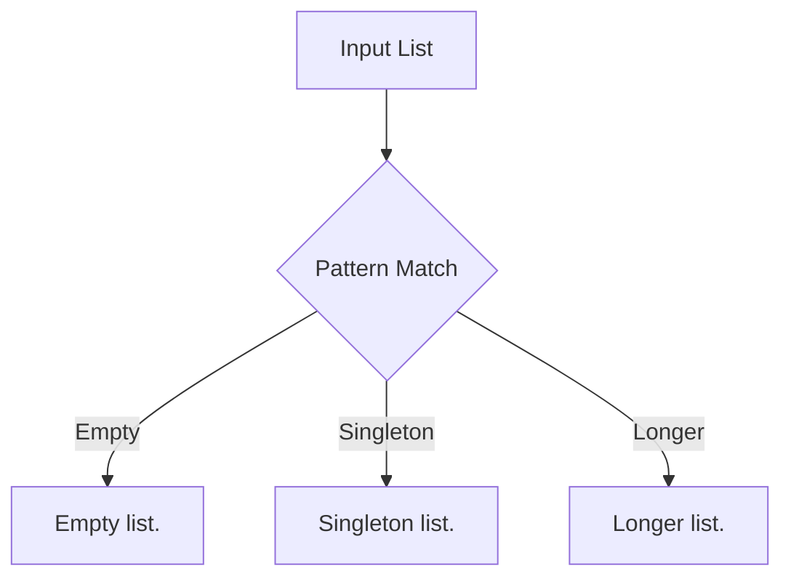
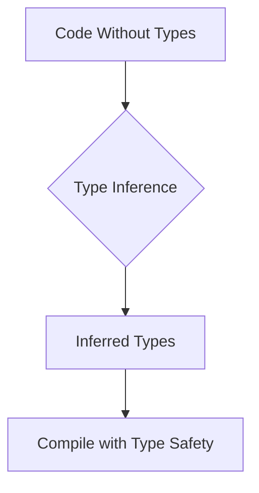

## 11.4. Exploring Language-Specific Features

In this section, we will explore some of the unique features that make functional programming languages powerful and expressive. Specifically, we will focus on pattern matching and type systems, which are fundamental to writing concise and robust functional code. We will examine how these features are implemented in Haskell, Scala, and JavaScript with functional programming libraries like Ramda.

### Pattern Matching

Pattern matching is a powerful feature in many functional programming languages that allows you to destructure and analyze data structures in a concise and readable way. It is akin to a more powerful switch statement found in imperative languages but with the ability to match complex data patterns.

#### Haskell Pattern Matching

In Haskell, pattern matching is a fundamental part of the language and is used extensively in function definitions. It allows you to define different behaviors for different shapes of input data.

```haskell
describeList :: [a] -> String
describeList [] = "Empty list."
describeList [x] = "Singleton list."
describeList xs = "Longer list."
```

In this example, the `describeList` function uses pattern matching to determine the structure of the list. It checks if the list is empty, has a single element, or is longer, and returns a corresponding description.

#### Scala Pattern Matching

Scala also supports pattern matching, and it is a key feature of the language. Scala's pattern matching is versatile and can be used with case classes, tuples, and more.

```scala
def describeList[A](xs: List[A]): String = xs match {
  case Nil => "Empty list."
  case x :: Nil => "Singleton list."
  case _ => "Longer list."
}
```

In Scala, the `match` keyword is used to perform pattern matching. The `describeList` function matches the input list against different patterns, similar to Haskell.

#### JavaScript with Ramda Pattern Matching

JavaScript does not natively support pattern matching, but libraries like Ramda provide functional utilities that mimic this behavior.

```javascript
const R = require('ramda');

const describeList = R.cond([
  [R.isEmpty, R.always("Empty list.")],
  [R.pipe(R.length, R.equals(1)), R.always("Singleton list.")],
  [R.T, R.always("Longer list.")]
]);

console.log(describeList([])); // "Empty list."
console.log(describeList([1])); // "Singleton list."
console.log(describeList([1, 2, 3])); // "Longer list."
```

In this example, Ramda's `cond` function is used to create a pattern matching-like behavior. It evaluates conditions in sequence and returns the result of the first condition that is true.

### Type Systems and Type Inference

Type systems are a crucial aspect of functional programming languages, providing a way to enforce correctness and reduce runtime errors. Type inference allows the compiler to deduce types automatically, reducing the need for explicit type annotations.

#### Haskell's Type System

Haskell is known for its strong, static type system and powerful type inference capabilities. The compiler can often infer the types of expressions without explicit annotations, making code both concise and safe.

```haskell
add :: Int -> Int -> Int
add x y = x + y
```

In this example, the type signature `Int -> Int -> Int` specifies that `add` takes two integers and returns an integer. However, Haskell can infer this type even if the signature is omitted.

#### Scala's Type System

Scala combines object-oriented and functional programming with a strong static type system. It also supports type inference, allowing for concise code while maintaining type safety.

```scala
def add(x: Int, y: Int): Int = x + y
```

Scala infers the return type of the `add` function if it is not explicitly specified, thanks to its sophisticated type inference mechanism.

#### JavaScript with TypeScript and FP Libraries

JavaScript is dynamically typed, but TypeScript adds static typing capabilities, which can be leveraged in functional programming with libraries like Ramda.

```typescript
const add = (x: number, y: number): number => x + y;
```

TypeScript's type annotations provide the benefits of static typing, such as early error detection and improved code readability, while maintaining JavaScript's flexibility.

### Visual Aids

To better understand pattern matching and type inference, let's visualize these concepts using Mermaid.js diagrams.

#### Pattern Matching Diagram



This diagram illustrates the flow of pattern matching in a list description function, showing how different patterns lead to different outcomes.

#### Type Inference Diagram



This diagram shows how type inference works, starting from code without explicit types, inferring types, and ensuring type safety during compilation.

### Conclusion

Pattern matching and type systems are powerful features that enhance the expressiveness and safety of functional programming languages. By understanding these features in Haskell, Scala, and JavaScript with FP libraries, you can write more robust and concise functional code. As you continue your journey in functional programming, these tools will become invaluable in your toolkit.

### References

- "Scala for the Impatient" by Cay S. Horstmann.
- "Programming in Haskell" by Graham Hutton.

## Quiz Time!



### What is pattern matching used for in functional programming?

- [x] Destructuring and analyzing data structures
- [ ] Compiling code into machine language
- [ ] Managing memory allocation
- [ ] Optimizing runtime performance

> **Explanation:** Pattern matching allows you to destructure and analyze data structures in a concise and readable way.

### Which language uses the `match` keyword for pattern matching?

- [ ] Haskell
- [x] Scala
- [ ] JavaScript
- [ ] Python

> **Explanation:** Scala uses the `match` keyword to perform pattern matching.

### How does Haskell handle type inference?

- [x] The compiler deduces types automatically
- [ ] Types must be explicitly declared
- [ ] Types are determined at runtime
- [ ] Types are inferred based on variable names

> **Explanation:** Haskell's compiler can often infer the types of expressions without explicit annotations.

### What library in JavaScript provides utilities for functional programming, including pattern matching-like behavior?

- [ ] Lodash
- [x] Ramda
- [ ] jQuery
- [ ] D3.js

> **Explanation:** Ramda provides functional utilities that mimic pattern matching behavior in JavaScript.

### What is the benefit of type inference in functional programming?

- [x] Reduces boilerplate code
- [x] Enhances code robustness
- [ ] Increases runtime speed
- [ ] Simplifies memory management

> **Explanation:** Type inference reduces the need for explicit type annotations, making code concise and robust.

### Which of the following is a feature of Haskell's type system?

- [x] Strong static typing
- [ ] Dynamic typing
- [ ] Weak typing
- [ ] No typing

> **Explanation:** Haskell is known for its strong static type system.

### In Scala, what is the result of the following pattern match: `List(1, 2, 3) match { case Nil => "Empty" case x :: Nil => "Singleton" case _ => "Longer" }`?

- [ ] "Empty"
- [ ] "Singleton"
- [x] "Longer"
- [ ] "Error"

> **Explanation:** The list `List(1, 2, 3)` matches the pattern `_`, resulting in "Longer".

### What does the `cond` function in Ramda do?

- [x] Evaluates conditions in sequence and returns the result of the first true condition
- [ ] Compiles JavaScript code
- [ ] Manages asynchronous operations
- [ ] Optimizes memory usage

> **Explanation:** The `cond` function evaluates conditions in sequence and returns the result of the first condition that is true.

### Which language feature helps in reducing runtime errors by enforcing correctness?

- [x] Type systems
- [ ] Pattern matching
- [ ] Lazy evaluation
- [ ] Closures

> **Explanation:** Type systems enforce correctness and reduce runtime errors.

### True or False: TypeScript adds static typing capabilities to JavaScript.

- [x] True
- [ ] False

> **Explanation:** TypeScript adds static typing capabilities to JavaScript, providing benefits like early error detection.


