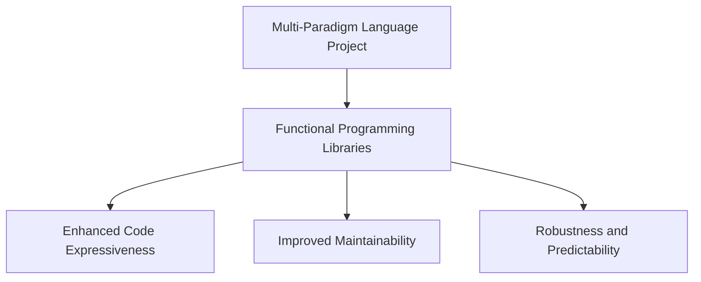

---

linkTitle: "11.5. Functional Programming in Multi-Paradigm Languages"
title: "Functional Programming in Multi-Paradigm Languages: Enhancing Code with FP Concepts"
description: "Explore how functional programming concepts can be integrated into multi-paradigm languages like Python and JavaScript, using libraries and extensions to enhance code expressiveness and maintainability."
categories:
- Functional Programming
- Multi-Paradigm Languages
- Software Development
tags:
- Functional Programming
- JavaScript
- Python
- Ramda
- functools
date: 2024-10-25
type: docs
nav_weight: 11500

---

## 11.5. Functional Programming in Multi-Paradigm Languages

In the world of software development, multi-paradigm languages like Python and JavaScript have gained immense popularity due to their flexibility and wide range of applications. These languages allow developers to blend different programming paradigms, including object-oriented, procedural, and functional programming (FP). This section explores how functional programming concepts can be seamlessly integrated into these languages, enhancing code expressiveness, maintainability, and robustness.

### Applying FP Concepts in Languages like Python and JavaScript

Functional programming emphasizes immutability, first-class functions, and declarative code style. By incorporating these principles into multi-paradigm languages, developers can write cleaner, more predictable code. Let's delve into how Python and JavaScript can be enhanced with functional programming concepts.

#### Python and Functional Programming

Python, known for its simplicity and readability, supports functional programming features such as first-class functions, higher-order functions, and list comprehensions. However, to fully leverage FP, Python provides modules like `functools` and `itertools`.

- **First-Class Functions:** In Python, functions are first-class citizens, meaning they can be passed as arguments, returned from other functions, and assigned to variables.
  
- **Higher-Order Functions:** Python's built-in functions like `map()`, `filter()`, and `reduce()` (from `functools`) allow developers to apply functions to collections, enabling a functional approach to data processing.

- **Immutability:** While Python does not enforce immutability, developers can use tuples and frozen sets to create immutable data structures, promoting safer and more predictable code.

#### JavaScript and Functional Programming

JavaScript, traditionally known for its imperative and event-driven nature, has embraced functional programming through ES6 features and libraries like Ramda and Lodash.

- **Arrow Functions:** Introduced in ES6, arrow functions provide a concise syntax for writing anonymous functions, making functional patterns more accessible.

- **Higher-Order Functions:** JavaScript's array methods such as `map()`, `filter()`, and `reduce()` facilitate functional programming by allowing operations on arrays without explicit loops.

- **Immutability:** Libraries like Immutable.js offer immutable data structures, helping developers manage state changes predictably.

### Functional Libraries and Extensions

To further enhance functional programming capabilities in Python and JavaScript, several libraries and extensions are available. These tools provide additional functions, utilities, and data structures that align with FP principles.

#### Ramda for JavaScript

Ramda is a functional programming library for JavaScript that emphasizes immutability and pure functions. It provides a suite of utility functions for data transformation and manipulation.

```javascript
const R = require('ramda');

const numbers = [1, 2, 3, 4, 5];
const doubled = R.map(R.multiply(2))(numbers);
console.log(doubled); // [2, 4, 6, 8, 10]
```

In this example, Ramda's `map` function is used to double each number in the array, demonstrating a declarative approach to data transformation.

#### functools for Python

The `functools` module in Python offers higher-order functions and tools for functional programming. It includes utilities like `reduce`, `partial`, and `lru_cache`.

```python
from functools import reduce

numbers = [1, 2, 3, 4, 5]
total = reduce(lambda acc, x: acc + x, numbers, 0)
print(total) # 15
```

Here, `reduce` is used to accumulate the sum of numbers in a list, showcasing a functional approach to aggregation.

### Visual Aids

To visualize how functional programming libraries integrate into multi-paradigm language projects, consider the following diagram:



This diagram illustrates the flow of integrating functional programming libraries into a project, resulting in enhanced code quality and maintainability.

### Practical Exercises

To solidify your understanding of functional programming in multi-paradigm languages, try the following exercises:

1. **JavaScript Exercise:**
   - Use Ramda to filter an array of objects based on a specific property value.
   - Implement a function that composes multiple functions into a single function using Ramda's `compose`.

2. **Python Exercise:**
   - Use `functools.partial` to create a partially applied function that multiplies numbers by a fixed factor.
   - Implement a memoized Fibonacci function using `functools.lru_cache`.

### Real-World Applications

Functional programming in multi-paradigm languages is widely used in industry projects. For instance, JavaScript's functional libraries are often employed in front-end frameworks like React to manage state and side effects declaratively. Similarly, Python's functional tools are utilized in data processing pipelines to handle large datasets efficiently.

### Summary of Key Points

- Functional programming concepts can be integrated into multi-paradigm languages like Python and JavaScript, enhancing code expressiveness and maintainability.
- Libraries such as Ramda for JavaScript and `functools` for Python provide tools and utilities that align with FP principles.
- By adopting functional programming techniques, developers can write cleaner, more predictable code, leading to robust and maintainable software.

### References and Further Reading

- "Functional Programming in JavaScript" by Luis Atencio.
- "Functional Programming in Python" by David Mertz.
- Official documentation for [Ramda](https://ramdajs.com/) and [functools](https://docs.python.org/3/library/functools.html).

## Quiz Time!



### Which of the following is a key feature of functional programming?

- [x] Immutability
- [ ] Inheritance
- [ ] Polymorphism
- [ ] Encapsulation

> **Explanation:** Immutability is a core principle of functional programming, emphasizing the use of immutable data structures.

### What does the `map` function do in functional programming?

- [x] Applies a function to each element in a collection
- [ ] Filters elements based on a condition
- [ ] Reduces a collection to a single value
- [ ] Sorts elements in a collection

> **Explanation:** The `map` function applies a given function to each element in a collection, returning a new collection with the results.

### Which library is commonly used for functional programming in JavaScript?

- [x] Ramda
- [ ] NumPy
- [ ] TensorFlow
- [ ] Pandas

> **Explanation:** Ramda is a popular library for functional programming in JavaScript, providing utilities for data transformation and manipulation.

### In Python, which module provides tools for functional programming?

- [x] functools
- [ ] itertools
- [ ] collections
- [ ] os

> **Explanation:** The `functools` module in Python offers higher-order functions and utilities for functional programming.

### What is the purpose of the `reduce` function?

- [x] To accumulate a collection into a single value
- [ ] To filter elements based on a condition
- [ ] To apply a function to each element in a collection
- [ ] To sort elements in a collection

> **Explanation:** The `reduce` function accumulates a collection into a single value by applying a function cumulatively to the elements.

### Which of the following is a benefit of using functional programming?

- [x] Enhanced code maintainability
- [ ] Increased code complexity
- [ ] Greater reliance on global state
- [ ] More frequent side effects

> **Explanation:** Functional programming enhances code maintainability by promoting immutability and pure functions, reducing side effects.

### What is a higher-order function?

- [x] A function that takes other functions as arguments or returns a function
- [ ] A function that performs arithmetic operations
- [ ] A function that sorts elements in a collection
- [ ] A function that reads from a file

> **Explanation:** A higher-order function is one that takes other functions as arguments or returns a function as its result.

### How does immutability benefit functional programming?

- [x] It makes code more predictable and easier to debug
- [ ] It increases the complexity of data structures
- [ ] It allows for more frequent state changes
- [ ] It requires more memory usage

> **Explanation:** Immutability makes code more predictable and easier to debug by preventing unintended state changes.

### Which of the following is an example of a first-class function?

- [x] A function assigned to a variable
- [ ] A function that only performs I/O operations
- [ ] A function that modifies global state
- [ ] A function that is defined within a loop

> **Explanation:** A first-class function can be assigned to a variable, passed as an argument, or returned from another function.

### True or False: Functional programming can only be used in languages specifically designed for it.

- [ ] True
- [x] False

> **Explanation:** Functional programming concepts can be applied in multi-paradigm languages like Python and JavaScript, not just in languages specifically designed for FP.


