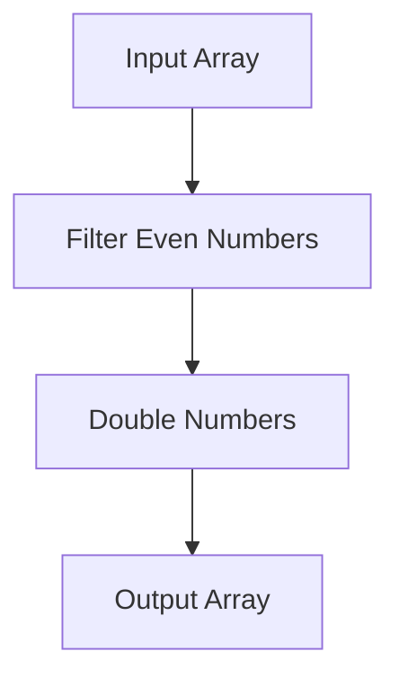

## 11.6. Practical Exercises

In this section, we will delve into practical exercises designed to reinforce your understanding of functional programming languages. These exercises will help you apply the concepts you've learned and explore language-specific features through hands-on coding tasks. By engaging with these exercises, you'll gain a deeper appreciation for the power and elegance of functional programming.

### Writing Basic Programs to Solidify Understanding

To begin, let's focus on writing simple programs that utilize the core principles and syntax of functional programming languages. These exercises are designed to help you become comfortable with the fundamental concepts and idiomatic usage of each language.

#### Exercise 1: Haskell - Pattern Matching

**Task:** Create a function using pattern matching to describe a number.

```haskell
-- Define a function that uses pattern matching to describe a number
describeNumber :: Int -> String
describeNumber 0 = "Zero"
describeNumber 1 = "One"
describeNumber _ = "Other number"

-- Test the function with different inputs
main :: IO ()
main = do
  print (describeNumber 0)  -- Output: "Zero"
  print (describeNumber 1)  -- Output: "One"
  print (describeNumber 42) -- Output: "Other number"
```

**Explanation:** This exercise introduces you to Haskell's pattern matching, a powerful feature that allows you to define function behavior based on specific input patterns. By matching against different integer values, you can provide concise and readable definitions for each case.

#### Exercise 2: JavaScript - Function Composition with Ramda

**Task:** Use Ramda to create a composed function that filters even numbers and doubles them.

```javascript
// Import the Ramda library
const R = require('ramda');

// Define a function to filter even numbers
const filterEven = R.filter(x => x % 2 === 0);

// Define a function to double numbers
const double = R.map(x => x * 2);

// Compose the functions to process an array
const process = R.compose(double, filterEven);

// Test the composed function
console.log(process([1, 2, 3, 4, 5])); // Output: [4, 8]
```

**Explanation:** This exercise demonstrates function composition using the Ramda library in JavaScript. By composing `filterEven` and `double`, you create a new function `process` that first filters even numbers and then doubles them. This approach showcases the elegance of functional programming in handling data transformations.

### Experimenting with Language-Specific Functional Features

Next, let's explore advanced features unique to specific functional programming languages. These exercises will challenge you to apply your knowledge and experiment with powerful language constructs.

#### Exercise 3: Scala - Higher-Kinded Types

**Task:** Implement a simple example using higher-kinded types in Scala.

```scala
// Define a trait with a higher-kinded type
trait Functor[F[_]] {
  def map[A, B](fa: F[A])(f: A => B): F[B]
}

// Implement Functor for List
object ListFunctor extends Functor[List] {
  def map[A, B](fa: List[A])(f: A => B): List[B] = fa.map(f)
}

// Test the Functor implementation
object FunctorTest extends App {
  val numbers = List(1, 2, 3)
  val doubled = ListFunctor.map(numbers)(_ * 2)
  println(doubled) // Output: List(2, 4, 6)
}
```

**Explanation:** Higher-kinded types allow you to abstract over type constructors in Scala. This exercise guides you through implementing a `Functor` type class for `List`, demonstrating how to use higher-kinded types to create reusable abstractions.

#### Exercise 4: Haskell - Lazy Evaluation

**Task:** Create a lazy list of Fibonacci numbers in Haskell.

```haskell
-- Define an infinite list of Fibonacci numbers using lazy evaluation
fibonacci :: [Integer]
fibonacci = 0 : 1 : zipWith (+) fibonacci (tail fibonacci)

-- Take the first 10 Fibonacci numbers
main :: IO ()
main = print (take 10 fibonacci) -- Output: [0, 1, 1, 2, 3, 5, 8, 13, 21, 34]
```

**Explanation:** Haskell's lazy evaluation allows you to define infinite data structures like the Fibonacci sequence. This exercise demonstrates how to create a lazy list of Fibonacci numbers, showcasing Haskell's ability to handle potentially infinite computations efficiently.

### Visual Aids

To enhance your understanding of these exercises, let's use Mermaid.js to illustrate the program structures and feature implementations.

#### Haskell Pattern Matching Diagram

```mermaid
graph TD;
    A[Input Number] --> B{Pattern Match};
    B -->|0| C[Output: "Zero"];
    B -->|1| D[Output: "One"];
    B -->|Other| E[Output: "Other number"];
```

**Explanation:** This diagram visualizes the decision-making process in the `describeNumber` function, highlighting how pattern matching directs the flow based on input values.

#### JavaScript Function Composition Diagram



**Explanation:** This diagram illustrates the flow of data through the composed function `process`, showing how each step transforms the input array.

### References

- "Learning Functional Programming" by Richard Eisenberg.
- "Functional Programming in Scala" by Paul Chiusano and Rúnar Bjarnason.

These references provide additional insights and examples to deepen your understanding of functional programming concepts.

## Quiz Time!



### What is the purpose of pattern matching in Haskell?

- [x] To define function behavior based on specific input patterns
- [ ] To iterate over lists
- [ ] To perform arithmetic operations
- [ ] To handle exceptions

> **Explanation:** Pattern matching in Haskell allows you to define function behavior based on specific input patterns, making code more concise and readable.

### What library is used in JavaScript for function composition in the exercises?

- [ ] Lodash
- [x] Ramda
- [ ] Underscore
- [ ] jQuery

> **Explanation:** The Ramda library is used in the exercises for function composition, providing a functional approach to data transformations in JavaScript.

### What is a higher-kinded type in Scala?

- [ ] A type that represents a single value
- [x] A type that abstracts over type constructors
- [ ] A type that can only be used with integers
- [ ] A type that is used for string manipulation

> **Explanation:** Higher-kinded types in Scala allow you to abstract over type constructors, enabling the creation of reusable abstractions like the `Functor` type class.

### How does Haskell handle infinite data structures?

- [x] Through lazy evaluation
- [ ] By using loops
- [ ] By allocating large memory blocks
- [ ] By using recursion only

> **Explanation:** Haskell uses lazy evaluation to handle infinite data structures, allowing computations to be performed only when needed.

### What is the output of the Haskell function `describeNumber` when given the input `42`?

- [ ] "Zero"
- [ ] "One"
- [x] "Other number"
- [ ] "Forty-two"

> **Explanation:** The `describeNumber` function uses pattern matching, and for any number other than 0 or 1, it returns "Other number".

### In the JavaScript exercise, what does the `process` function do?

- [ ] It filters odd numbers and triples them
- [x] It filters even numbers and doubles them
- [ ] It sorts numbers in ascending order
- [ ] It reverses the array

> **Explanation:** The `process` function filters even numbers and then doubles them, as demonstrated in the exercise.

### What is the main advantage of using lazy evaluation in Haskell?

- [x] It allows for efficient handling of potentially infinite computations
- [ ] It speeds up arithmetic operations
- [ ] It simplifies error handling
- [ ] It enhances string manipulation

> **Explanation:** Lazy evaluation in Haskell allows for efficient handling of potentially infinite computations by evaluating expressions only when needed.

### Which of the following is a feature of higher-kinded types?

- [x] They allow abstraction over type constructors
- [ ] They are specific to integer operations
- [ ] They simplify string concatenation
- [ ] They are used for error handling

> **Explanation:** Higher-kinded types allow abstraction over type constructors, enabling the creation of generic and reusable abstractions in Scala.

### What does the `zipWith` function do in the Haskell Fibonacci example?

- [ ] It concatenates two lists
- [x] It combines two lists using a specified function
- [ ] It reverses a list
- [ ] It sorts a list

> **Explanation:** The `zipWith` function in Haskell combines two lists using a specified function, in this case, adding corresponding elements to generate the Fibonacci sequence.

### True or False: Function composition in JavaScript can be achieved using the Ramda library.

- [x] True
- [ ] False

> **Explanation:** True. The Ramda library provides tools for function composition, allowing for elegant and functional data transformations in JavaScript.



By completing these exercises and quizzes, you will solidify your understanding of functional programming concepts and language-specific features, preparing you for more advanced topics and real-world applications.
