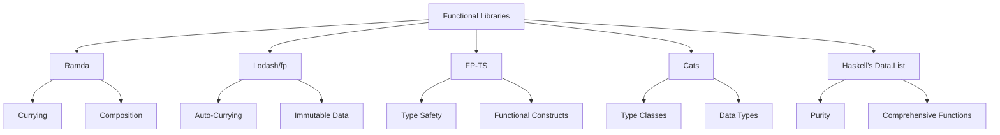

---

linkTitle: "12.1. Introduction to Functional Libraries"
title: "Functional Libraries: Enhancing Functional Programming Practices"
description: "Explore the role of functional libraries like Ramda, lodash/fp, and FP-TS in enhancing functional programming practices across various languages."
categories:
- Functional Programming
- Software Development
- Programming Libraries
tags:
- Functional Libraries
- Ramda
- Lodash
- FP-TS
- Cats
date: 2024-10-25
type: docs
nav_weight: 1210000
---

## 12.1. Introduction to Functional Libraries

Functional programming has gained significant traction in the software development world due to its emphasis on immutability, pure functions, and declarative code. To facilitate the adoption of functional programming paradigms, a variety of functional libraries have been developed across different programming languages. These libraries provide a suite of tools and utilities that simplify the implementation of functional patterns, reduce boilerplate code, and enhance code readability and maintainability. In this section, we will explore some of the most popular functional libraries, their features, and the benefits they offer to developers.

### Overview of Functional Libraries in Various Languages

Functional libraries are designed to bring the power of functional programming to languages that may not be purely functional. They provide a set of utilities that make it easier to work with functions, collections, and data transformations in a functional style. Let's take a closer look at some of the most widely used functional libraries in different programming languages.

#### Ramda for JavaScript

Ramda is a functional programming library for JavaScript that emphasizes a functional approach to data manipulation. It provides a wide range of utility functions that are designed to work with immutable data and pure functions. Ramda's functions are automatically curried, allowing for partial application and composition.

**Key Features:**
- **Currying and Composition:** Ramda functions are curried by default, enabling easy function composition.
- **Immutability:** Encourages working with immutable data structures.
- **Point-Free Style:** Supports writing code in a point-free style, enhancing readability.

**Example:**

```javascript
const R = require('ramda');

const users = [
  { name: 'Alice', age: 25 },
  { name: 'Bob', age: 30 },
  { name: 'Charlie', age: 35 }
];

const getNames = R.map(R.prop('name'));
console.log(getNames(users)); // ['Alice', 'Bob', 'Charlie']
```

#### Lodash/fp for JavaScript

Lodash/fp is a functional programming variant of the popular Lodash library. It provides a set of utilities that are designed to work with immutable data and support a functional programming style.

**Key Features:**
- **Auto-Currying:** Functions are automatically curried.
- **Immutable Data Handling:** Encourages immutability by default.
- **Functional Iteration:** Provides functional alternatives to common iteration patterns.

#### FP-TS for TypeScript

FP-TS is a library for functional programming in TypeScript. It provides a comprehensive set of tools for working with functional patterns, including monads, functors, and applicatives.

**Key Features:**
- **Type Safety:** Leverages TypeScript's type system to ensure type safety.
- **Functional Constructs:** Offers a wide range of functional constructs like Option, Either, and Task.
- **Composability:** Encourages composable and reusable code.

#### Cats for Scala

Cats is a library that provides abstractions for functional programming in Scala. It offers a variety of type classes and data types that facilitate functional programming.

**Key Features:**
- **Type Classes:** Provides a rich set of type classes like Functor, Monad, and Applicative.
- **Data Types:** Includes data types like Option, Either, and Validated.
- **Interoperability:** Works seamlessly with Scala's standard library.

**Example:**

```scala
import cats.implicits._

val numbers = List(1, 2, 3)
val doubled = numbers.map(_ * 2)
println(doubled) // List(2, 4, 6)
```

#### Haskell's Standard Libraries

Haskell, being a purely functional language, has a rich set of standard libraries that support functional programming. The `Data.List` module, for example, provides a variety of functions for list manipulation.

**Key Features:**
- **Purity and Immutability:** All functions are pure and data is immutable by default.
- **Comprehensive Functionality:** Offers a wide range of functions for working with lists, sets, and other data structures.

**Example:**

```haskell
import Data.List (sort, nub)

let numbers = [3, 1, 2, 3, 4, 2]
let uniqueSorted = sort (nub numbers)
print uniqueSorted -- [1,2,3,4]
```

### Benefits of Using Functional Libraries

Functional libraries offer several benefits that make them an attractive choice for developers looking to adopt functional programming practices:

1. **Facilitate Functional Patterns:** These libraries provide utilities that make it easier to implement functional patterns such as map, filter, and reduce, without having to write boilerplate code.

2. **Reduce Boilerplate Code:** By providing pre-built functions for common tasks, functional libraries help reduce the amount of boilerplate code, allowing developers to focus on the logic of their applications.

3. **Improve Code Readability and Maintainability:** Functional libraries encourage a declarative style of programming, which often results in more readable and maintainable code. The use of pure functions and immutability also reduces the likelihood of bugs.

4. **Enhance Composability:** With features like currying and function composition, functional libraries enable developers to build complex functionality by composing simple functions, leading to more modular and reusable code.

### Visual Aids

To better understand the utility functions provided by these libraries and how they map to common functional programming tasks, let's look at a diagram that illustrates these relationships.



### Conclusion

Functional libraries play a crucial role in bringing functional programming paradigms to a wide range of programming languages. By providing a rich set of utilities and abstractions, these libraries enable developers to write cleaner, more maintainable, and more expressive code. Whether you're working with JavaScript, Scala, Haskell, or any other language, leveraging functional libraries can significantly enhance your development process and help you build robust applications.

### References

- "Functional Programming in JavaScript" by Luis Atencio.
- "Programming in Haskell" by Graham Hutton.
- "Cats - Functional Programming in Scala" Documentation: [https://typelevel.org/cats/](https://typelevel.org/cats/)

## Quiz Time!



### Which of the following is a key feature of Ramda?

- [x] Currying and Composition
- [ ] Object-Oriented Programming
- [ ] Dynamic Typing
- [ ] Inheritance

> **Explanation:** Ramda emphasizes currying and composition, allowing for functional programming patterns in JavaScript.

### What is a primary benefit of using functional libraries?

- [x] Reduce Boilerplate Code
- [ ] Increase Code Complexity
- [ ] Promote Global State
- [ ] Encourage Side Effects

> **Explanation:** Functional libraries help reduce boilerplate code, making it easier to implement functional patterns.

### Which library is specifically designed for functional programming in TypeScript?

- [ ] Lodash/fp
- [ ] Ramda
- [x] FP-TS
- [ ] Cats

> **Explanation:** FP-TS is a library for functional programming in TypeScript, providing tools for functional constructs.

### What does the `nub` function do in Haskell's Data.List module?

- [x] Removes duplicates from a list
- [ ] Sorts a list
- [ ] Reverses a list
- [ ] Concatenates lists

> **Explanation:** The `nub` function removes duplicate elements from a list in Haskell.

### Which of the following is a feature of Cats in Scala?

- [x] Type Classes
- [ ] Dynamic Typing
- [ ] Object Inheritance
- [ ] Global Variables

> **Explanation:** Cats provides type classes, which are a key feature for functional programming in Scala.

### What is a common feature of both Ramda and Lodash/fp?

- [x] Auto-Currying
- [ ] Object-Oriented Design
- [ ] Dynamic Typing
- [ ] Inheritance

> **Explanation:** Both Ramda and Lodash/fp support auto-currying, facilitating functional programming patterns.

### Which functional library is known for its point-free style?

- [x] Ramda
- [ ] Lodash/fp
- [ ] FP-TS
- [ ] Cats

> **Explanation:** Ramda supports a point-free style, enhancing code readability and maintainability.

### What is the primary focus of FP-TS?

- [x] Type Safety and Functional Constructs
- [ ] Object-Oriented Programming
- [ ] Dynamic Typing
- [ ] Inheritance

> **Explanation:** FP-TS focuses on type safety and functional constructs, leveraging TypeScript's type system.

### Which of the following is NOT a benefit of using functional libraries?

- [ ] Facilitate Functional Patterns
- [ ] Improve Code Readability
- [ ] Enhance Composability
- [x] Promote Global State

> **Explanation:** Functional libraries discourage global state, focusing instead on immutability and pure functions.

### True or False: Functional libraries only benefit purely functional languages.

- [ ] True
- [x] False

> **Explanation:** Functional libraries are beneficial in both purely functional and multi-paradigm languages, enhancing functional programming practices.


