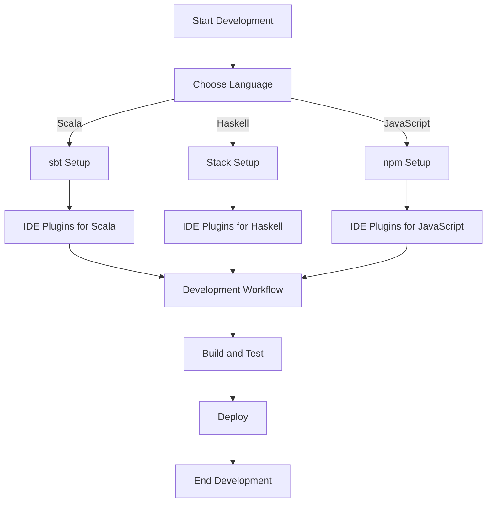

## 12.2. Leveraging Tools for Functional Development

In the realm of functional programming, the right tools can significantly enhance your development workflow, making it more efficient and enjoyable. This section delves into the essential build tools and IDE extensions that support functional programming, focusing on Scala, Haskell, and JavaScript. By leveraging these tools, developers can streamline their processes, manage dependencies effectively, and ensure code quality through enhanced IDE capabilities.

### Build Tools and Compilers Supporting FP

Build tools and compilers are crucial in managing the complexities of software development, especially in functional programming. They handle tasks such as compilation, dependency management, and build processes, allowing developers to focus on writing clean, functional code.

#### Scala: sbt (Simple Build Tool)

sbt is the de facto build tool for Scala projects. It provides a robust environment for compiling Scala code, managing dependencies, and automating tasks.

**Key Features of sbt:**
- **Incremental Compilation:** sbt compiles only the modified parts of the code, reducing build times.
- **Dependency Management:** It uses Ivy to manage project dependencies, ensuring that all required libraries are available.
- **Task Automation:** sbt allows for the automation of repetitive tasks, such as testing and packaging.

**Example sbt Configuration:**

```scala
name := "ScalaFunctionalProject"

version := "0.1"

scalaVersion := "2.13.6"

libraryDependencies += "org.typelevel" %% "cats-core" % "2.6.1"
```

This configuration sets up a basic Scala project using sbt, specifying the project name, version, Scala version, and a dependency on the Cats library, which provides functional programming abstractions.

#### Haskell: Stack

Stack is a powerful build tool for Haskell, designed to simplify the process of managing Haskell projects and their dependencies.

**Key Features of Stack:**
- **Version Management:** Stack ensures that the correct versions of GHC (Glasgow Haskell Compiler) and libraries are used.
- **Dependency Management:** It uses curated package sets to manage dependencies, reducing conflicts and ensuring compatibility.
- **Build Automation:** Stack automates the build process, making it easier to compile and test Haskell code.

**Example Stack Configuration:**

```yaml
resolver: lts-16.27

packages:
  - .

extra-deps: []

flags: {}

build: {}

haddock: {}

coverage: {}

tests: {}

benchmarks: {}
```

This configuration file sets up a basic Haskell project using Stack, specifying the resolver version and package settings.

#### JavaScript: npm (Node Package Manager)

npm is the package manager for JavaScript, widely used in both front-end and back-end development. It facilitates the installation and management of libraries and tools necessary for functional programming in JavaScript.

**Key Features of npm:**
- **Package Management:** npm provides access to a vast repository of JavaScript libraries, including functional programming libraries like Ramda.
- **Script Automation:** It allows for the automation of tasks through custom scripts defined in the `package.json` file.
- **Version Control:** npm helps manage different versions of packages, ensuring compatibility and stability.

**Example npm Configuration:**

```json
{
  "name": "javascript-functional-project",
  "version": "1.0.0",
  "main": "index.js",
  "dependencies": {
    "ramda": "^0.27.1"
  },
  "devDependencies": {
    "eslint": "^7.32.0",
    "prettier": "^2.3.2"
  }
}
```

This `package.json` file sets up a JavaScript project with dependencies on Ramda for functional programming utilities and development tools like ESLint and Prettier for code quality.

### Functional IDE Plugins and Extensions

IDE plugins and extensions play a vital role in enhancing the functional programming experience by providing features such as syntax highlighting, linting, autocomplete, and type checking.

#### Enhancing Scala Development

- **Scala Metals:** An IDE extension providing features like code navigation, refactoring, and type information.
- **IntelliJ IDEA Scala Plugin:** Offers comprehensive support for Scala development, including syntax highlighting, code completion, and error detection.

#### Enhancing Haskell Development

- **Haskell Language Server:** Provides IDE features such as code completion, type information, and linting.
- **Haskell for Visual Studio Code:** An extension that integrates Haskell tools into VS Code, offering a seamless development experience.

#### Enhancing JavaScript Development

- **ESLint:** A popular linting tool that helps maintain code quality by enforcing coding standards.
- **Prettier:** An opinionated code formatter that ensures consistent code style across the project.

### Visual Aids

To better understand how these tools integrate into the functional development workflow, consider the following flowchart:



This flowchart illustrates the integration of build tools and IDE extensions into the functional programming workflow, from setup to deployment.

### References

- [Official sbt Documentation](https://www.scala-sbt.org/)
- [Official Stack Documentation](https://docs.haskellstack.org/)
- [Official npm Documentation](https://docs.npmjs.com/)

### Conclusion

Leveraging the right tools is essential for efficient functional programming development. By utilizing build tools like sbt, Stack, and npm, along with IDE plugins and extensions, developers can enhance their productivity, manage dependencies effectively, and maintain high code quality. These tools not only streamline the development process but also empower developers to focus on writing robust, functional code.

## Quiz Time!



### Which build tool is commonly used for Scala projects?

- [x] sbt
- [ ] Maven
- [ ] Gradle
- [ ] Ant

> **Explanation:** sbt (Simple Build Tool) is the standard build tool for Scala projects, offering features like incremental compilation and dependency management.

### What is the primary purpose of Stack in Haskell development?

- [x] Managing dependencies and automating builds
- [ ] Providing a graphical user interface
- [ ] Compiling Java code
- [ ] Managing JavaScript libraries

> **Explanation:** Stack is used in Haskell development to manage dependencies, automate builds, and ensure compatibility with specific GHC versions.

### Which npm feature is crucial for managing JavaScript project dependencies?

- [x] Package management
- [ ] Code refactoring
- [ ] Syntax highlighting
- [ ] Debugging

> **Explanation:** npm's package management feature allows developers to install and manage JavaScript libraries and tools, ensuring project stability.

### What does the `libraryDependencies` setting in sbt configuration specify?

- [x] External libraries required for the project
- [ ] The main class of the project
- [ ] The Scala version
- [ ] The project name

> **Explanation:** The `libraryDependencies` setting in sbt specifies the external libraries that the project depends on.

### Which IDE extension provides Haskell support in Visual Studio Code?

- [x] Haskell for Visual Studio Code
- [ ] Scala Metals
- [ ] ESLint
- [ ] Prettier

> **Explanation:** The "Haskell for Visual Studio Code" extension integrates Haskell tools into VS Code, offering features like code completion and linting.

### What is the role of ESLint in JavaScript development?

- [x] Enforcing coding standards through linting
- [ ] Compiling TypeScript code
- [ ] Providing a graphical user interface
- [ ] Managing package dependencies

> **Explanation:** ESLint is a linting tool that helps maintain code quality by enforcing coding standards in JavaScript projects.

### Which feature of sbt reduces build times by compiling only modified parts of the code?

- [x] Incremental Compilation
- [ ] Full Compilation
- [ ] Parallel Compilation
- [ ] Lazy Compilation

> **Explanation:** Incremental Compilation in sbt reduces build times by compiling only the parts of the code that have changed.

### What does the `resolver` setting in a Stack configuration file specify?

- [x] The version of the package set to use
- [ ] The main module of the project
- [ ] The output directory for builds
- [ ] The project's license

> **Explanation:** The `resolver` setting in Stack specifies the version of the package set to use, ensuring compatibility with specific library versions.

### Which tool is used to ensure consistent code style in JavaScript projects?

- [x] Prettier
- [ ] GHC
- [ ] sbt
- [ ] Stack

> **Explanation:** Prettier is an opinionated code formatter that ensures consistent code style across JavaScript projects.

### True or False: npm is only used for managing dependencies in Node.js projects.

- [ ] True
- [x] False

> **Explanation:** False. npm is used for managing dependencies in both Node.js and front-end JavaScript projects, providing a wide range of libraries and tools.


