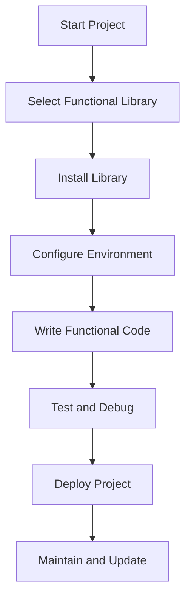

## 12.3. Integrating Functional Libraries into Projects

Incorporating functional libraries into your projects can significantly enhance your ability to write clean, efficient, and maintainable code. These libraries provide powerful abstractions and tools that align with functional programming principles, such as immutability, higher-order functions, and function composition. This section will guide you through the process of setting up and configuring functional libraries, offer best practices for their use, and provide practical examples in JavaScript, Scala, and Haskell.

### Setting Up and Configuring Libraries

Integrating functional libraries into your project involves a few key steps: selecting the appropriate library, installing it, and configuring your development environment to make the most of its features. Let's explore these steps in detail.

#### Step-by-Step Instructions

1. **Select the Right Library:**
   - **JavaScript:** Consider libraries like Ramda or Lodash/fp for functional utilities.
   - **Scala:** The Cats library is a popular choice for functional programming in Scala.
   - **Haskell:** The standard library and packages like `Data.List` offer extensive functional capabilities.

2. **Install the Library:**
   - **JavaScript with Ramda:**
     ```bash
     npm install ramda
     ```
   - **Scala with Cats:**
     Add the following dependency to your `build.sbt` file:
     ```scala
     libraryDependencies += "org.typelevel" %% "cats-core" % "2.6.1"
     ```
   - **Haskell with Data.List:**
     Ensure your Haskell environment is set up with the necessary packages, typically included in the standard library.

3. **Configure Your Environment:**
   - Ensure your IDE or text editor is configured to recognize the library's syntax and provide autocompletion and linting support.
   - Set up build tools (e.g., Webpack for JavaScript, sbt for Scala) to manage dependencies and compile your code efficiently.

### Best Practices for Using Functional Tools

To fully leverage the power of functional libraries, it's essential to adhere to best practices that promote clean and efficient code.

#### Guidelines for Structuring Code

- **Promote Immutability:** Always prefer immutable data structures. This reduces side effects and makes your code more predictable.
- **Use Higher-Order Functions:** Take advantage of functions that accept other functions as arguments or return them as results. This leads to more abstract and reusable code.
- **Compose Functions:** Build complex operations by composing simple functions. This enhances readability and maintainability.

#### Example Code Snippets

Let's look at how these principles are applied in different languages using functional libraries.

- **JavaScript with Ramda:**

  ```javascript
  const R = require('ramda');
  
  const users = [
    { name: 'Alice', age: 25 },
    { name: 'Bob', age: 30 },
    { name: 'Charlie', age: 35 }
  ];
  
  const getNames = R.map(R.prop('name'));
  const above30 = R.filter(R.propSatisfies(age => age > 30, 'age'));
  
  console.log(getNames(users)); // ['Alice', 'Bob', 'Charlie']
  console.log(above30(users)); // [{ name: 'Charlie', age: 35 }]
  ```

  Here, `R.map` and `R.filter` are higher-order functions that operate on collections, demonstrating function composition and immutability.

- **Scala with Cats:**

  ```scala
  import cats.implicits._
  
  val numbers = List(1, 2, 3, 4, 5)
  val doubled = numbers.map(_ * 2)
  val even = numbers.filter(_ % 2 == 0)
  
  println(doubled) // List(2, 4, 6, 8, 10)
  println(even) // List(2, 4)
  ```

  In Scala, the Cats library provides functional abstractions that allow for concise and expressive transformations of data.

- **Haskell with Data.List:**

  ```haskell
  import Data.List (map, filter, sort, nub)
  
  let numbers = [3, 1, 2, 3, 4, 2]
  let doubled = map (*2) numbers
  let evens = filter even numbers
  let uniqueSorted = sort (nub numbers)
  
  print doubled -- [6,2,4,6,8,4]
  print evens -- [2,4,2]
  print uniqueSorted -- [1,2,3,4]
  ```

  Haskell's `Data.List` module offers powerful functions for list manipulation, emphasizing immutability and function composition.

### Visual Aids

To better understand the integration process, let's visualize how functional libraries fit into a typical project structure using a Mermaid.js diagram.



This diagram outlines the flow from starting a project to maintaining it, highlighting the role of functional libraries in the development lifecycle.

### References

To deepen your understanding of functional programming and the use of libraries, consider the following resources:

- "Functional Programming in Scala" by Paul Chiusano and Rúnar Bjarnason.
- "Functional Programming in JavaScript" by Luis Atencio.
- "Programming in Haskell" by Graham Hutton.

These texts provide comprehensive insights into functional programming concepts and their practical applications.

## Quiz Time!



### What is the first step in integrating a functional library into a project?

- [x] Select the right library
- [ ] Install the library
- [ ] Configure the environment
- [ ] Write functional code

> **Explanation:** Selecting the right library is crucial as it determines the tools and features you'll have at your disposal.

### Which JavaScript library is mentioned for functional programming?

- [x] Ramda
- [ ] Lodash
- [ ] jQuery
- [ ] Underscore

> **Explanation:** Ramda is a popular library for functional programming in JavaScript.

### What is a key benefit of using higher-order functions?

- [x] They allow for more abstract and reusable code
- [ ] They increase code complexity
- [ ] They reduce code readability
- [ ] They are only useful in JavaScript

> **Explanation:** Higher-order functions enable abstraction and reusability, making code cleaner and more maintainable.

### In Scala, which library is commonly used for functional programming?

- [x] Cats
- [ ] Akka
- [ ] Play
- [ ] Slick

> **Explanation:** Cats is a library that provides functional programming abstractions in Scala.

### What does the `nub` function do in Haskell?

- [x] Removes duplicate elements from a list
- [ ] Sorts a list
- [ ] Filters even numbers
- [ ] Maps a function over a list

> **Explanation:** The `nub` function removes duplicate elements from a list, ensuring all elements are unique.

### Which of the following is a best practice when using functional libraries?

- [x] Promote immutability
- [ ] Use mutable data structures
- [ ] Avoid higher-order functions
- [ ] Write monolithic functions

> **Explanation:** Promoting immutability is a best practice as it reduces side effects and enhances code predictability.

### What is the purpose of the `R.map` function in Ramda?

- [x] It applies a function to each element in a list
- [ ] It filters elements from a list
- [ ] It sorts a list
- [ ] It reduces a list to a single value

> **Explanation:** `R.map` applies a function to each element in a list, transforming the list.

### How can you ensure your development environment supports a functional library?

- [x] Configure your IDE for syntax recognition and linting
- [ ] Ignore IDE configurations
- [ ] Use any text editor without configuration
- [ ] Avoid using build tools

> **Explanation:** Configuring your IDE ensures that you have syntax recognition and linting support, enhancing development efficiency.

### What is the advantage of composing functions?

- [x] It enhances readability and maintainability
- [ ] It makes code harder to understand
- [ ] It increases the number of lines of code
- [ ] It is only applicable in Haskell

> **Explanation:** Composing functions allows for building complex operations from simple ones, improving readability and maintainability.

### True or False: Functional libraries are only useful in functional programming languages.

- [ ] True
- [x] False

> **Explanation:** Functional libraries can be used in multi-paradigm languages like JavaScript to apply functional programming principles.



By following these guidelines and utilizing the provided resources, you can effectively integrate functional libraries into your projects, leading to more robust and maintainable codebases.
