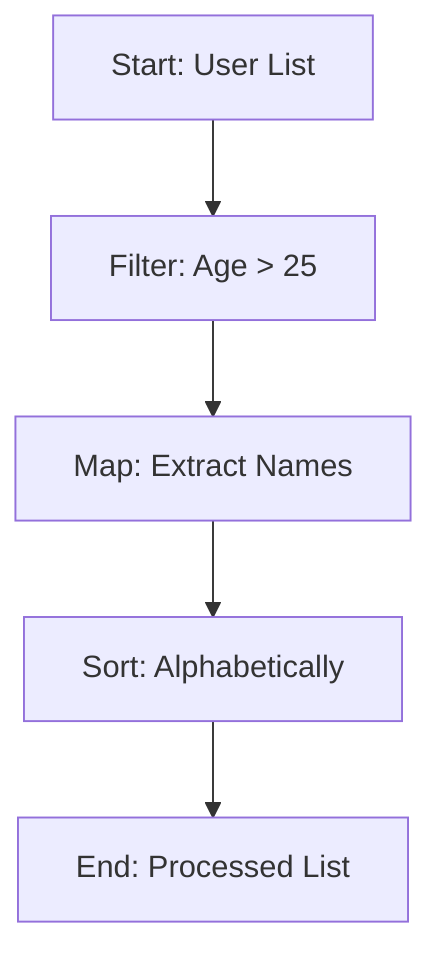

## 12.4. Functional Programming Design Patterns

In the realm of functional programming, design patterns play a crucial role in crafting code that is not only efficient but also easy to read and maintain. This section delves into some of the most prevalent design patterns in functional programming, focusing on immutability, function chaining, and pipeline operators. These patterns help developers build complex operations from simpler ones, ensuring that code remains clean and modular.

### Immutability and Function Chaining

#### Immutability

Immutability is a cornerstone of functional programming. It refers to the practice of creating data structures that cannot be modified after they are created. This approach offers several benefits:

- **Predictability:** Since immutable data cannot change, functions that operate on it are more predictable and easier to reason about.
- **Concurrency:** Immutability eliminates the risks associated with concurrent modifications, making it easier to write safe concurrent programs.
- **Simplified Debugging:** With immutable data, the state of the program is consistent, reducing the complexity of debugging.

#### Function Chaining

Function chaining is a pattern where multiple functions are called in a sequence, with each function passing its result to the next. This pattern is particularly useful for processing data through a series of transformations. It promotes:

- **Readability:** By chaining functions, the flow of data transformations becomes clear and linear.
- **Modularity:** Each function in the chain performs a single, well-defined task, making the code easier to maintain and extend.

**Scala Function Chaining Example:**

```scala
val users = List(
  Person("Alice", 25),
  Person("Bob", 30),
  Person("Charlie", 35),
  Person("Dave", 20)
)

val processed = users
  .filter(_.age > 25)
  .map(_.name)
  .sorted

println(processed) // List(Bob, Charlie)
```

In this Scala example, we filter a list of `Person` objects to include only those older than 25, map the result to extract names, and then sort the names. Each transformation is a separate function, chained together to form a cohesive data processing pipeline.

### Pipeline Operators and Function Composition

#### Pipeline Operators

Pipeline operators, such as `|>`, are syntactic constructs that allow for the chaining of function calls in a clear and concise manner. They are particularly popular in languages like Elixir and F#. The pipeline operator takes the result of an expression and passes it as the first argument to the next function.

#### Function Composition

Function composition is the process of combining two or more functions to produce a new function. This pattern is central to functional programming, allowing developers to build complex operations from simpler, reusable functions.

**JavaScript with Ramda Pipeline Example:**

```javascript
const R = require('ramda');

const processData = R.pipe(
  R.filter(R.propSatisfies(age => age > 25, 'age')),
  R.map(R.prop('name')),
  R.sortBy(R.identity)
);

const users = [
  { name: 'Alice', age: 25 },
  { name: 'Bob', age: 30 },
  { name: 'Charlie', age: 35 },
  { name: 'Dave', age: 20 }
];

console.log(processData(users)); // ['Bob', 'Charlie']
```

In this JavaScript example using Ramda, `R.pipe` is used to compose a series of functions into a single function that processes a list of users. The pipeline filters users by age, maps to extract names, and sorts the names.

### Visual Aids

To better understand how function chaining and pipeline operators work, consider the following diagram illustrating a data processing pipeline:



This diagram represents the flow of data through a series of transformations, highlighting the linear progression of operations typical in function chaining and pipeline usage.

### References

- "Design Patterns: Elements of Reusable Object-Oriented Software" by Erich Gamma et al., which provides foundational concepts that can be adapted to functional programming.
- "Functional Programming in Scala" by Paul Chiusano and Rúnar Bjarnason, offering in-depth insights into functional programming patterns and practices.

### Conclusion

Functional programming design patterns such as immutability, function chaining, and pipeline operators are essential tools for developers seeking to write clean, efficient, and maintainable code. By leveraging these patterns, you can create robust applications that are easy to understand and extend.

## Quiz Time!



### What is a key benefit of immutability in functional programming?

- [x] Predictability and easier reasoning about code
- [ ] Increased performance due to mutable state
- [ ] Simplified syntax for complex operations
- [ ] Direct manipulation of data structures

> **Explanation:** Immutability ensures that data structures do not change, making code more predictable and easier to reason about.

### How does function chaining improve code readability?

- [x] By creating a clear, linear flow of data transformations
- [ ] By reducing the number of functions needed
- [ ] By allowing direct manipulation of global state
- [ ] By minimizing the use of higher-order functions

> **Explanation:** Function chaining creates a clear, linear flow of data transformations, enhancing readability.

### What is the role of a pipeline operator in functional programming?

- [x] To chain function calls in a clear and concise manner
- [ ] To directly modify data structures
- [ ] To increase the complexity of function definitions
- [ ] To eliminate the need for function composition

> **Explanation:** Pipeline operators chain function calls, making the flow of data transformations clear and concise.

### In the JavaScript Ramda example, what does `R.pipe` do?

- [x] Composes a series of functions into a single function
- [ ] Directly modifies the input data
- [ ] Eliminates the need for function chaining
- [ ] Increases the complexity of the code

> **Explanation:** `R.pipe` composes a series of functions into a single function, facilitating function chaining.

### Which of the following is a benefit of using immutable data structures?

- [x] Safe concurrent programming
- [ ] Direct manipulation of state
- [ ] Increased memory usage
- [ ] Simplified syntax

> **Explanation:** Immutable data structures are inherently safe for concurrent programming as they cannot be modified.

### What does function composition allow developers to do?

- [x] Build complex operations from simpler, reusable functions
- [ ] Directly manipulate global state
- [ ] Increase the complexity of code
- [ ] Avoid using higher-order functions

> **Explanation:** Function composition allows developers to build complex operations from simpler, reusable functions.

### How does immutability simplify debugging?

- [x] By ensuring consistent program state
- [ ] By allowing direct state manipulation
- [ ] By reducing the number of functions
- [ ] By increasing the complexity of data structures

> **Explanation:** Immutability ensures a consistent program state, simplifying debugging.

### What is a common use case for function chaining?

- [x] Processing data through a series of transformations
- [ ] Directly modifying global variables
- [ ] Increasing code complexity
- [ ] Avoiding the use of functions

> **Explanation:** Function chaining is commonly used to process data through a series of transformations.

### Which language feature is particularly popular in Elixir and F# for chaining functions?

- [x] Pipeline operators
- [ ] Mutable state
- [ ] Direct state manipulation
- [ ] Complex syntax

> **Explanation:** Pipeline operators are popular in Elixir and F# for chaining functions.

### True or False: Immutability eliminates the risks associated with concurrent modifications.

- [x] True
- [ ] False

> **Explanation:** Immutability eliminates the risks associated with concurrent modifications, making it easier to write safe concurrent programs.


