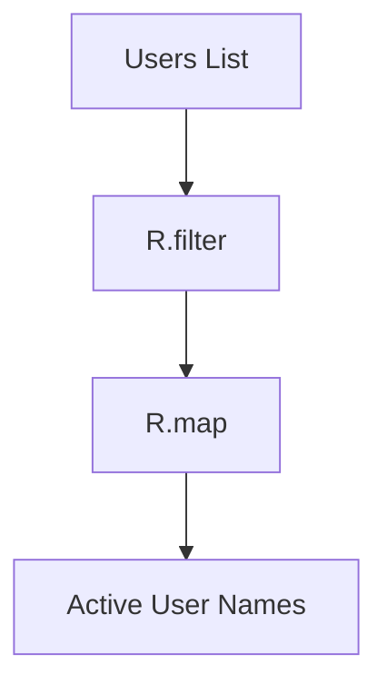

## 12.5. Practical Exercises

In this section, we will delve into practical exercises that leverage functional programming libraries to solve real-world problems. These exercises are designed to help you understand the capabilities of libraries like Ramda in JavaScript and Cats in Scala, and how they can be integrated into your projects to enhance functionality and maintainability.

### Introduction

Functional programming libraries provide a rich set of tools that simplify complex operations and promote a declarative style of coding. By engaging with these libraries through hands-on exercises, you will gain a deeper understanding of their functions and best use cases. This section will guide you through building projects and exploring library functions, with visual aids to illustrate the integration and flow of these functions within your codebases.

### Building Projects Using Functional Libraries

#### Exercise 1: JavaScript with Ramda

In this exercise, we will use the Ramda library to filter and transform a list of users based on their active status. Ramda is a practical library for functional programming in JavaScript, offering a suite of functions that make it easier to work with data in a functional style.

```javascript
const R = require('ramda');

const users = [
  { name: 'Alice', active: true },
  { name: 'Bob', active: false },
  { name: 'Charlie', active: true }
];

const getActiveUserNames = R.pipe(
  R.filter(R.propEq('active', true)),
  R.map(R.prop('name'))
);

console.log(getActiveUserNames(users)); // ['Alice', 'Charlie']
```

**Explanation:**

- **R.pipe:** This function creates a pipeline of functions that process data in sequence. It takes multiple functions as arguments and returns a new function.
- **R.filter:** Filters the list of users based on a predicate function. Here, `R.propEq('active', true)` is used to filter users who are active.
- **R.map:** Transforms the filtered list by extracting the `name` property from each user object.

**Exercise Instructions:**

1. Install Ramda using npm: `npm install ramda`.
2. Implement the code snippet above in a JavaScript file.
3. Run the file to see the output and verify the functionality.
4. Modify the exercise to filter users based on different criteria, such as names starting with a specific letter.

#### Exercise 2: Scala with Cats

In this exercise, we will use the Cats library in Scala to achieve similar functionality. Cats is a powerful library that provides abstractions for functional programming in Scala, allowing for elegant and concise code.

```scala
import cats.implicits._

case class User(name: String, active: Boolean)

val users = List(
  User("Alice", true),
  User("Bob", false),
  User("Charlie", true)
)

val getActiveUserNames = users.filter(_.active).map(_.name)
println(getActiveUserNames) // List(Alice, Charlie)
```

**Explanation:**

- **filter:** A standard Scala collection method used to filter elements based on a predicate.
- **map:** Transforms each element of the list by applying a function, in this case, extracting the `name` property.

**Exercise Instructions:**

1. Ensure you have the Cats library set up in your Scala project.
2. Implement the code snippet in a Scala file.
3. Compile and run the program to verify the output.
4. Extend the exercise by adding more user attributes and filtering based on multiple conditions.

### Exploring Library Functions Through Hands-On Examples

To deepen your understanding of functional libraries, explore additional functions provided by Ramda and Cats. Experiment with different combinations and see how they can simplify complex operations.

#### Additional Exercises:

- **Ramda:** Use `R.groupBy` to categorize users by their active status and `R.sortBy` to sort them alphabetically by name.
- **Cats:** Utilize `Foldable` and `Traverse` to aggregate user data and perform side-effectful operations in a controlled manner.

### Visual Aids

To better understand the integration and flow of functional library functions, consider the following diagram illustrating the data transformation process using Ramda:



**Explanation:**

- **Users List:** The initial data structure containing user objects.
- **R.filter:** Filters the list based on a condition.
- **R.map:** Transforms the filtered list to extract specific properties.
- **Active User Names:** The final output of the transformation process.

### Conclusion

By completing these exercises, you will gain practical experience in using functional programming libraries to solve real-world problems. These libraries not only simplify complex operations but also promote a clean and maintainable codebase. Continue exploring the vast array of functions available in these libraries to enhance your functional programming skills.

### References

- "JavaScript Allongé" by Reginald Braithwaite.
- "Functional Programming in Scala" by Paul Chiusano and Rúnar Bjarnason.

## Quiz Time!



### What is the primary purpose of using functional libraries like Ramda and Cats?

- [x] To simplify complex operations and promote a declarative coding style
- [ ] To replace all imperative code with functional code
- [ ] To make code execution faster
- [ ] To eliminate the need for any other libraries

> **Explanation:** Functional libraries provide tools that simplify complex operations and promote a declarative style of coding, making code more readable and maintainable.

### In the Ramda exercise, what does the `R.pipe` function do?

- [x] It creates a pipeline of functions that process data in sequence
- [ ] It filters data based on a condition
- [ ] It maps data to a new format
- [ ] It sorts data alphabetically

> **Explanation:** `R.pipe` is used to create a sequence of functions that process data step-by-step, allowing for a clean and readable transformation process.

### Which Scala library is used in the exercises to demonstrate functional programming?

- [ ] Scalaz
- [x] Cats
- [ ] Akka
- [ ] Play

> **Explanation:** The Cats library is used in the exercises to demonstrate functional programming in Scala, providing powerful abstractions for functional code.

### What does the `R.filter` function do in the Ramda exercise?

- [x] It filters the list of users based on a predicate function
- [ ] It transforms each element of the list
- [ ] It sorts the list in ascending order
- [ ] It groups elements by a specified key

> **Explanation:** `R.filter` is used to filter elements of a list based on a given predicate, in this case, checking if users are active.

### In the Scala exercise, what method is used to transform each element of the list?

- [ ] filter
- [x] map
- [ ] fold
- [ ] reduce

> **Explanation:** The `map` method is used to transform each element of the list by applying a function, such as extracting the `name` property.

### What is the output of the Ramda exercise code snippet?

- [ ] ['Bob']
- [x] ['Alice', 'Charlie']
- [ ] ['Alice', 'Bob']
- [ ] ['Charlie']

> **Explanation:** The output is `['Alice', 'Charlie']` because the code filters for active users and maps their names.

### What is the main advantage of using `R.pipe` in functional programming?

- [x] It allows for a clean and readable transformation process
- [ ] It increases the speed of code execution
- [ ] It reduces the number of lines of code
- [ ] It automatically handles errors

> **Explanation:** `R.pipe` allows for a clean and readable transformation process by chaining functions in a logical sequence.

### Which function in Cats is used to filter elements based on a condition?

- [x] filter
- [ ] map
- [ ] fold
- [ ] traverse

> **Explanation:** The `filter` function is used to filter elements of a collection based on a given condition.

### What is the purpose of the `R.map` function in the Ramda exercise?

- [ ] To filter elements based on a condition
- [x] To transform the filtered list by extracting specific properties
- [ ] To sort the list in descending order
- [ ] To group elements by a specified key

> **Explanation:** `R.map` is used to transform the filtered list by extracting specific properties, such as the `name` of each user.

### True or False: Functional libraries like Ramda and Cats can help in writing more maintainable code.

- [x] True
- [ ] False

> **Explanation:** True. Functional libraries promote a declarative style of coding, which leads to more readable and maintainable code.


