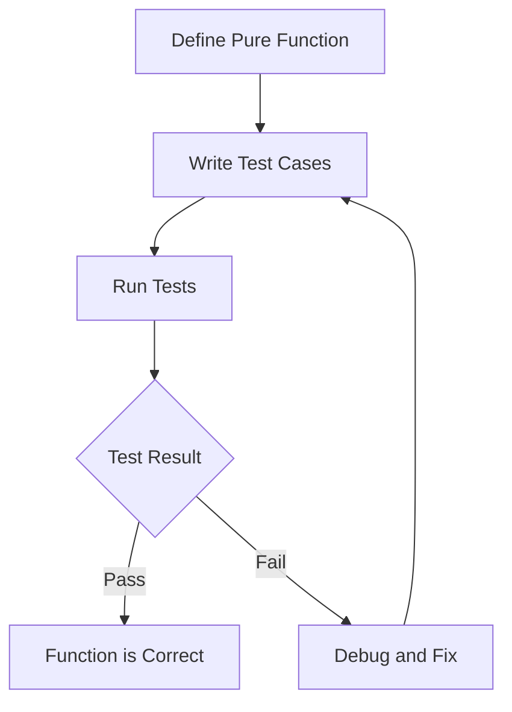

## 13.1. Importance of Testing in Functional Programming

In the realm of software development, testing is a cornerstone practice that ensures code correctness, reliability, and maintainability. This is particularly true in functional programming (FP), where the paradigm's emphasis on pure functions and immutability offers unique advantages and challenges for testing. In this section, we will delve into the importance of testing in FP, explore the deterministic nature of pure functions, and provide practical examples of how to implement tests in various functional programming languages.

### Ensuring Code Correctness and Reliability

Testing in functional programming is crucial for several reasons:

1. **Validation of Pure Functions:** Pure functions, by definition, are deterministic and free of side effects. This means that for a given input, a pure function will always produce the same output. Testing these functions is straightforward and reliable, as it involves verifying that the function consistently returns the expected result.

2. **Correctness in Function Composition:** Functional programming often involves composing simple functions to build more complex operations. Testing ensures that these compositions behave correctly and that the integration of functions does not introduce unexpected behavior.

3. **Facilitating Refactoring:** The immutability and stateless nature of functional programming make code easier to refactor. Tests serve as a safety net, allowing developers to make changes with confidence that the functionality remains intact.

4. **Enhancing Code Reliability:** By rigorously testing functions, developers can catch errors early in the development process, leading to more reliable and robust software.

### Visualizing the Testing Process

To better understand the testing process in functional programming, let's look at a conceptual diagram illustrating how pure functions are tested:



This diagram highlights the deterministic nature of pure functions, where the testing process involves defining the function, writing test cases, running the tests, and iterating based on the results.

### Code Snippets: Testing in Different Languages

#### Haskell Unit Test Example

Haskell, a purely functional language, provides a robust framework for testing pure functions. Here's a simple example using HUnit, a unit testing framework for Haskell:

```haskell
import Test.HUnit

-- Define a simple pure function
add :: Int -> Int -> Int
add x y = x + y

-- Create a test case for the add function
addTest = TestCase (assertEqual "for (add 2 3)," (add 2 3) 5)

-- Run the test
main = runTestTT addTest
```

In this example, we define a pure function `add` and a corresponding test case `addTest` that asserts the function's correctness. The `runTestTT` function executes the test, providing feedback on the result.

#### JavaScript Unit Test Example with Jest

JavaScript, while not a purely functional language, supports functional programming concepts and testing through libraries like Jest. Here's how you can test a pure function in JavaScript:

```javascript
// Define a simple pure function
const add = (x, y) => x + y;

// Write a test case using Jest
test('adds 2 + 3 to equal 5', () => {
  expect(add(2, 3)).toBe(5);
});
```

This example demonstrates how to use Jest to test the `add` function, ensuring it produces the expected result.

### Best Practices for Testing in Functional Programming

- **Test Pure Functions Thoroughly:** Since pure functions are deterministic, ensure that all possible input scenarios are covered in your tests.
- **Leverage Property-Based Testing:** Tools like QuickCheck (for Haskell) allow you to test properties of functions over a wide range of inputs, providing a more comprehensive testing approach.
- **Isolate Side Effects:** When testing functions that interact with external systems or have side effects, isolate these effects to maintain test reliability.

### References and Further Reading

To deepen your understanding of testing in functional programming, consider exploring the following resources:

- "Test-Driven Development with Python" by Harry J.W. Percival: A comprehensive guide to test-driven development, applicable to functional programming concepts.
- "Functional Programming in Scala" by Paul Chiusano and Rúnar Bjarnason: This book provides insights into functional programming and testing in Scala.

### Summary of Key Points

- Testing is essential in functional programming to ensure the correctness and reliability of pure functions and composed operations.
- Pure functions' deterministic nature simplifies testing, allowing for straightforward validation of expected outcomes.
- Practical examples in Haskell and JavaScript illustrate how to implement unit tests for pure functions.
- Best practices include thorough testing of pure functions, leveraging property-based testing, and isolating side effects.

By understanding and applying these testing principles, you can enhance the quality and reliability of your functional programming projects.

## Quiz Time!



### Why is testing particularly important in functional programming?

- [x] To validate that pure functions behave as expected.
- [ ] To ensure that mutable state is correctly managed.
- [ ] To test the performance of imperative loops.
- [ ] To verify the correctness of global variables.

> **Explanation:** Testing in functional programming is crucial for validating the behavior of pure functions, which are deterministic and free of side effects.

### What is a key advantage of testing pure functions?

- [x] They are deterministic, making tests reliable.
- [ ] They require complex setup and teardown processes.
- [ ] They often involve mutable state.
- [ ] They depend on external systems.

> **Explanation:** Pure functions are deterministic, meaning they always produce the same output for the same input, making tests straightforward and reliable.

### Which tool is commonly used for property-based testing in Haskell?

- [x] QuickCheck
- [ ] Jest
- [ ] Mocha
- [ ] JUnit

> **Explanation:** QuickCheck is a popular tool for property-based testing in Haskell, allowing for comprehensive testing across a range of inputs.

### In the provided Haskell example, what does the `assertEqual` function do?

- [x] It checks if the actual result matches the expected result.
- [ ] It runs the test suite.
- [ ] It initializes the test environment.
- [ ] It logs the test results to a file.

> **Explanation:** `assertEqual` is used to verify that the actual result of a function matches the expected result in a test case.

### What is the purpose of the `runTestTT` function in Haskell?

- [x] To execute the test cases and report results.
- [ ] To define a new test case.
- [ ] To compile the Haskell code.
- [ ] To generate test data.

> **Explanation:** `runTestTT` is used to run the test cases defined in HUnit and report the results.

### In JavaScript, which library is used in the example to test the `add` function?

- [x] Jest
- [ ] Mocha
- [ ] Jasmine
- [ ] QUnit

> **Explanation:** Jest is the library used in the JavaScript example to test the `add` function.

### What is a benefit of using property-based testing?

- [x] It tests properties of functions over a wide range of inputs.
- [ ] It focuses on testing specific edge cases only.
- [ ] It requires less code than unit testing.
- [ ] It is only applicable to object-oriented programming.

> **Explanation:** Property-based testing allows for testing the properties of functions over a wide range of inputs, providing a comprehensive testing approach.

### Which of the following is a best practice for testing in functional programming?

- [x] Isolate side effects when testing.
- [ ] Use global variables to manage state.
- [ ] Avoid testing pure functions.
- [ ] Focus only on performance testing.

> **Explanation:** Isolating side effects is a best practice in functional programming to maintain test reliability and focus on pure logic.

### What does the `expect` function do in the JavaScript Jest example?

- [x] It asserts that the actual result matches the expected result.
- [ ] It initializes the test environment.
- [ ] It logs the test results.
- [ ] It compiles the JavaScript code.

> **Explanation:** The `expect` function in Jest is used to assert that the actual result of a function matches the expected result.

### True or False: Pure functions in functional programming are non-deterministic.

- [ ] True
- [x] False

> **Explanation:** Pure functions are deterministic, meaning they always produce the same output for the same input, which is a key characteristic in functional programming.


