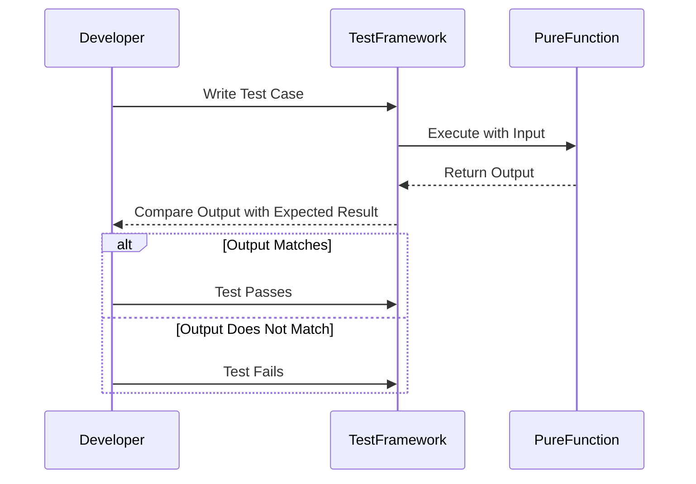

## 13.2. Unit Testing Pure Functions

In the realm of functional programming, pure functions stand out due to their deterministic nature, making them inherently easier to test. This section delves into the nuances of unit testing pure functions, exploring the benefits, methodologies, and tools that facilitate effective testing in functional programming environments.

### Writing Tests for Deterministic Functions

Pure functions are characterized by their predictability: given the same input, they will always produce the same output without side effects. This determinism simplifies the testing process, as it allows developers to focus solely on input-output validation. Here's why testing pure functions is straightforward and effective:

- **Predictability:** Since pure functions do not rely on external state or cause side effects, tests can be written with confidence that the function's behavior is consistent across different environments and runs.
- **Isolation:** Pure functions can be tested in isolation, without the need for complex setup or teardown procedures that are often required for impure functions.
- **Simplicity:** The absence of side effects means that tests for pure functions are simpler and more focused, often requiring fewer lines of code to achieve comprehensive coverage.

#### Example: Testing a Simple Addition Function

Consider a simple addition function. Testing this function involves verifying that it returns the correct sum for given inputs:

- **Function Definition:**
  ```haskell
  add :: Int -> Int -> Int
  add x y = x + y
  ```

- **Test Case:**
  ```haskell
  addTest = TestCase (assertEqual "for (add 2 3)," (add 2 3) 5)
  ```

This test case checks that the `add` function returns `5` when provided with the inputs `2` and `3`.

### Tools and Frameworks for Functional Testing

Several testing frameworks are tailored for functional programming languages, providing robust tools for writing and executing tests. Here are some popular options:

- **HUnit for Haskell:** A unit testing framework that allows Haskell developers to write concise and expressive tests.
- **ScalaTest for Scala:** A flexible testing tool that supports a variety of testing styles, including behavior-driven development (BDD).
- **Jest for JavaScript:** A comprehensive testing framework that integrates seamlessly with JavaScript, offering features like snapshot testing and mocking.

#### Haskell with HUnit

HUnit is a lightweight testing framework for Haskell, inspired by JUnit. It provides a simple interface for defining and running tests.

- **Example Code:**
  ```haskell
  import Test.HUnit

  add :: Int -> Int -> Int
  add x y = x + y

  addTest = TestCase (assertEqual "for (add 2 3)," (add 2 3) 5)

  main = runTestTT addTest
  ```

This code snippet demonstrates how to define a test case using HUnit, checking that the `add` function behaves as expected.

#### JavaScript with Jest

Jest is a popular testing framework for JavaScript, known for its ease of use and powerful features.

- **Example Code:**
  ```javascript
  const add = (x, y) => x + y;

  test('adds 2 + 3 to equal 5', () => {
    expect(add(2, 3)).toBe(5);
  });
  ```

This example illustrates how to write a simple test using Jest, verifying that the `add` function returns the correct result.

### Visual Aids

To better understand the unit testing workflow for pure functions, consider the following sequence diagram created using Mermaid.js:



This diagram illustrates the straightforward process of writing and executing tests for pure functions, highlighting the role of the developer, the test framework, and the function itself.

### Conclusion

Unit testing pure functions is a fundamental practice in functional programming, leveraging the deterministic nature of these functions to ensure code reliability and correctness. By utilizing appropriate tools and frameworks, developers can efficiently validate their code, leading to more robust and maintainable software.

### References

- "JavaScript Testing with Jest" by Brian Lonsdorf.
- "Real World Haskell" by Bryan O'Sullivan, John Goerzen, and Don Stewart.

## Quiz Time!



### What is a key characteristic of pure functions that makes them easier to test?

- [x] Determinism
- [ ] Complexity
- [ ] Side effects
- [ ] Randomness

> **Explanation:** Pure functions are deterministic, meaning they always produce the same output for the same input, which simplifies testing.

### Which testing framework is commonly used for Haskell?

- [x] HUnit
- [ ] Jest
- [ ] ScalaTest
- [ ] Mocha

> **Explanation:** HUnit is a popular testing framework for Haskell, inspired by JUnit.

### In the context of unit testing, what does "isolation" refer to?

- [x] Testing functions without external dependencies
- [ ] Running tests in parallel
- [ ] Using mock objects
- [ ] Testing multiple functions together

> **Explanation:** Isolation in unit testing means testing functions without relying on external state or dependencies.

### Which JavaScript testing framework is known for its ease of use and powerful features?

- [x] Jest
- [ ] Mocha
- [ ] Jasmine
- [ ] QUnit

> **Explanation:** Jest is a widely used JavaScript testing framework known for its simplicity and robust feature set.

### What is the primary focus when testing pure functions?

- [x] Input-output validation
- [ ] Performance optimization
- [ ] User interface testing
- [ ] Security testing

> **Explanation:** Testing pure functions primarily involves validating that the output matches the expected result for given inputs.

### Which of the following is NOT a benefit of testing pure functions?

- [ ] Predictability
- [ ] Isolation
- [ ] Simplicity
- [x] Complexity

> **Explanation:** Testing pure functions is generally simpler and more predictable due to their deterministic nature.

### What does the sequence diagram in this section illustrate?

- [x] The workflow of unit testing pure functions
- [ ] The process of writing impure functions
- [ ] The architecture of a testing framework
- [ ] The lifecycle of a software application

> **Explanation:** The sequence diagram illustrates the workflow of unit testing pure functions, showing the interaction between the developer, test framework, and function.

### Which language is ScalaTest associated with?

- [x] Scala
- [ ] Haskell
- [ ] JavaScript
- [ ] Python

> **Explanation:** ScalaTest is a testing framework designed for the Scala programming language.

### What is the main advantage of using Jest for JavaScript testing?

- [x] Comprehensive features and ease of use
- [ ] Limited functionality
- [ ] Complex setup
- [ ] Lack of documentation

> **Explanation:** Jest is favored for its comprehensive features and ease of use in JavaScript testing.

### True or False: Pure functions can have side effects.

- [ ] True
- [x] False

> **Explanation:** Pure functions do not have side effects; they only depend on their input and produce consistent output.


