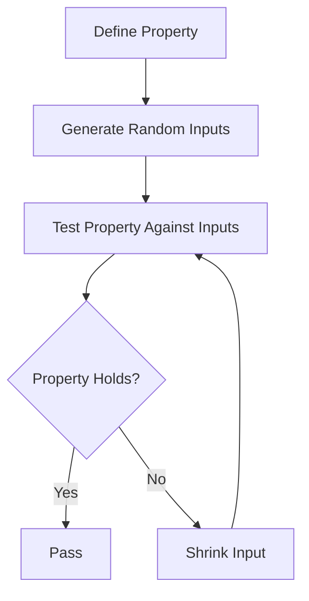

## 13.3. Introduction to Property-Based Testing

In the realm of functional programming, testing is a crucial component that ensures the reliability and correctness of code. While traditional testing methods focus on specific input-output pairs, property-based testing offers a more robust approach by specifying properties that functions should satisfy across a wide range of inputs. This section delves into the concepts and benefits of property-based testing, explores tools like QuickCheck and jest-property-based, and provides practical examples to illustrate its implementation.

### Concepts and Benefits of Property-Based Testing

Property-based testing is a testing methodology where you define properties or invariants that your code should always satisfy, regardless of the input values. Instead of writing individual test cases with specific inputs and expected outputs, you describe the general behavior of the function. The testing framework then generates a wide range of random inputs to verify that the property holds true in all cases.

#### Key Concepts

- **Properties:** These are general assertions about the behavior of your code. For example, a property for an addition function might be that it is commutative: `add(x, y) == add(y, x)`.
- **Random Input Generation:** The testing tool automatically generates a diverse set of inputs to test the properties, often covering edge cases that a developer might not consider.
- **Shrinking:** When a test fails, the tool attempts to simplify the input to the smallest case that still causes the failure, making debugging easier.

#### Benefits

- **Comprehensive Testing:** By testing a wide range of inputs, property-based testing can uncover edge cases and bugs that traditional testing might miss.
- **Specification of Behavior:** It encourages developers to think about the general behavior and properties of their functions, leading to better design.
- **Automated Test Case Generation:** Reduces the manual effort involved in writing exhaustive test cases.

### Implementing Property-Based Testing with Tools

Several tools facilitate property-based testing in different programming languages. Here, we explore two popular tools: QuickCheck for Haskell and jest-property-based for JavaScript.

#### QuickCheck in Haskell

QuickCheck is a pioneering tool for property-based testing in Haskell. It allows you to define properties as Haskell functions and automatically tests them with a variety of inputs.

**Example: Testing Associativity of Addition**

```haskell
import Test.QuickCheck

-- Define a property for associativity of addition
addAssociative :: Int -> Int -> Int -> Bool
addAssociative x y z = (x + y) + z == x + (y + z)

-- Main function to run the test
main = quickCheck addAssociative
```

In this example, `addAssociative` is a property that checks if addition is associative for integers. QuickCheck generates random integers for `x`, `y`, and `z` and verifies the property.

#### Jest Property-Based Testing in JavaScript

For JavaScript, jest-property-based is an extension that integrates property-based testing into the Jest framework.

**Example: Testing Associativity of Addition**

```javascript
const add = (x, y) => x + y;

// Define a property for associativity of addition
test('addition is associative', () => {
  property(
    (x, y, z) => add(add(x, y), z) === add(x, add(y, z))
  )(q => q);
});
```

Here, the `property` function is used to define the associative property of addition. The framework generates random numbers for `x`, `y`, and `z` to test the property.

### Visualizing Property-Based Testing

To better understand the flow of property-based testing, consider the following diagram:



This diagram illustrates the process of property-based testing, where properties are defined, random inputs are generated, and properties are tested. If a property fails, the input is shrunk to find the minimal failing case.

### Practical Exercises

To reinforce your understanding of property-based testing, try the following exercises:

1. **Exercise 1: Commutativity of Multiplication**
   - Define a property to test the commutativity of multiplication in Haskell using QuickCheck.
   - Implement the same property in JavaScript using jest-property-based.

2. **Exercise 2: Identity Property**
   - Write a property to test the identity property of addition (i.e., `add(x, 0) == x`) in both Haskell and JavaScript.

3. **Exercise 3: Edge Case Exploration**
   - Modify the addition property to include edge cases, such as negative numbers and zero, and observe how the testing tool handles them.

### References

- "ScalaTest: Effective Testing for Scala and Java Developers" by David Pollak.
- "Functional Programming in Scala" by Paul Chiusano and Rúnar Bjarnason.

### Summary of Key Points

Property-based testing is a powerful technique in functional programming that allows developers to specify general properties of their code and automatically test these properties against a wide range of inputs. Tools like QuickCheck and jest-property-based facilitate this process, making it easier to uncover edge cases and ensure code reliability.

## Quiz Time!



### What is the main advantage of property-based testing over traditional testing?

- [x] It tests properties across a wide range of inputs.
- [ ] It requires less setup time.
- [ ] It is easier to write than traditional tests.
- [ ] It only tests specific input-output pairs.

> **Explanation:** Property-based testing focuses on testing properties across a wide range of inputs, which helps uncover edge cases that might be missed by traditional testing.

### Which tool is commonly used for property-based testing in Haskell?

- [x] QuickCheck
- [ ] Jest
- [ ] Mocha
- [ ] Jasmine

> **Explanation:** QuickCheck is a popular tool for property-based testing in Haskell.

### In property-based testing, what is the purpose of shrinking?

- [x] To simplify the input to the smallest case that still causes a failure.
- [ ] To increase the number of test cases.
- [ ] To reduce the execution time of tests.
- [ ] To enhance the readability of test cases.

> **Explanation:** Shrinking simplifies the input to the smallest case that still causes a failure, making it easier to debug.

### What is a property in the context of property-based testing?

- [x] A general assertion about the behavior of code.
- [ ] A specific input-output pair.
- [ ] A configuration setting for tests.
- [ ] A type of test case.

> **Explanation:** A property is a general assertion about the behavior of code that should hold true for a wide range of inputs.

### Which of the following is a property of addition that can be tested?

- [x] Commutativity
- [ ] Identity
- [x] Associativity
- [ ] Distributivity

> **Explanation:** Commutativity and associativity are properties of addition that can be tested.

### How does jest-property-based integrate with Jest?

- [x] It extends Jest to support property-based testing.
- [ ] It replaces Jest as a testing framework.
- [ ] It is a standalone testing tool.
- [ ] It only works with Mocha.

> **Explanation:** jest-property-based extends Jest to support property-based testing.

### What is the role of random input generation in property-based testing?

- [x] To test properties with a diverse set of inputs.
- [ ] To reduce the number of test cases.
- [ ] To ensure tests run faster.
- [ ] To simplify test setup.

> **Explanation:** Random input generation tests properties with a diverse set of inputs, helping to uncover edge cases.

### Which of the following is NOT a benefit of property-based testing?

- [ ] Comprehensive testing
- [ ] Automated test case generation
- [ ] Specification of behavior
- [x] Reduced code complexity

> **Explanation:** While property-based testing offers comprehensive testing and automated test case generation, it does not necessarily reduce code complexity.

### What is the main focus of property-based testing?

- [x] Testing the general behavior of functions.
- [ ] Testing specific input-output pairs.
- [ ] Reducing test execution time.
- [ ] Simplifying test setup.

> **Explanation:** Property-based testing focuses on testing the general behavior of functions across a wide range of inputs.

### True or False: Property-based testing can only be used in functional programming languages.

- [ ] True
- [x] False

> **Explanation:** Property-based testing can be used in various programming paradigms, not just functional programming.


