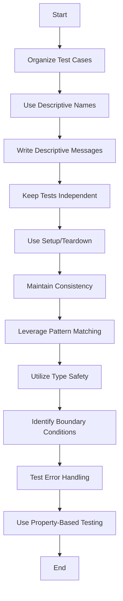

---

linkTitle: "13.4. Writing Effective Tests for Functional Code"
title: "Effective Testing Strategies for Functional Programming"
description: "Explore strategies for writing effective tests in functional programming, focusing on readability, maintenance, and handling edge cases."
categories:
- Functional Programming
- Software Testing
- Code Quality
tags:
- Functional Programming
- Testing
- Code Quality
- JavaScript
- Haskell
date: 2024-10-25
type: docs
nav_weight: 13400

---

## 13.4. Writing Effective Tests for Functional Code

In the realm of functional programming, testing plays a crucial role in ensuring that code behaves as expected. Functional programming's emphasis on pure functions and immutability provides a solid foundation for creating reliable and maintainable tests. This section will delve into strategies for writing effective tests, focusing on structuring tests for readability and maintenance, handling edge cases, and leveraging the strengths of functional programming.

### Structuring Tests for Readability and Maintenance

A well-structured test suite is essential for maintaining code quality over time. Here are some guidelines to help you organize your tests effectively:

#### 1. Organize Test Cases Logically

Group related tests together to make it easier to understand the functionality being tested. Use descriptive names for test files and directories to indicate the module or feature they cover.

#### 2. Use Clear and Descriptive Naming Conventions

Naming conventions are vital for test readability. Test names should clearly describe the behavior being tested. For example, instead of naming a test `test1`, use a descriptive name like `testDivideByNonZero`.

#### 3. Write Descriptive Test Messages

When a test fails, a descriptive message can help quickly identify the issue. Use assert statements with custom messages to provide context about the expected behavior.

#### 4. Keep Tests Independent

Ensure that each test is independent and does not rely on the outcome of other tests. This independence allows tests to be run in any order and simplifies debugging.

#### 5. Use Setup and Teardown Methods

For tests that require specific setup or teardown steps, use dedicated methods to prepare the test environment. This approach keeps the test logic focused and reduces duplication.

#### 6. Maintain Consistency Across Tests

Consistency in test structure and style makes it easier for developers to understand and maintain the test suite. Establish and adhere to a consistent testing style guide.

### Handling Edge Cases in Functional Testing

Edge cases are scenarios that occur at the extreme ends of operating parameters. Identifying and testing these cases is crucial for comprehensive test coverage.

#### 1. Leverage Exhaustive Pattern Matching

Functional programming languages often support pattern matching, which can be used to handle different cases explicitly. This feature helps ensure that all possible inputs are considered.

#### 2. Utilize Type Safety

Type systems in functional languages can prevent many common errors. Use types to enforce constraints and guide the handling of edge cases.

#### 3. Identify Boundary Conditions

Consider inputs that are at the limits of acceptable values, such as zero, negative numbers, or maximum values. Test these conditions to ensure the program handles them correctly.

#### 4. Test Error Handling

Ensure that your code gracefully handles errors and unexpected inputs. Write tests that verify error messages and exception handling behavior.

#### 5. Use Property-Based Testing

Property-based testing tools, like QuickCheck, allow you to specify properties that should hold true for a wide range of inputs. This approach can uncover edge cases that traditional example-based tests might miss.

### Visual Aids

To illustrate best practices in structuring and maintaining functional tests, consider the following flowchart:



### Code Snippets

Let's explore how to implement these testing strategies using JavaScript with Jest and Haskell with HUnit.

#### JavaScript with Jest

```javascript
const divide = (x, y) => {
  if (y === 0) throw new Error("Division by zero");
  return x / y;
};

describe('divide', () => {
  test('divides positive numbers correctly', () => {
    expect(divide(10, 2)).toBe(5);
  });
  
  test('throws error on division by zero', () => {
    expect(() => divide(10, 0)).toThrow("Division by zero");
  });
});
```

In this example, we define a `divide` function and write tests to verify its behavior. The tests are organized within a `describe` block, and each test has a descriptive name and message.

#### Haskell with HUnit

```haskell
import Test.HUnit

divide :: Int -> Int -> Either String Int
divide _ 0 = Left "Division by zero"
divide x y = Right (x `div` y)

testDivideSuccess = TestCase (assertEqual "for (divide 10 2)," (divide 10 2) (Right 5))
testDivideFailure = TestCase (assertEqual "for (divide 10 0)," (divide 10 0) (Left "Division by zero"))

main = runTestTT $ TestList [testDivideSuccess, testDivideFailure]
```

In Haskell, we use the `Either` type to handle division errors. The tests verify both successful division and error handling, with clear messages indicating the expected outcomes.

### References

- "Clean Code" by Robert C. Martin.
- "Functional Programming in Scala" by Paul Chiusano and Rúnar Bjarnason.

### Conclusion

Writing effective tests for functional code involves organizing tests for readability and maintenance, handling edge cases, and leveraging the strengths of functional programming. By following these guidelines, you can create a robust test suite that ensures code quality and reliability.

## Quiz Time!



### What is a key benefit of using descriptive test names?

- [x] They make it easier to understand the behavior being tested.
- [ ] They reduce the number of tests needed.
- [ ] They improve the performance of the test suite.
- [ ] They eliminate the need for comments in the code.

> **Explanation:** Descriptive test names provide clarity about what each test is verifying, making it easier for developers to understand the purpose of the test.

### Why should tests be independent of each other?

- [x] To allow tests to be run in any order without affecting results.
- [ ] To reduce the number of test files.
- [ ] To improve the speed of test execution.
- [ ] To eliminate the need for setup and teardown methods.

> **Explanation:** Independent tests ensure that the outcome of one test does not affect another, allowing for flexible test execution and easier debugging.

### What is the purpose of using setup and teardown methods in tests?

- [x] To prepare and clean up the test environment.
- [ ] To increase the number of test cases.
- [ ] To improve test execution speed.
- [ ] To reduce the need for descriptive test names.

> **Explanation:** Setup and teardown methods help prepare the environment for testing and clean up afterward, ensuring that tests run in a controlled and consistent state.

### How can exhaustive pattern matching help in testing?

- [x] By ensuring all possible inputs are considered.
- [ ] By reducing the number of test cases needed.
- [ ] By improving test execution speed.
- [ ] By eliminating the need for error handling.

> **Explanation:** Exhaustive pattern matching allows developers to explicitly handle all possible input cases, ensuring comprehensive test coverage.

### What is a benefit of using property-based testing?

- [x] It can uncover edge cases that example-based tests might miss.
- [ ] It reduces the number of test cases needed.
- [ ] It improves test execution speed.
- [ ] It eliminates the need for descriptive test names.

> **Explanation:** Property-based testing explores a wide range of inputs to verify that certain properties hold true, potentially uncovering edge cases that were not anticipated.

### Why is type safety important in functional testing?

- [x] It prevents many common errors and guides edge case handling.
- [ ] It reduces the number of test cases needed.
- [ ] It improves test execution speed.
- [ ] It eliminates the need for setup and teardown methods.

> **Explanation:** Type safety helps catch errors at compile time and provides a framework for handling edge cases effectively.

### What is an edge case in testing?

- [x] A scenario that occurs at the extreme ends of operating parameters.
- [ ] A test case that is redundant.
- [ ] A test case that improves performance.
- [ ] A scenario that is not important to test.

> **Explanation:** Edge cases are conditions that occur at the boundaries of input ranges and are critical to test to ensure robustness.

### How does maintaining consistency across tests benefit a test suite?

- [x] It makes the test suite easier to understand and maintain.
- [ ] It reduces the number of test cases needed.
- [ ] It improves test execution speed.
- [ ] It eliminates the need for descriptive test names.

> **Explanation:** Consistency in test structure and style helps developers quickly understand and maintain the test suite.

### What is a common pitfall in writing tests?

- [x] Making tests dependent on each other.
- [ ] Using descriptive test names.
- [ ] Writing too many tests.
- [ ] Using setup and teardown methods.

> **Explanation:** Dependent tests can lead to unpredictable results and make debugging more difficult.

### True or False: Property-based testing can replace all example-based tests.

- [ ] True
- [x] False

> **Explanation:** While property-based testing is powerful for exploring a wide range of inputs, example-based tests are still valuable for verifying specific scenarios and expected outcomes.


