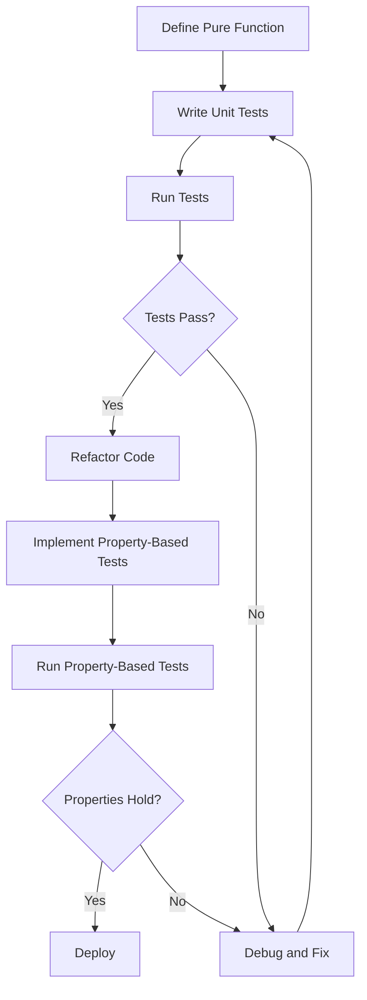

## 13.5. Practical Exercises

Testing is a cornerstone of software development, ensuring that code behaves as expected and remains robust over time. In functional programming, the emphasis on pure functions and immutability provides unique advantages for testing. This section will guide you through practical exercises to solidify your understanding of testing functional code, focusing on unit tests and property-based tests.

### Introduction

Functional programming offers a distinct advantage when it comes to testing due to its reliance on pure functions. Pure functions, by definition, have no side effects and produce the same output for the same input, making them ideal candidates for unit testing. Additionally, property-based testing allows us to verify that functions adhere to expected properties across a wide range of inputs, providing a more comprehensive validation than traditional example-based tests.

### Writing Unit Tests for Functional Programs

Unit tests are designed to test individual units of code, typically functions, to ensure they perform as expected. In functional programming, unit tests are straightforward due to the deterministic nature of pure functions.

#### Exercise 1: Unit Testing in Haskell

Let's start with a simple exercise in Haskell. We'll write unit tests for a pure function that calculates the square of a number.

```haskell
-- Define the function to be tested
square :: Int -> Int
square x = x * x

-- Import the HUnit testing library
import Test.HUnit

-- Define test cases
squareTest1 = TestCase (assertEqual "square of 2" (square 2) 4)
squareTest2 = TestCase (assertEqual "square of -3" (square (-3)) 9)

-- Run the tests
main = runTestTT $ TestList [squareTest1, squareTest2]
```

In this exercise, we define a simple `square` function and use HUnit to create test cases. Each test case checks that the function returns the expected result for a given input.

### Implementing Property-Based Tests for Complex Functions

Property-based testing involves specifying properties that a function should satisfy and then automatically generating test cases to verify these properties. This approach is particularly useful for functions with complex behaviors or multiple inputs.

#### Exercise 2: Property-Based Testing in JavaScript with Jest

For this exercise, we'll write property-based tests for a function that reverses an array using JavaScript and the Jest testing framework.

```javascript
// Import Ramda for functional utilities
const R = require('ramda');
const reverse = R.reverse;

// Define a property-based test
test('reversing an array twice returns the original array', () => {
  property(
    (arr) => R.equals(reverse(reverse(arr)), arr)
  )(q => q);
});
```

In this example, we use Ramda for functional utilities and Jest for testing. The property we are testing is that reversing an array twice should yield the original array. This property is tested across a wide range of automatically generated inputs.

### Visual Aids

To better understand the testing strategies applied in these exercises, let's visualize the process using Mermaid.js.



This diagram illustrates the workflow of testing functional code, highlighting the iterative nature of writing and refining tests.

### Conclusion

Through these exercises, you have practiced writing both unit tests and property-based tests for functional programs. These testing techniques are crucial for ensuring the correctness and reliability of your code. By leveraging the deterministic nature of pure functions, you can create comprehensive test suites that provide confidence in your software's behavior.

### References

- "Test-Driven Development by Example" by Kent Beck.
- "Real World Haskell" by Bryan O'Sullivan, John Goerzen, and Don Stewart.

### Further Reading

- "Functional Programming in Scala" by Paul Chiusano and Rúnar Bjarnason.
- "Programming in Haskell" by Graham Hutton.

## Quiz Time!



### What is a key advantage of testing pure functions?

- [x] They produce the same output for the same input, making tests predictable.
- [ ] They can modify global state, which is useful for testing.
- [ ] They are inherently complex, requiring fewer tests.
- [ ] They do not require any input.

> **Explanation:** Pure functions are deterministic, meaning they always produce the same output for the same input, which simplifies testing.

### What is the main goal of property-based testing?

- [x] To verify that a function adheres to expected properties across a wide range of inputs.
- [ ] To test only a single example input.
- [ ] To ensure functions have side effects.
- [ ] To replace unit tests entirely.

> **Explanation:** Property-based testing focuses on verifying that functions satisfy certain properties over many inputs, providing broader coverage than example-based tests.

### In the Haskell exercise, what library is used for unit testing?

- [x] HUnit
- [ ] QuickCheck
- [ ] Jest
- [ ] Mocha

> **Explanation:** HUnit is a unit testing library for Haskell, used in the exercise to test the `square` function.

### What does the property-based test in the JavaScript exercise check?

- [x] Reversing an array twice returns the original array.
- [ ] Reversing an array changes its length.
- [ ] Reversing an array sorts it.
- [ ] Reversing an array duplicates its elements.

> **Explanation:** The property-based test checks that reversing an array twice results in the original array, a key property of the reverse function.

### Which of the following is a benefit of using property-based testing?

- [x] It can uncover edge cases that example-based tests might miss.
- [ ] It requires less setup than unit tests.
- [ ] It only tests a single input.
- [ ] It is faster than unit testing.

> **Explanation:** Property-based testing can reveal edge cases by testing a wide range of inputs, which might not be covered by example-based tests.

### What is the purpose of the `assertEqual` function in Haskell's HUnit?

- [x] To check if two values are equal in a test case.
- [ ] To generate random test inputs.
- [ ] To reverse an array.
- [ ] To compile the code.

> **Explanation:** `assertEqual` is used to verify that the expected and actual values are equal in a test case.

### In the Mermaid.js diagram, what happens if tests do not pass?

- [x] Debug and fix the code, then rerun the tests.
- [ ] Deploy the code immediately.
- [ ] Skip the tests and move to property-based testing.
- [ ] Delete the tests.

> **Explanation:** If tests do not pass, the code should be debugged and fixed before rerunning the tests to ensure correctness.

### What is a common property to test for a function that reverses an array?

- [x] Reversing twice returns the original array.
- [ ] Reversing changes the array length.
- [ ] Reversing sorts the array.
- [ ] Reversing duplicates the elements.

> **Explanation:** A common property for a reverse function is that reversing twice should return the original array.

### Why is immutability beneficial for testing in functional programming?

- [x] It ensures that functions do not have side effects, making tests more predictable.
- [ ] It allows functions to modify global state.
- [ ] It makes functions inherently complex.
- [ ] It reduces the need for tests.

> **Explanation:** Immutability ensures that functions do not alter state, leading to predictable and reliable tests.

### True or False: Property-based testing can replace unit testing entirely.

- [ ] True
- [x] False

> **Explanation:** While property-based testing provides broad coverage, it complements rather than replaces unit testing, which is still valuable for specific cases.


