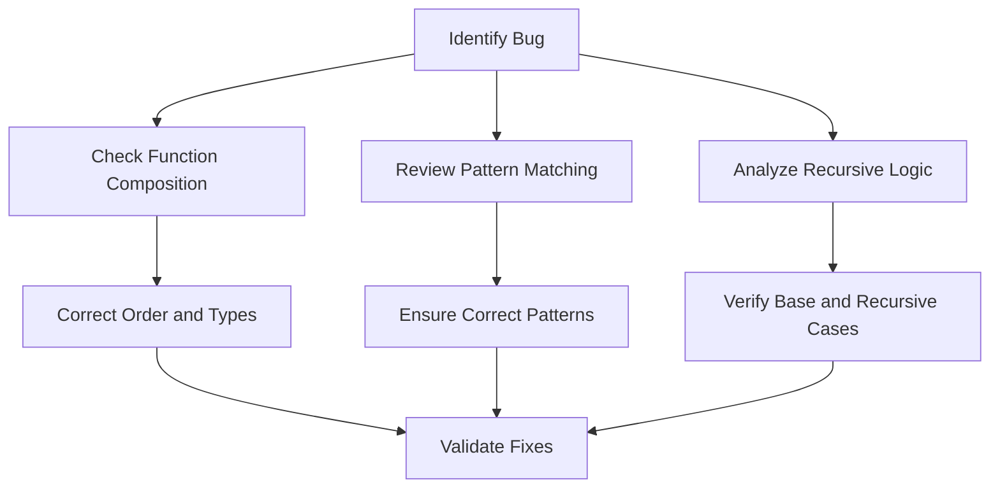

## 14.1. Strategies for Troubleshooting Functional Code

Debugging functional code can be a unique challenge due to the paradigm's emphasis on immutability, pure functions, and higher-order functions. However, by understanding common pitfalls and employing effective strategies, developers can efficiently troubleshoot and resolve issues. This section will delve into typical bugs encountered in functional programming, techniques for isolating and identifying these issues, and provide practical examples in Haskell and JavaScript.

### Understanding Common Functional Bugs

Functional programming introduces a different set of challenges compared to imperative programming. Here are some common bugs you might encounter:

- **Incorrect Function Compositions:** Function composition is a powerful tool in FP, but incorrect ordering or mismatched types can lead to unexpected behaviors.
- **Unexpected Pattern Matching Behaviors:** Pattern matching is a concise way to deconstruct data, but incorrect patterns can lead to runtime errors or logic flaws.
- **Improper Handling of Recursive Functions:** Recursive functions are prevalent in FP, and errors in base or recursive cases can cause infinite loops or incorrect results.

#### Example: Incorrect Function Composition

Consider a scenario where you are composing functions to process a list of numbers. An incorrect composition might look like this:

```haskell
-- Haskell Example
processNumbers = map (*2) . filter (>10) . sum
```

The above composition is incorrect because `sum` returns a single number, not a list, which `filter` expects.

### Techniques for Isolating and Identifying Issues

To effectively troubleshoot functional code, consider the following techniques:

1. **Using REPLs for Interactive Debugging:**
   - REPLs (Read-Eval-Print Loops) allow you to test functions interactively, making it easier to isolate issues by evaluating expressions step-by-step.

2. **Leveraging Type Systems:**
   - Strong type systems in languages like Haskell can catch many errors at compile-time. Pay attention to type errors and use them to guide your debugging process.

3. **Employing Logging within Pure Functions Cautiously:**
   - While logging is a common debugging tool, it can introduce side effects. Use logging sparingly and ensure it doesn't alter the function's behavior.

4. **Utilizing Debugging Tools and Libraries:**
   - Many functional languages offer debugging tools and libraries that can help trace and diagnose issues without compromising the purity of functions.

#### Example: Debugging a Recursive Function

Let's explore a common bug in recursive functions with examples in Haskell and JavaScript.

**Haskell Debugging Example:**

```haskell
-- Task: Debug a faulty recursive function that incorrectly calculates the sum of a list
faultySum :: [Int] -> Int
faultySum [] = 0
faultySum (x:xs) = x + faultySum xs + 1 -- Bug: Extra '+ 1'

-- Correct Function
correctSum :: [Int] -> Int
correctSum [] = 0
correctSum (x:xs) = x + correctSum xs
```

**JavaScript Debugging Example:**

```javascript
const sum = (arr) => {
  if (arr.length === 0) return 0;
  return arr[0] + sum(arr.slice(1)) + 1; // Bug: Extra '+ 1'
};

// Correct Function
const correctSum = (arr) => {
  if (arr.length === 0) return 0;
  return arr[0] + correctSum(arr.slice(1));
};
```

In both examples, the bug is an extra `+ 1` in the recursive call, which leads to incorrect results. By carefully reviewing the recursive logic and base cases, such issues can be identified and corrected.

### Visual Aids

To better understand common functional bugs and troubleshooting steps, consider the following diagram:



### Practical Exercises

1. **Exercise 1: Debugging Function Composition**
   - Given a composed function that processes a list, identify and correct any composition errors.

2. **Exercise 2: Recursive Function Debugging**
   - Analyze a faulty recursive function and correct its logic to produce the expected output.

### Conclusion

Troubleshooting functional code requires a solid understanding of functional principles and the ability to leverage language-specific tools and techniques. By recognizing common bugs and applying effective debugging strategies, developers can maintain the integrity and reliability of their functional programs.

### References

- "Debugging: The 9 Indispensable Rules for Finding Even the Most Elusive Software and Hardware Problems" by David Agans.
- "Effective Haskell" by Bryan O'Sullivan.

## Quiz Time!



### What is a common bug in functional programming related to function composition?

- [x] Incorrect ordering or mismatched types
- [ ] Using too many functions
- [ ] Not using enough functions
- [ ] Functions that are too long

> **Explanation:** Incorrect ordering or mismatched types can lead to unexpected behaviors in function composition.

### How can REPLs assist in debugging functional code?

- [x] By allowing interactive testing of functions
- [ ] By automatically fixing bugs
- [ ] By generating documentation
- [ ] By compiling code faster

> **Explanation:** REPLs allow you to test functions interactively, making it easier to isolate issues by evaluating expressions step-by-step.

### What role does a strong type system play in debugging?

- [x] It catches many errors at compile-time
- [ ] It slows down the development process
- [ ] It makes code harder to read
- [ ] It reduces the need for comments

> **Explanation:** Strong type systems can catch many errors at compile-time, guiding the debugging process.

### Why should logging be used cautiously in pure functions?

- [x] It can introduce side effects
- [ ] It makes code run slower
- [ ] It is not supported in functional languages
- [ ] It is too complex to implement

> **Explanation:** Logging can introduce side effects, which should be avoided in pure functions to maintain their purity.

### What is a common issue with recursive functions in functional programming?

- [x] Errors in base or recursive cases
- [ ] Using too many recursive calls
- [ ] Not using enough recursion
- [ ] Recursive functions are inherently flawed

> **Explanation:** Errors in base or recursive cases can cause infinite loops or incorrect results.

### What is the purpose of the extra '+ 1' in the faulty recursive function example?

- [ ] To correctly calculate the sum
- [x] It is a bug that leads to incorrect results
- [ ] To improve performance
- [ ] To handle edge cases

> **Explanation:** The extra '+ 1' is a bug that leads to incorrect results in the recursive function.

### How can pattern matching lead to bugs in functional programming?

- [x] Incorrect patterns can lead to runtime errors or logic flaws
- [ ] It makes code harder to read
- [ ] It is not supported in all functional languages
- [ ] It is too complex to implement

> **Explanation:** Incorrect patterns can lead to runtime errors or logic flaws in functional programming.

### What is the first step in the troubleshooting diagram?

- [x] Identify Bug
- [ ] Correct Order and Types
- [ ] Ensure Correct Patterns
- [ ] Verify Base and Recursive Cases

> **Explanation:** The first step in the troubleshooting diagram is to identify the bug.

### What should be done after correcting order and types in function composition?

- [x] Run Tests
- [ ] Identify Bug
- [ ] Ensure Correct Patterns
- [ ] Verify Base and Recursive Cases

> **Explanation:** After correcting order and types, you should run tests to validate the fixes.

### True or False: Recursive functions are not commonly used in functional programming.

- [ ] True
- [x] False

> **Explanation:** Recursive functions are commonly used in functional programming to handle iterative processes.


