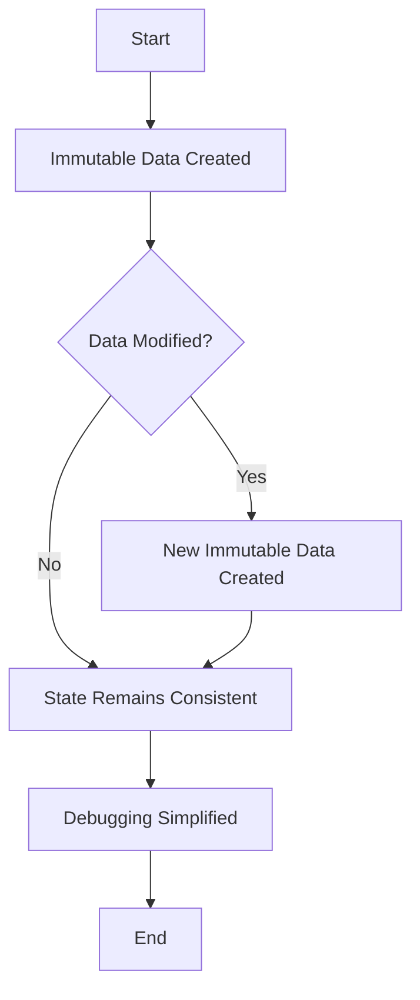

## 14.2. Debugging Immutable and Pure Codebases

Debugging is an essential part of software development, and functional programming offers unique advantages in this area through the use of immutability and pure functions. In this section, we will explore how these concepts simplify the debugging process, introduce tools that support functional debugging, and provide practical examples and visual aids to enhance understanding.

### Leveraging Immutability for Easier Debugging

Immutability is a cornerstone of functional programming, ensuring that once data is created, it cannot be altered. This characteristic has profound implications for debugging:

- **Predictable State Changes:** Since data cannot be changed, the state of a program is predictable and traceable. This predictability makes it easier to understand how data flows through the system and to identify where things might go wrong.
- **Simplified Reasoning:** With immutable data, developers can reason about code without worrying about unexpected side effects. This clarity reduces the cognitive load when tracking down bugs.
- **Concurrency Benefits:** Immutability eliminates issues related to concurrent modifications, as data races and locks are not a concern. This makes debugging concurrent applications more straightforward.

#### Example: Understanding Immutability in Haskell

Consider a simple Haskell function that calculates the factorial of a number:

```haskell
factorial :: Integer -> Integer
factorial 0 = 1
factorial n = n * factorial (n - 1)
```

In this example, the function is pure and relies on immutable data. If a bug occurs, you can be confident that the issue lies within the logic of the function itself, not in any external state changes.

### Tools Supporting Functional Debugging

Functional programming languages often come with specialized tools and linters that help identify and fix bugs. These tools leverage the principles of immutability and purity to provide more insightful diagnostics.

#### HLint for Haskell

HLint is a popular tool for Haskell that analyzes code and suggests improvements. It can identify redundant patterns, suggest more idiomatic expressions, and help maintain clean and efficient code.

**Example: HLint Warning and Fix**

```haskell
-- Example HLint warning for redundant pattern match
factorial n = case n of
  0 -> 1
  _ -> n * factorial (n - 1)

-- Recommended Fix
factorial 0 = 1
factorial n = n * factorial (n - 1)
```

In this example, HLint suggests a more concise pattern matching approach, improving readability and maintainability.

#### ESLint with Functional Plugins for JavaScript

For JavaScript, ESLint is a widely used linter that can be extended with plugins to enforce functional programming practices. The `ramda` plugin, for example, helps ensure that code adheres to functional principles.

**Example: ESLint Configuration for Functional Programming**

```javascript
// ESLint Configuration for Functional Programming
module.exports = {
  "env": {
    "browser": true,
    "es2021": true
  },
  "extends": [
    "eslint:recommended",
    "plugin:ramda/recommended"
  ],
  "parserOptions": {
    "ecmaVersion": 12,
    "sourceType": "module"
  },
  "plugins": [
    "ramda"
  ],
  "rules": {
    // Custom rules if necessary
  }
};
```

This configuration ensures that JavaScript code follows functional programming best practices, reducing the likelihood of bugs related to mutable state.

### Visual Aids: How Immutability Aids Debugging

To better understand how immutability aids in debugging, consider the following flowchart:



This flowchart illustrates that with immutability, any modification results in new data, maintaining consistent state and simplifying debugging.

### Conclusion

Immutability and pure functions are powerful tools in the functional programming toolkit, offering significant advantages for debugging. By ensuring predictable state changes and eliminating side effects, these concepts make it easier to identify and fix bugs. Tools like HLint and ESLint further enhance the debugging process by enforcing functional programming best practices.

### References

- "Effective Haskell" by Bryan O'Sullivan.
- "Real World Haskell" by Bryan O'Sullivan, John Goerzen, and Don Stewart.

## Quiz Time!



### How does immutability simplify debugging?

- [x] By ensuring predictable state changes
- [ ] By allowing data to be modified freely
- [ ] By making code more complex
- [ ] By introducing side effects

> **Explanation:** Immutability ensures that data cannot be altered unexpectedly, making state changes predictable and traceable.

### Which tool is used for analyzing Haskell code?

- [x] HLint
- [ ] ESLint
- [ ] JSLint
- [ ] PyLint

> **Explanation:** HLint is a tool specifically designed for analyzing Haskell code and suggesting improvements.

### What is a benefit of using ESLint with functional plugins?

- [x] Enforcing functional programming practices
- [ ] Allowing mutable state
- [ ] Introducing side effects
- [ ] Making code less readable

> **Explanation:** ESLint with functional plugins helps ensure that JavaScript code adheres to functional programming principles.

### What does HLint suggest for the factorial function example?

- [x] A more concise pattern matching approach
- [ ] Using mutable variables
- [ ] Adding side effects
- [ ] Removing recursion

> **Explanation:** HLint suggests using a more concise pattern matching approach to improve readability and maintainability.

### What is a key characteristic of pure functions?

- [x] They have no side effects
- [ ] They modify global state
- [x] They return the same output for the same input
- [ ] They depend on external variables

> **Explanation:** Pure functions have no side effects and always return the same output for the same input.

### Which of the following is a benefit of immutability in concurrent applications?

- [x] Eliminating data races
- [ ] Increasing data races
- [ ] Allowing concurrent modifications
- [ ] Introducing locks

> **Explanation:** Immutability eliminates issues related to concurrent modifications, such as data races.

### What does the `ramda` plugin for ESLint enforce?

- [x] Functional programming practices
- [ ] Object-oriented programming practices
- [ ] Procedural programming practices
- [ ] Imperative programming practices

> **Explanation:** The `ramda` plugin for ESLint enforces functional programming practices in JavaScript.

### What is the main advantage of using immutable data?

- [x] Predictable and traceable state changes
- [ ] Increased complexity
- [ ] Unpredictable state changes
- [ ] Frequent data corruption

> **Explanation:** Immutable data ensures predictable and traceable state changes, simplifying debugging.

### How does immutability affect reasoning about code?

- [x] It simplifies reasoning by eliminating side effects
- [ ] It complicates reasoning by introducing side effects
- [ ] It has no effect on reasoning
- [ ] It makes reasoning more difficult

> **Explanation:** Immutability simplifies reasoning about code by eliminating side effects.

### True or False: Immutability introduces data races in concurrent applications.

- [ ] True
- [x] False

> **Explanation:** Immutability eliminates data races, making concurrent applications easier to debug.


