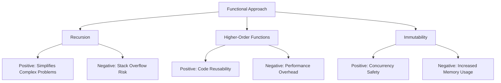

## 14.3. Performance Considerations in Functional Programming

In the realm of functional programming, performance optimization is a critical aspect that often requires a different approach compared to imperative programming paradigms. This section delves into the performance implications of functional constructs such as recursion, higher-order functions, and immutability, and provides strategies for optimizing these constructs to achieve efficient and performant functional programs.

### Analyzing the Performance of Functional Constructs

Functional programming emphasizes the use of pure functions, immutability, and declarative constructs, which can have both positive and negative impacts on performance.

#### Recursion

Recursion is a fundamental concept in functional programming, often replacing iterative loops found in imperative languages. While recursion can lead to elegant and concise code, it may also introduce performance challenges, such as stack overflow errors and increased memory usage due to deep call stacks.

- **Positive Impact:** Recursion can simplify complex problems by breaking them down into smaller, more manageable sub-problems, leading to clearer and more maintainable code.
- **Negative Impact:** Without optimization, recursive functions can be inefficient, particularly when they involve deep recursion or redundant calculations.

#### Higher-Order Functions

Higher-order functions, which take other functions as arguments or return them as results, are powerful tools in functional programming. They enable code reuse and abstraction but can introduce overhead due to additional function calls and context switching.

- **Positive Impact:** They promote code modularity and reusability, allowing for more abstract and flexible code design.
- **Negative Impact:** Excessive use of higher-order functions can lead to performance bottlenecks, especially in performance-critical sections of code.

#### Immutability

Immutability is a core principle in functional programming, ensuring that data structures cannot be modified after creation. This leads to safer and more predictable code but can also result in performance trade-offs.

- **Positive Impact:** Immutability simplifies reasoning about code and enhances concurrency by eliminating race conditions.
- **Negative Impact:** Creating new copies of data structures for every modification can lead to increased memory usage and slower performance.

### Optimizing Recursive Functions and Data Structures

To mitigate the performance drawbacks of recursion and immutability, several optimization techniques can be employed.

#### Tail Recursion

Tail recursion is an optimization technique where the recursive call is the last operation in a function. This allows the compiler or interpreter to optimize the recursion into a loop, reducing the risk of stack overflow and improving performance.

**Haskell Tail-Recursive Factorial Example:**

```haskell
factorial :: Int -> Int
factorial n = go n 1
  where
    go 0 acc = acc
    go n acc = go (n - 1) (n * acc)
```

In this example, the `factorial` function uses a helper function `go` to accumulate the result, ensuring that the recursive call is in the tail position.

#### Memoization

Memoization is a technique used to cache the results of expensive function calls and reuse them when the same inputs occur again. This can significantly improve the performance of recursive functions by avoiding redundant calculations.

#### Efficient Immutable Data Structures

Functional programming languages often provide efficient immutable data structures that leverage structural sharing to minimize memory overhead. These data structures, such as persistent lists and trees, allow for efficient updates without copying the entire structure.

### Visual Aids

To better understand the performance implications of functional constructs, consider the following performance benchmark diagram comparing functional and imperative approaches:



### Code Snippets

Let's explore some practical code examples to illustrate the concepts discussed:

**JavaScript Recursive vs. Iterative Sum:**

```javascript
// Recursive Sum
const recursiveSum = (arr) => {
  if (arr.length === 0) return 0;
  return arr[0] + recursiveSum(arr.slice(1));
};

// Tail-Recursive Sum (Using a helper function)
const tailRecursiveSum = (arr, acc = 0) => {
  if (arr.length === 0) return acc;
  return tailRecursiveSum(arr.slice(1), acc + arr[0]);
};

// Iterative Sum
const iterativeSum = (arr) => arr.reduce((acc, x) => acc + x, 0);
```

In these examples, the `recursiveSum` function demonstrates a simple recursive approach, while `tailRecursiveSum` optimizes it using tail recursion. The `iterativeSum` function provides an alternative iterative solution using JavaScript's `reduce` method.

### References

For further reading and a deeper understanding of performance optimization in functional programming, consider the following resources:

- "High Performance Haskell" by John Launchbury.
- "Functional Programming in Scala" by Paul Chiusano and Rúnar Bjarnason.

## Quiz Time!



### What is a potential negative impact of recursion in functional programming?

- [x] Stack overflow errors
- [ ] Simplified code
- [ ] Enhanced readability
- [ ] Improved maintainability

> **Explanation:** Recursion can lead to stack overflow errors if not optimized, especially in deep recursive calls.

### How does tail recursion optimize recursive functions?

- [x] By converting recursion into a loop
- [ ] By increasing memory usage
- [ ] By adding more function calls
- [ ] By making code less readable

> **Explanation:** Tail recursion allows the compiler to optimize recursive calls into loops, reducing stack usage.

### What is a benefit of higher-order functions?

- [x] Code modularity and reusability
- [ ] Increased memory usage
- [ ] Performance bottlenecks
- [ ] Simplified syntax

> **Explanation:** Higher-order functions promote code modularity and reusability, allowing for flexible code design.

### What is a drawback of immutability in functional programming?

- [x] Increased memory usage
- [ ] Simplified concurrency
- [ ] Enhanced predictability
- [ ] Reduced code safety

> **Explanation:** Immutability can lead to increased memory usage due to the creation of new data structures for modifications.

### Which technique is used to cache results of expensive function calls?

- [x] Memoization
- [ ] Tail recursion
- [ ] Immutability
- [ ] Higher-order functions

> **Explanation:** Memoization caches results to avoid redundant calculations, improving performance.

### What is a positive impact of recursion?

- [x] Simplifies complex problems
- [ ] Increases stack usage
- [ ] Reduces code readability
- [ ] Decreases maintainability

> **Explanation:** Recursion simplifies complex problems by breaking them into smaller sub-problems.

### Which data structures leverage structural sharing to minimize memory overhead?

- [x] Persistent lists and trees
- [ ] Mutable arrays
- [ ] Linked lists
- [ ] Hash tables

> **Explanation:** Persistent lists and trees use structural sharing to efficiently manage memory in functional programming.

### What is a potential negative impact of higher-order functions?

- [x] Performance overhead
- [ ] Code modularity
- [ ] Enhanced flexibility
- [ ] Improved abstraction

> **Explanation:** Higher-order functions can introduce performance overhead due to additional function calls.

### How does immutability enhance concurrency?

- [x] By eliminating race conditions
- [ ] By increasing memory usage
- [ ] By reducing code safety
- [ ] By complicating code logic

> **Explanation:** Immutability eliminates race conditions, making concurrent programming safer and more predictable.

### True or False: Tail recursion can help prevent stack overflow errors.

- [x] True
- [ ] False

> **Explanation:** Tail recursion optimizes recursive calls into loops, reducing stack usage and preventing overflow errors.


