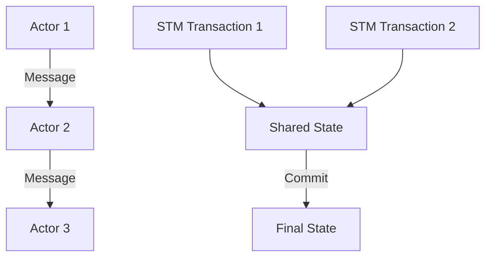

## 14.4. Concurrency and Parallelism in Functional Programming

In the realm of software development, concurrency and parallelism are crucial for building efficient and responsive applications. Functional programming offers unique advantages in these areas, primarily due to its emphasis on immutability and pure functions. This section explores how functional programming paradigms facilitate safe and effective concurrent and parallel execution.

### Benefits of Immutability in Concurrent Environments

Immutability is a cornerstone of functional programming, and it plays a pivotal role in simplifying concurrent programming. In a concurrent environment, multiple threads or processes may attempt to access and modify shared data simultaneously, leading to issues like race conditions, deadlocks, and data corruption. Immutability eliminates these problems by ensuring that data cannot be changed once it is created.

#### Key Advantages of Immutability:

- **Elimination of Race Conditions:** Since immutable data cannot be altered, there is no risk of race conditions where two threads compete to modify the same data.
- **Simplified Reasoning:** Developers can reason about the behavior of concurrent programs more easily, as the state of data remains consistent throughout execution.
- **Thread Safety:** Immutable data structures are inherently thread-safe, reducing the need for complex synchronization mechanisms like locks or semaphores.

### Functional Techniques for Safe Parallel Execution

Functional programming provides several techniques and abstractions to manage parallel execution safely. These techniques leverage the principles of immutability and pure functions to ensure that parallel computations do not interfere with each other.

#### Pure Functions

Pure functions, which have no side effects and always produce the same output for the same input, are ideal for parallel execution. Since they do not depend on or alter shared state, they can be executed concurrently without risk of interference.

#### Immutable Data Structures

Using immutable data structures ensures that data shared across concurrent tasks remains consistent and unaltered. This consistency allows multiple threads to read data simultaneously without the need for locks.

#### Concurrency Models

Functional programming languages often provide concurrency models that abstract away the complexities of parallel execution. Two popular models are the Actor Model and Software Transactional Memory (STM).

- **Actor Model:** This model treats "actors" as the fundamental units of computation. Actors encapsulate state and behavior, communicate via message passing, and process messages sequentially, ensuring thread safety.
- **Software Transactional Memory (STM):** STM allows for composable memory transactions, similar to database transactions. It provides a mechanism to safely manage shared state by ensuring that concurrent transactions do not interfere with each other.

### Visual Aids

Below is a Mermaid.js diagram illustrating the Actor Model and Software Transactional Memory in functional programming.



### Code Snippets

To illustrate these concepts, let's explore code examples in Scala and Haskell.

#### Scala Concurrent Programming with Futures

Scala's `Future` is a powerful abstraction for handling asynchronous computations. Here's an example of using `Future` to fetch data concurrently:

```scala
import scala.concurrent.Future
import scala.concurrent.ExecutionContext.Implicits.global

def fetchData(id: Int): Future[String] = Future {
  // Simulate data fetching
  s"Data for ID: $id"
}

val dataFuture = fetchData(1).map(data => data.toUpperCase)

dataFuture.onComplete {
  case scala.util.Success(data) => println(data)
  case scala.util.Failure(e) => println(s"Error: ${e.getMessage}")
}
```

In this example, `fetchData` is a pure function that returns a `Future`, allowing the computation to run concurrently. The `map` function transforms the result without blocking the main thread.

#### Haskell Concurrency with STM

Haskell's STM provides a robust framework for managing shared state in concurrent applications. Here's a simple example:

```haskell
import Control.Concurrent.STM
import Control.Concurrent.STM.TVar

main :: IO ()
main = do
  counter <- newTVarIO 0
  atomically $ modifyTVar' counter (+1)
  current <- readTVarIO counter
  print current -- 1
```

In this Haskell code, a `TVar` is used to hold a mutable counter. The `atomically` function ensures that the modification of the counter is performed as a single transaction, maintaining consistency even in a concurrent environment.

### References

- "Concurrency in Haskell" by Simon Marlow.
- "Functional Programming in Scala" by Paul Chiusano and Rúnar Bjarnason.

### Conclusion

Functional programming offers powerful tools and paradigms for managing concurrency and parallelism. By leveraging immutability, pure functions, and advanced concurrency models like the Actor Model and STM, developers can build robust, efficient, and safe concurrent applications. As you continue to explore functional programming, consider how these techniques can be applied to your projects to enhance performance and reliability.

## Quiz Time!



### What is a primary benefit of immutability in concurrent programming?

- [x] It eliminates race conditions.
- [ ] It increases memory usage.
- [ ] It makes code harder to read.
- [ ] It requires more synchronization mechanisms.

> **Explanation:** Immutability ensures that data cannot be changed, eliminating race conditions where multiple threads compete to modify the same data.

### Which of the following is a key feature of pure functions?

- [x] They have no side effects.
- [ ] They always modify global state.
- [ ] They depend on external variables.
- [ ] They produce different outputs for the same inputs.

> **Explanation:** Pure functions have no side effects and always produce the same output for the same input, making them ideal for parallel execution.

### What does the Actor Model use for communication between actors?

- [x] Message passing
- [ ] Shared memory
- [ ] Global variables
- [ ] Direct function calls

> **Explanation:** The Actor Model uses message passing for communication between actors, ensuring that each actor processes messages sequentially.

### In Haskell, what does STM stand for?

- [x] Software Transactional Memory
- [ ] Synchronous Transactional Memory
- [ ] Simple Transactional Model
- [ ] Standard Transactional Module

> **Explanation:** STM stands for Software Transactional Memory, a concurrency control mechanism that allows for composable memory transactions.

### What is the purpose of the `atomically` function in Haskell's STM?

- [x] To ensure that a series of operations are performed as a single transaction
- [ ] To execute operations immediately without delay
- [ ] To modify global variables
- [ ] To create new threads

> **Explanation:** The `atomically` function ensures that a series of operations are performed as a single transaction, maintaining consistency in concurrent environments.

### Which Scala feature is used for handling asynchronous computations?

- [x] Future
- [ ] Promise
- [ ] Actor
- [ ] Thread

> **Explanation:** Scala's `Future` is used for handling asynchronous computations, allowing tasks to run concurrently without blocking the main thread.

### What is a key advantage of using immutable data structures in parallel execution?

- [x] They are inherently thread-safe.
- [ ] They require more memory.
- [ ] They are slower to access.
- [ ] They need complex locking mechanisms.

> **Explanation:** Immutable data structures are inherently thread-safe, as they cannot be modified once created, eliminating the need for complex locking mechanisms.

### Which concurrency model treats "actors" as fundamental units of computation?

- [x] Actor Model
- [ ] Software Transactional Memory
- [ ] Thread Model
- [ ] Lock-Free Model

> **Explanation:** The Actor Model treats "actors" as fundamental units of computation, encapsulating state and behavior and communicating via message passing.

### What is the main advantage of using STM in functional programming?

- [x] It allows for composable memory transactions.
- [ ] It increases the complexity of code.
- [ ] It requires more synchronization mechanisms.
- [ ] It decreases performance.

> **Explanation:** STM allows for composable memory transactions, ensuring that concurrent transactions do not interfere with each other, thus maintaining consistency.

### True or False: Immutability in functional programming increases the risk of data corruption in concurrent environments.

- [ ] True
- [x] False

> **Explanation:** False. Immutability reduces the risk of data corruption in concurrent environments by ensuring that data cannot be modified once created.


