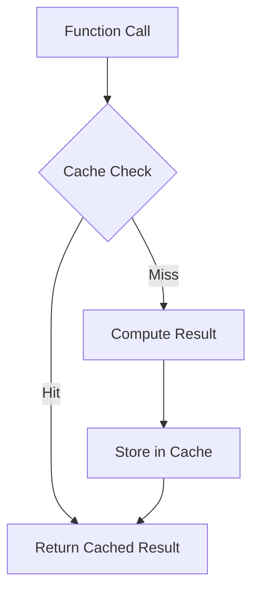

## 14.5. Practical Optimization Techniques

In the realm of functional programming, optimization techniques play a crucial role in enhancing the performance and efficiency of applications. This section delves into two powerful optimization strategies: lazy evaluation and memoization. By understanding and applying these techniques, developers can significantly improve the performance of their functional programs.

### Lazy Evaluation and Its Benefits

Lazy evaluation is a cornerstone of functional programming that defers the computation of expressions until their values are actually needed. This approach can lead to significant performance improvements, especially in scenarios involving large data sets or complex computations.

#### Understanding Lazy Evaluation

Lazy evaluation allows programs to avoid unnecessary calculations, thereby reducing the computational overhead. This is particularly useful in handling potentially infinite data structures, such as streams, where only the required portion of the data is computed.

**Benefits of Lazy Evaluation:**

- **Efficiency:** By computing values only when needed, lazy evaluation can reduce the number of operations performed, leading to faster execution times.
- **Memory Usage:** It can help in managing memory more effectively by not holding onto unnecessary data.
- **Infinite Data Structures:** Enables the creation and manipulation of infinite lists or streams, which can be processed incrementally.

#### Example: Lazy Evaluation in Haskell

Haskell, a purely functional language, employs lazy evaluation by default. Consider the following example that demonstrates lazy evaluation with infinite lists:

```haskell
-- Define an infinite list of natural numbers
naturals :: [Integer]
naturals = [0..]

-- Take the first 10 numbers from the infinite list
firstTenNaturals :: [Integer]
firstTenNaturals = take 10 naturals

main :: IO ()
main = print firstTenNaturals
```

In this example, the list `naturals` is infinite, but only the first 10 elements are computed and printed, thanks to lazy evaluation.

### Memoization and Caching Strategies

Memoization is an optimization technique that involves storing the results of expensive function calls and reusing them when the same inputs occur again. This can drastically reduce the time complexity of recursive functions and improve overall performance.

#### Implementing Memoization

Memoization can be implemented in various functional programming languages, each with its own idiomatic approach. Below, we explore memoization examples in Haskell, JavaScript, and Scala.

**Haskell Memoization Example:**

In Haskell, memoization can be achieved using arrays to store computed values:

```haskell
import Data.Array

-- Memoized Fibonacci function
fib :: Int -> Int
fib n = fibs ! n
  where
    fibs = listArray (0, n) (map fib' [0..n])
    fib' 0 = 0
    fib' 1 = 1
    fib' k = fibs ! (k - 1) + fibs ! (k - 2)

main :: IO ()
main = print (fib 10) -- Output: 55
```

**JavaScript Simple Memoization:**

JavaScript, being a multi-paradigm language, allows for memoization through closures and objects:

```javascript
const memoize = (f) => {
  const cache = {};
  return (...args) => {
    const key = JSON.stringify(args);
    if (cache[key]) return cache[key];
    const result = f(...args);
    cache[key] = result;
    return result;
  };
};

// Memoized factorial function
const factorial = memoize((n) => {
  if (n === 0) return 1;
  return n * factorial(n - 1);
});

console.log(factorial(5)); // Output: 120
```

**Scala Memoization Example:**

In Scala, memoization can be implemented using mutable maps:

```scala
import scala.collection.mutable

def memoize[A, B](f: A => B): A => B = {
  val cache = mutable.Map[A, B]()
  a => cache.getOrElseUpdate(a, f(a))
}

// Memoized factorial function
val factorial: Int => BigInt = memoize(n => if (n == 0) 1 else n * factorial(n - 1))

println(factorial(5)) // Output: 120
```

### Visualizing Memoization and Caching

To better understand the concept of memoization, consider the following diagram illustrating the process:



This diagram shows how a function call first checks the cache for a precomputed result. If found, it returns the cached result; otherwise, it computes the result, stores it in the cache, and then returns it.

### Practical Exercises

To reinforce your understanding of these optimization techniques, try the following exercises:

1. **Implement Lazy Evaluation:**
   - Create a program in Haskell that generates an infinite list of prime numbers and retrieves the first 20 primes using lazy evaluation.

2. **Memoize a Recursive Function:**
   - Implement a memoized version of the Fibonacci sequence in JavaScript and Scala, and compare the performance with a non-memoized version.

3. **Visualize Caching:**
   - Draw a flowchart similar to the Mermaid.js diagram above to represent the caching process in your preferred functional language.

### Summary of Key Points

- **Lazy Evaluation:** Defers computations until necessary, optimizing performance and memory usage.
- **Memoization:** Caches results of expensive computations to avoid redundant calculations, enhancing efficiency.
- **Practical Application:** Both techniques are widely applicable in functional programming to improve the performance of recursive functions and handle large or infinite data structures effectively.

### References and Further Reading

- "Advanced Functional Programming" by James Duncan Davidson.
- "High Performance Haskell" by John Launchbury.

These resources provide deeper insights into functional programming optimization techniques and are recommended for further exploration.

## Quiz Time!



### What is lazy evaluation?

- [x] A technique that defers computation until the result is needed
- [ ] A method of precomputing all possible results
- [ ] A way to execute code in parallel
- [ ] A technique for optimizing memory usage by duplicating data

> **Explanation:** Lazy evaluation defers computation until the result is actually needed, which can optimize performance and memory usage.

### Which of the following is a benefit of lazy evaluation?

- [x] Reduced computational overhead
- [ ] Increased memory usage
- [ ] Immediate computation of all expressions
- [ ] Increased complexity of code

> **Explanation:** Lazy evaluation reduces computational overhead by avoiding unnecessary calculations.

### What is memoization?

- [x] Caching the results of expensive function calls
- [ ] A method of compressing data
- [ ] A technique for parallel processing
- [ ] A way to increase code readability

> **Explanation:** Memoization involves caching the results of expensive function calls to avoid redundant computations.

### How does memoization improve performance?

- [x] By storing and reusing results of previous computations
- [ ] By executing code in parallel
- [ ] By reducing the size of data structures
- [ ] By increasing the number of function calls

> **Explanation:** Memoization improves performance by storing and reusing results of previous computations, thus avoiding redundant calculations.

### In which language is lazy evaluation the default behavior?

- [x] Haskell
- [ ] JavaScript
- [ ] Scala
- [ ] Python

> **Explanation:** Haskell employs lazy evaluation by default, allowing computations to be deferred until necessary.

### Which data structure is commonly used in Haskell for memoization?

- [x] Arrays
- [ ] Lists
- [ ] Sets
- [ ] Queues

> **Explanation:** In Haskell, arrays are commonly used for memoization to store computed values efficiently.

### What is the purpose of the `getOrElseUpdate` method in Scala's memoization example?

- [x] To retrieve a value from the cache or compute and store it if not present
- [ ] To remove a value from the cache
- [ ] To update all values in the cache
- [ ] To clear the cache

> **Explanation:** The `getOrElseUpdate` method retrieves a value from the cache or computes and stores it if not present, facilitating memoization.

### Which of the following is a key advantage of using memoization?

- [x] Improved performance for recursive functions
- [ ] Increased code complexity
- [ ] Reduced readability
- [ ] Increased memory usage

> **Explanation:** Memoization improves performance for recursive functions by avoiding redundant calculations.

### What is a common use case for lazy evaluation?

- [x] Handling infinite data structures
- [ ] Immediate computation of all results
- [ ] Parallel processing
- [ ] Data compression

> **Explanation:** Lazy evaluation is commonly used for handling infinite data structures, allowing only the necessary portion to be computed.

### True or False: Memoization is only applicable in functional programming languages.

- [ ] True
- [x] False

> **Explanation:** Memoization is a general optimization technique that can be applied in various programming paradigms, not just functional programming.


