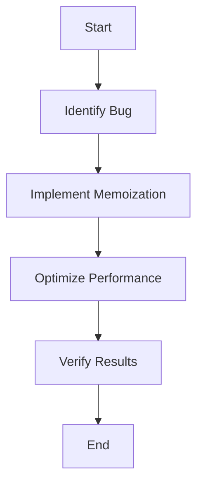

## 14.6. Practical Exercises

In this section, we delve into practical exercises designed to reinforce your understanding of debugging and optimization in functional programming. These exercises will challenge you to identify and fix common bugs in functional code and apply optimization techniques such as lazy evaluation and memoization to enhance performance. By working through these exercises, you'll gain hands-on experience in improving the efficiency and reliability of functional programs.

### Debugging Real-World Functional Code

Debugging functional code can be a unique challenge due to the immutability and pure function principles that often obscure traditional debugging techniques. However, these same principles can also simplify the debugging process by reducing side effects and making code behavior more predictable. Let's explore a practical exercise to hone your debugging skills.

#### Exercise 1: Debugging a Haskell Function

Consider the following Haskell function intended to calculate the nth Fibonacci number. The function contains a common bug that leads to inefficiency and potential stack overflow for large inputs. Your task is to identify the bug and optimize the function using memoization.

```haskell
-- Task: Debug and optimize a recursive function that calculates the nth Fibonacci number
fibonacci :: Int -> Int
fibonacci 0 = 0
fibonacci 1 = 1
fibonacci n = fibonacci (n - 1) + fibonacci (n - 2)

-- Optimized with Memoization
fibonacciMemo :: Int -> Int
fibonacciMemo n = fibs ! n
  where
    fibs = listArray (0, n) (map fib [0..n])
    fib 0 = 0
    fib 1 = 1
    fib k = fibs ! (k - 1) + fibs ! (k - 2)
```

**Instructions:**

1. **Identify the Bug:** The original `fibonacci` function uses a naive recursive approach, leading to exponential time complexity due to repeated calculations of the same Fibonacci numbers.
2. **Optimize with Memoization:** Implement memoization to store previously computed Fibonacci numbers, reducing the time complexity to linear.

**Solution Explanation:**

The optimized version uses an array to store Fibonacci numbers as they are computed. This approach ensures that each number is calculated only once, significantly improving performance.

### Implementing Optimizations in Functional Programs

Optimization in functional programming often involves techniques like lazy evaluation and memoization. These techniques can drastically improve the performance of recursive functions and data processing tasks.

#### Exercise 2: Optimizing a JavaScript Function

The following JavaScript function calculates the factorial of a number using a recursive approach. Your task is to optimize this function using memoization to avoid redundant calculations.

```javascript
// Task: Optimize a recursive factorial function with memoization
const factorial = (n) => {
  if (n === 0) return 1;
  return n * factorial(n - 1);
};

// Optimized with Memoization
const memoize = (f) => {
  const cache = {};
  return (...args) => {
    const key = JSON.stringify(args);
    if (cache[key]) return cache[key];
    const result = f(...args);
    cache[key] = result;
    return result;
  };
};

const optimizedFactorial = memoize((n) => {
  if (n === 0) return 1;
  return n * optimizedFactorial(n - 1);
});

console.log(optimizedFactorial(5)); // 120
```

**Instructions:**

1. **Identify Inefficiency:** The original `factorial` function recalculates results for the same inputs multiple times.
2. **Implement Memoization:** Use a caching mechanism to store results of previous calculations, thereby reducing redundant computations.

**Solution Explanation:**

The `memoize` function creates a cache object to store results of function calls. When the `optimizedFactorial` function is called, it first checks if the result is already in the cache, returning it if available, or computing and storing it if not.

### Visual Aids

To better understand the debugging and optimization processes, let's use Mermaid.js to illustrate the flow of these exercises.

#### Debugging and Optimization Process



This flowchart represents the steps involved in debugging and optimizing a functional program. By following this process, you can systematically improve the efficiency of your code.

### References

For further reading and a deeper understanding of functional programming concepts, consider the following resources:

- "Functional Reactive Programming" by Stephen Blackheath and Anthony Jones.
- "Functional Programming in Scala" by Paul Chiusano and Rúnar Bjarnason.

These texts provide comprehensive insights into functional programming paradigms and advanced techniques.

## Quiz Time!



### What is the main inefficiency in the naive Fibonacci function?

- [x] Repeated calculations of the same Fibonacci numbers
- [ ] Incorrect base cases
- [ ] Use of mutable state
- [ ] Lack of type annotations

> **Explanation:** The naive Fibonacci function recalculates Fibonacci numbers multiple times, leading to exponential time complexity.

### How does memoization improve the performance of recursive functions?

- [x] By storing previously computed results
- [ ] By using mutable variables
- [ ] By increasing the recursion depth
- [ ] By reducing the number of function calls

> **Explanation:** Memoization stores results of previous computations, avoiding redundant calculations and improving performance.

### What is the time complexity of the optimized Fibonacci function using memoization?

- [x] Linear
- [ ] Exponential
- [ ] Quadratic
- [ ] Logarithmic

> **Explanation:** The optimized Fibonacci function has linear time complexity because each Fibonacci number is calculated only once.

### In the JavaScript memoization example, what is the purpose of the `cache` object?

- [x] To store results of previous function calls
- [ ] To hold global variables
- [ ] To manage asynchronous operations
- [ ] To handle exceptions

> **Explanation:** The `cache` object stores results of previous function calls, enabling memoization.

### What is a common benefit of using lazy evaluation in functional programming?

- [x] Avoiding unnecessary computations
- [ ] Increasing code complexity
- [ ] Reducing code readability
- [ ] Introducing side effects

> **Explanation:** Lazy evaluation delays computations until their results are needed, avoiding unnecessary work.

### Which of the following is NOT a technique used in functional optimization?

- [ ] Memoization
- [x] Global variables
- [ ] Lazy evaluation
- [ ] Function composition

> **Explanation:** Global variables are not typically used in functional optimization due to the preference for immutability.

### What is the primary goal of debugging in functional programming?

- [x] Identifying and fixing bugs
- [ ] Increasing code size
- [ ] Introducing side effects
- [ ] Reducing code readability

> **Explanation:** The primary goal of debugging is to identify and fix bugs, ensuring code correctness.

### How does immutability aid in debugging functional code?

- [x] By reducing side effects
- [ ] By allowing global state changes
- [ ] By increasing code complexity
- [ ] By introducing mutable variables

> **Explanation:** Immutability reduces side effects, making code behavior more predictable and easier to debug.

### What is the advantage of using a flowchart in debugging exercises?

- [x] Visualizing the debugging process
- [ ] Increasing code complexity
- [ ] Reducing code readability
- [ ] Introducing side effects

> **Explanation:** Flowcharts help visualize the debugging process, making it easier to follow and understand.

### True or False: Memoization can be used to optimize both recursive and iterative functions.

- [x] True
- [ ] False

> **Explanation:** Memoization can be applied to both recursive and iterative functions to store and reuse results of expensive function calls.



By completing these exercises, you will enhance your ability to debug and optimize functional programs, making your code more efficient and reliable.
