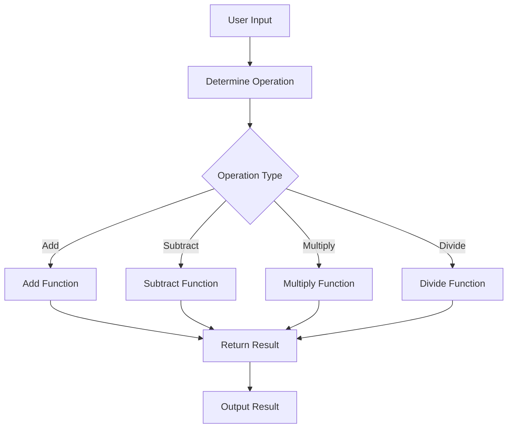

## 15.1. Building a Simple Calculator

In this section, we will explore how to build a simple calculator using functional programming principles. This project will help solidify your understanding of pure functions, immutability, and function composition. By the end of this section, you will have a functional calculator that performs basic arithmetic operations and handles errors gracefully.

### Designing the Calculator with Functional Principles

Functional programming emphasizes the use of pure functions, immutability, and function composition. These principles ensure that our code is predictable, easy to test, and maintainable. Let's break down how we can apply these principles to design our calculator.

#### Pure Functions

A pure function is a function where the output value is determined only by its input values, without observable side effects. In the context of our calculator, each arithmetic operation (addition, subtraction, multiplication, division) should be implemented as a pure function. This means that given the same inputs, the function will always return the same output.

#### Immutability

Immutability means that once a data structure is created, it cannot be changed. Instead of modifying existing data, you create new data structures. This principle helps prevent unintended side effects and makes reasoning about code easier. In our calculator, we will ensure that any state or data used is immutable.

#### Function Composition

Function composition is the process of combining simple functions to build more complex ones. This allows us to create modular and reusable code. In our calculator, we will compose functions to handle different operations and manage the flow of data.

### Implementing Basic Arithmetic Operations

Let's implement the basic arithmetic operations using pure functions in three different functional programming languages: Haskell, JavaScript, and Scala.

#### Haskell Implementation

In Haskell, we define a data type `Operation` to represent the different arithmetic operations. The `calculate` function takes an `Operation` and two integers, returning a `Maybe Int` to handle division by zero gracefully.

```haskell
data Operation = Add | Subtract | Multiply | Divide

calculate :: Operation -> Int -> Int -> Maybe Int
calculate Add x y = Just (x + y)
calculate Subtract x y = Just (x - y)
calculate Multiply x y = Just (x * y)
calculate Divide x y = if y == 0 then Nothing else Just (x `div` y)

main :: IO ()
main = do
  print (calculate Add 5 3)       -- Just 8
  print (calculate Divide 10 0)   -- Nothing
```

#### JavaScript Implementation

In JavaScript, we use Ramda, a functional programming library, to implement our calculator. We define pure functions for each operation and use a `Maybe` type to handle division by zero.

```javascript
const R = require('ramda');

const add = (x, y) => x + y;
const subtract = (x, y) => x - y;
const multiply = (x, y) => x * y;
const divide = (x, y) => y === 0 ? Maybe.Nothing() : Maybe.Just(x / y);

const calculate = (operation, x, y) => {
  switch(operation) {
    case 'Add': return Maybe.Just(add(x, y));
    case 'Subtract': return Maybe.Just(subtract(x, y));
    case 'Multiply': return Maybe.Just(multiply(x, y));
    case 'Divide': return divide(x, y);
    default: return Maybe.Nothing();
  }
};

console.log(calculate('Add', 5, 3)); // Just(8)
console.log(calculate('Divide', 10, 0)); // Nothing
```

#### Scala Implementation

In Scala, we define a sealed trait `Operation` and implement the `calculate` function using pattern matching. We use `Option[Int]` to handle division by zero.

```scala
sealed trait Operation
case object Add extends Operation
case object Subtract extends Operation
case object Multiply extends Operation
case object Divide extends Operation

def calculate(operation: Operation, x: Int, y: Int): Option[Int] = operation match {
  case Add => Some(x + y)
  case Subtract => Some(x - y)
  case Multiply => Some(x * y)
  case Divide => if (y == 0) None else Some(x / y)
}

def main(args: Array[String]): Unit = {
  println(calculate(Add, 5, 3))       // Some(8)
  println(calculate(Divide, 10, 0))   // None
}
```

### Visual Aids

To better understand the architecture of our calculator application and the flow of function calls, let's use a Mermaid.js diagram.



### Practical Exercises

To reinforce your understanding, try implementing the following exercises:

1. **Extend the Calculator:**
   - Add support for additional operations such as modulus and exponentiation.
   - Ensure that these operations are implemented as pure functions.

2. **Error Handling:**
   - Improve the error handling mechanism to provide more informative error messages.
   - Consider using a custom error type to represent different error conditions.

3. **User Interface:**
   - Create a simple command-line interface for the calculator.
   - Allow users to input operations and numbers, and display the results.

### Conclusion

In this section, we have built a simple calculator using functional programming principles. By implementing basic arithmetic operations as pure functions and handling errors gracefully, we have created a robust and maintainable application. This project demonstrates the power of functional programming in designing clean and efficient software.

### References

- "Functional Programming in JavaScript" by Luis Atencio.
- "Functional Programming in Scala" by Paul Chiusano and Rúnar Bjarnason.

## Quiz Time!



### What is a pure function?

- [x] A function where the output is determined only by its input values, without side effects.
- [ ] A function that can modify global variables.
- [ ] A function that always returns the same value.
- [ ] A function that performs I/O operations.

> **Explanation:** A pure function is one where the output is determined solely by its input values, and it has no side effects.

### What is immutability in functional programming?

- [x] Once a data structure is created, it cannot be changed.
- [ ] Data structures can be modified in place.
- [ ] Functions can change their input values.
- [ ] Variables can be reassigned.

> **Explanation:** Immutability means that once a data structure is created, it cannot be changed, which helps prevent unintended side effects.

### What is function composition?

- [x] Combining simple functions to build more complex ones.
- [ ] Writing functions that call themselves.
- [ ] Using functions to modify global state.
- [ ] Creating functions that perform I/O operations.

> **Explanation:** Function composition involves combining simple functions to create more complex functions, promoting modularity and reusability.

### How does Haskell handle division by zero in the calculator example?

- [x] It returns `Nothing`.
- [ ] It throws an exception.
- [ ] It returns zero.
- [ ] It returns an error message.

> **Explanation:** In Haskell, division by zero is handled by returning `Nothing`, indicating an absence of a valid result.

### In JavaScript, what library is used to implement functional programming concepts in the calculator?

- [x] Ramda
- [ ] Lodash
- [ ] jQuery
- [ ] Underscore

> **Explanation:** Ramda is a functional programming library used in the JavaScript example to implement functional programming concepts.

### What type does Scala use to handle division by zero?

- [x] Option[Int]
- [ ] Int
- [ ] Either[String, Int]
- [ ] List[Int]

> **Explanation:** Scala uses `Option[Int]` to handle division by zero, where `None` represents an invalid result.

### What is the purpose of using a `Maybe` type in JavaScript?

- [x] To handle operations that may not return a valid result.
- [ ] To perform asynchronous operations.
- [ ] To modify global variables.
- [ ] To handle exceptions.

> **Explanation:** The `Maybe` type is used to handle operations that may not return a valid result, such as division by zero.

### What is the benefit of using pure functions in a calculator application?

- [x] Predictable behavior and easier testing.
- [ ] Faster execution time.
- [ ] Ability to modify global state.
- [ ] Simplified I/O operations.

> **Explanation:** Pure functions provide predictable behavior and are easier to test, as they depend only on their input values.

### How can you extend the calculator to support additional operations?

- [x] Implement new pure functions for each operation.
- [ ] Modify existing functions to handle more cases.
- [ ] Use global variables to store results.
- [ ] Perform operations in the main function.

> **Explanation:** To extend the calculator, you should implement new pure functions for each additional operation.

### True or False: In functional programming, data structures are typically mutable.

- [ ] True
- [x] False

> **Explanation:** In functional programming, data structures are typically immutable, meaning they cannot be changed once created.


