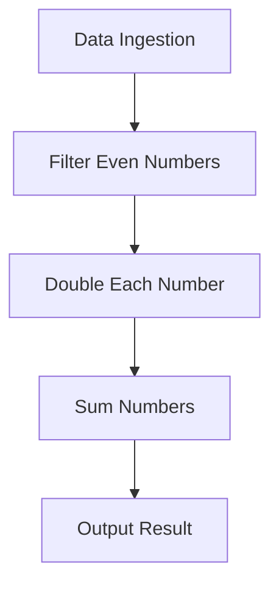

## 15.3. Functional Data Processing Pipeline

In the realm of functional programming, the concept of a data processing pipeline is a powerful paradigm that allows developers to handle data ingestion, transformation, filtering, and aggregation in a clean, efficient, and maintainable manner. This section will guide you through the process of building such pipelines using function composition, a core principle of functional programming. We will explore how to leverage higher-order functions to create readable and maintainable data processing flows, with practical examples in Haskell, JavaScript, and Scala.

### Creating a Pipeline Using Function Composition

Function composition is the process of combining simple functions to build more complex operations. In the context of data processing, this means creating a sequence of operations where the output of one function becomes the input of the next. This approach not only enhances code readability but also promotes reusability and modularity.

#### Key Concepts

- **Ingestion:** The initial stage where data is collected from various sources.
- **Transformation:** Modifying data to fit the desired format or structure.
- **Filtering:** Selecting data that meets certain criteria.
- **Aggregation:** Combining data elements to produce a summary or result.

By composing functions for each of these stages, we can create a seamless pipeline that processes data efficiently.

### Processing and Transforming Data Efficiently

To illustrate the power of function composition in data processing, let's consider a simple example: processing a list of integers to sum the double of even numbers. This task involves filtering, mapping, and reducing operations, which can be elegantly expressed using function composition.

#### Haskell Example

In Haskell, we can use the composition operator `(.)` to chain functions together:

```haskell
import Data.List (filter, map, foldl')

processData :: [Int] -> Int
processData = foldl' (+) 0 . map (*2) . filter even

main :: IO ()
main = print (processData [1, 2, 3, 4, 5, 6]) -- Output: 24
```

Here, `filter even` selects even numbers, `map (*2)` doubles each number, and `foldl' (+) 0` sums them up. The composition operator `(.)` allows us to create a pipeline that processes the data in a single, readable expression.

#### JavaScript Example

Using the Ramda library in JavaScript, we can achieve similar results with the `pipe` function:

```javascript
const R = require('ramda');

const processData = R.pipe(
  R.filter(R.even),
  R.map(x => x * 2),
  R.reduce(R.add, 0)
);

console.log(processData([1, 2, 3, 4, 5, 6])); // Output: 24
```

The `R.pipe` function composes the operations into a pipeline, making the code concise and expressive.

#### Scala Example

In Scala, we can use method chaining to achieve function composition:

```scala
val numbers = List(1, 2, 3, 4, 5, 6)
val processData = numbers.filter(_ % 2 == 0).map(_ * 2).sum
println(processData) // Output: 24
```

Scala's collection methods allow for a natural and intuitive way to compose functions, resulting in a clear and concise pipeline.

### Visual Aids

To better understand the flow of data through a processing pipeline, consider the following diagram:



This diagram illustrates the stages of our data processing pipeline, showing how data moves from ingestion to output through composed functions.

### Practical Exercises

To reinforce your understanding of functional data processing pipelines, try the following exercises:

1. **Exercise 1:** Modify the pipeline to process a list of strings, filtering out those that do not contain a specific substring, converting the remaining strings to uppercase, and concatenating them into a single string.

2. **Exercise 2:** Implement a pipeline that processes a list of records (e.g., user data), filters out inactive users, extracts their email addresses, and counts the number of unique domains.

3. **Exercise 3:** Create a pipeline that processes a list of transactions, filters out those below a certain amount, converts the amounts to a different currency, and calculates the total.

### Summary of Key Points

- Function composition allows for the creation of efficient and maintainable data processing pipelines.
- By chaining simple operations, complex data transformations can be expressed in a clear and concise manner.
- Haskell, JavaScript, and Scala each offer unique features that facilitate function composition, making them ideal for building data processing pipelines.

### References

- "Data Structures and Algorithms in Scala" by Michael T. Goodrich and Roberto Tamassia.
- "Functional Programming in Scala" by Paul Chiusano and Rúnar Bjarnason.

### Further Reading

- "Learn You a Haskell for Great Good!" by Miran Lipovača
- "JavaScript: The Good Parts" by Douglas Crockford
- "Programming in Scala" by Martin Odersky, Lex Spoon, and Bill Venners

## Quiz Time!



### What is the primary benefit of using function composition in data processing pipelines?

- [x] It enhances code readability and maintainability.
- [ ] It increases the complexity of the code.
- [ ] It reduces the need for data validation.
- [ ] It eliminates the need for error handling.

> **Explanation:** Function composition allows developers to create clear and maintainable code by chaining simple functions into complex operations.

### Which of the following stages is NOT typically part of a data processing pipeline?

- [ ] Ingestion
- [ ] Transformation
- [ ] Filtering
- [x] Compilation

> **Explanation:** Compilation is not a stage in data processing pipelines; it is related to converting source code into executable code.

### In Haskell, which operator is used for function composition?

- [x] (.)
- [ ] (+)
- [ ] (*)
- [ ] (/)

> **Explanation:** The `(.)` operator in Haskell is used for function composition, allowing functions to be chained together.

### What library in JavaScript is commonly used for functional programming and function composition?

- [ ] Lodash
- [x] Ramda
- [ ] jQuery
- [ ] React

> **Explanation:** Ramda is a library in JavaScript that provides utilities for functional programming, including function composition.

### In Scala, which method is used to sum elements of a list?

- [ ] fold
- [ ] reduce
- [x] sum
- [ ] aggregate

> **Explanation:** The `sum` method in Scala is used to calculate the sum of elements in a list.

### What is the output of the following Haskell code: `foldl' (+) 0 . map (*2) . filter even $ [1, 2, 3, 4, 5, 6]`?

- [x] 24
- [ ] 12
- [ ] 18
- [ ] 30

> **Explanation:** The code filters even numbers, doubles them, and sums the result, yielding 24.

### Which function in Ramda is used to create a pipeline of functions?

- [ ] compose
- [x] pipe
- [ ] chain
- [ ] flow

> **Explanation:** The `pipe` function in Ramda is used to create a pipeline of functions, executing them from left to right.

### In Scala, how can you filter even numbers from a list?

- [x] `numbers.filter(_ % 2 == 0)`
- [ ] `numbers.map(_ * 2)`
- [ ] `numbers.reduce(_ + _)`
- [ ] `numbers.sum`

> **Explanation:** The `filter` method with a predicate `_ % 2 == 0` selects even numbers from a list.

### What is the purpose of the `foldl'` function in Haskell?

- [x] To reduce a list to a single value using a left-associative fold.
- [ ] To map a function over a list.
- [ ] To filter elements from a list.
- [ ] To compose multiple functions.

> **Explanation:** `foldl'` is used to reduce a list to a single value by applying a function from the left.

### True or False: Function composition can only be used in functional programming languages.

- [ ] True
- [x] False

> **Explanation:** Function composition is a concept that can be applied in many programming paradigms, not just functional programming.


