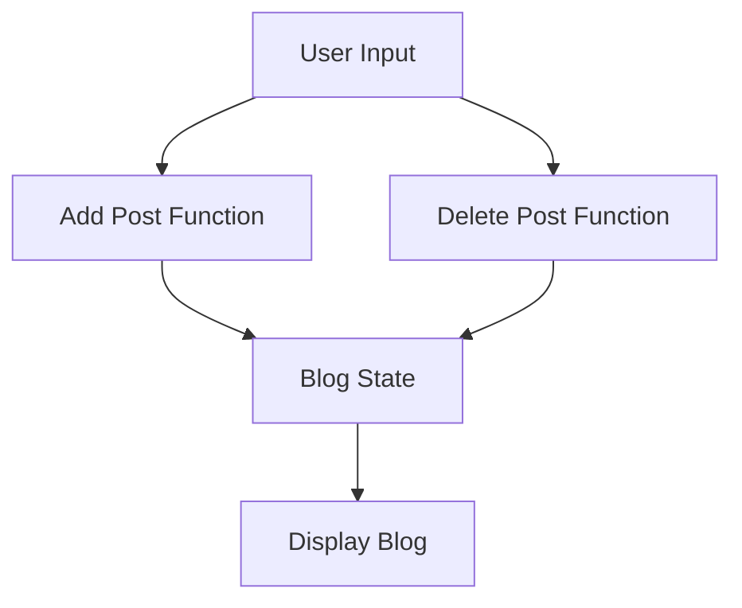

## 15.4. Capstone Project: Mini Blog Platform

In this capstone project, we will explore how to design and implement a mini blog platform using functional programming principles. This project will help solidify your understanding of pure functions, immutability, and function composition, which are foundational concepts in functional programming. We will guide you through the architecture design and implementation of core features such as post creation, listing, and deletion using Haskell, JavaScript, and Scala.

### Designing the Architecture Functionally

When designing a mini blog platform with functional programming, the focus is on leveraging pure functions and immutable data structures. This approach ensures that our application is predictable, testable, and maintainable.

#### Key Architectural Principles

1. **Pure Functions:** Ensure that all functions are pure, meaning they do not have side effects and always produce the same output for the same input.
2. **Immutability:** Use immutable data structures to prevent accidental changes to data, which enhances the reliability of the application.
3. **Function Composition:** Build complex functionality by composing simple functions, promoting code reuse and modularity.

#### Architecture Overview

The architecture of our mini blog platform can be visualized as a series of functional transformations applied to immutable data structures. Here's a high-level overview of the architecture:



- **User Input:** Represents actions such as adding or deleting a post.
- **Add Post Function:** A pure function that adds a new post to the blog.
- **Delete Post Function:** A pure function that removes a post from the blog.
- **Blog State:** An immutable list representing the current state of the blog.
- **Display Blog:** A function that outputs the current list of posts.

### Implementing Core Features

Let's implement the core features of our mini blog platform: post creation, listing, and deletion. We'll demonstrate these features in Haskell, JavaScript, and Scala.

#### Haskell Implementation

In Haskell, we use lists to represent the blog and define pure functions for adding and deleting posts.

```haskell
type Post = String
type Blog = [Post]

addPost :: Post -> Blog -> Blog
addPost post blog = post : blog

deletePost :: Post -> Blog -> Blog
deletePost post = filter (/= post)

main :: IO ()
main = do
  let blog = []
  let blog1 = addPost "First Post" blog
  let blog2 = addPost "Second Post" blog1
  let blog3 = deletePost "First Post" blog2
  print blog3 -- ["Second Post"]
```

- **addPost:** Adds a new post to the beginning of the blog list.
- **deletePost:** Removes a post from the blog list using the `filter` function.

#### JavaScript Implementation

In JavaScript, we use the Ramda library to handle immutability and functional operations.

```javascript
const R = require('ramda');

const addPost = (post, blog) => R.prepend(post, blog);
const deletePost = (post, blog) => R.reject(R.equals(post), blog);

// Usage
let blog = [];
blog = addPost("First Post", blog);
blog = addPost("Second Post", blog);
blog = deletePost("First Post", blog);
console.log(blog); // ["Second Post"]
```

- **addPost:** Uses `R.prepend` to add a post to the blog.
- **deletePost:** Uses `R.reject` to filter out the specified post.

#### Scala Implementation

In Scala, we use case classes and immutable lists to represent posts and the blog.

```scala
case class Post(content: String)

type Blog = List[Post]

def addPost(post: Post, blog: Blog): Blog = post :: blog

def deletePost(post: Post, blog: Blog): Blog = blog.filterNot(_ == post)

def main(args: Array[String]): Unit = {
  var blog: Blog = List()
  blog = addPost(Post("First Post"), blog)
  blog = addPost(Post("Second Post"), blog)
  blog = deletePost(Post("First Post"), blog)
  println(blog) // List(Post(Second Post))
}
```

- **addPost:** Adds a post to the front of the blog list.
- **deletePost:** Filters out the specified post from the blog list.

### Visual Aids

To better understand the data flow and function interactions within our mini blog platform, refer to the Mermaid.js diagram provided earlier. This diagram illustrates how user inputs are transformed through pure functions to update the blog state.

### Practical Exercises

To reinforce your understanding, try implementing additional features such as editing a post or searching for posts by keywords. Consider how you can maintain immutability and use pure functions to achieve these tasks.

### References

- "Building Web Apps with Haskell and Yesod" by Bryan O'Sullivan.
- "Functional Programming in Scala" by Paul Chiusano and Rúnar Bjarnason.

These resources provide further insights into building functional applications and can help deepen your understanding of the concepts covered in this project.

## Quiz Time!



### Which of the following is a key principle of functional programming used in the mini blog platform?

- [x] Immutability
- [ ] Global State
- [ ] Side Effects
- [ ] Mutable Variables

> **Explanation:** Immutability is a core principle of functional programming, ensuring that data structures do not change state after they are created.

### What is the purpose of using pure functions in the mini blog platform?

- [x] To ensure predictability and testability
- [ ] To allow side effects
- [ ] To enable global state changes
- [ ] To increase code complexity

> **Explanation:** Pure functions help ensure that the code is predictable and testable, as they always produce the same output for the same input without side effects.

### In the Haskell code example, what does the `addPost` function do?

- [x] Adds a new post to the beginning of the blog list
- [ ] Deletes a post from the blog list
- [ ] Modifies an existing post in the blog list
- [ ] Clears all posts from the blog list

> **Explanation:** The `addPost` function in Haskell adds a new post to the beginning of the blog list using the `:` operator.

### How does the JavaScript implementation ensure immutability?

- [x] By using the Ramda library
- [ ] By using global variables
- [ ] By modifying the original array
- [ ] By using mutable objects

> **Explanation:** The JavaScript implementation uses the Ramda library, which provides functions that operate on immutable data structures.

### In Scala, what type is used to represent a blog?

- [x] List[Post]
- [ ] Array[Post]
- [ ] Set[Post]
- [ ] Map[Post]

> **Explanation:** In Scala, a blog is represented as a `List[Post]`, which is an immutable list of posts.

### What is the role of function composition in the mini blog platform?

- [x] To build complex functionality from simple functions
- [ ] To increase code duplication
- [ ] To allow side effects
- [ ] To enable mutable state

> **Explanation:** Function composition allows building complex functionality by combining simple functions, promoting code reuse and modularity.

### Which function in the Haskell example is responsible for removing a post?

- [x] deletePost
- [ ] addPost
- [ ] main
- [ ] filter

> **Explanation:** The `deletePost` function in Haskell is responsible for removing a post from the blog list.

### What does the `filterNot` function do in the Scala code example?

- [x] Removes elements that match a condition
- [ ] Adds elements to a list
- [ ] Modifies elements in a list
- [ ] Clears all elements from a list

> **Explanation:** The `filterNot` function in Scala removes elements from a list that match a specified condition.

### Which library is used in the JavaScript example to handle functional operations?

- [x] Ramda
- [ ] Lodash
- [ ] jQuery
- [ ] Underscore

> **Explanation:** The JavaScript example uses the Ramda library to handle functional operations and ensure immutability.

### True or False: In functional programming, data structures are typically mutable.

- [ ] True
- [x] False

> **Explanation:** In functional programming, data structures are typically immutable, meaning they cannot be changed after they are created.


