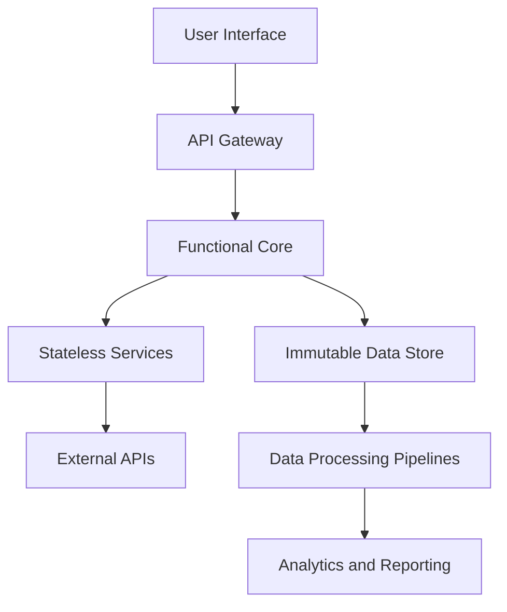

## 15.5. Analyzing Real-World Functional Applications

Functional programming (FP) has moved beyond academic circles and niche applications to become a powerful tool in the arsenal of many leading technology companies. This section delves into real-world applications of functional programming, examining how industry giants like Facebook and Twitter have integrated FP principles into their systems. We will explore the benefits they have realized, the challenges they faced, and the lessons learned from their experiences.

### Case Studies of Functional Programming in Industry

#### Facebook and Hack

Facebook, a pioneer in social media, has adopted functional programming principles through its language Hack. Hack is a dialect of PHP that incorporates many functional programming features, such as type annotations, generics, and lambda expressions. By integrating these features, Facebook has improved the reliability and maintainability of its codebase.

**Key Benefits:**
- **Type Safety:** Hack's type system helps catch errors at compile-time, reducing runtime errors and improving code quality.
- **Performance Improvements:** Functional constructs like immutability and pure functions have led to more predictable and optimized performance.
- **Developer Productivity:** The use of functional paradigms has streamlined development processes, allowing engineers to write cleaner and more concise code.

**Challenges:**
- **Learning Curve:** Transitioning to a functional style required significant training and adaptation for developers accustomed to imperative programming.
- **Integration with Legacy Systems:** Incorporating functional programming into an existing codebase presented challenges in terms of compatibility and refactoring.

#### Twitter and Scala

Twitter's adoption of Scala, a language that blends object-oriented and functional programming, has been instrumental in scaling its platform to handle millions of tweets per day. Scala's functional features, such as pattern matching and higher-order functions, have enabled Twitter to build robust and scalable systems.

**Key Benefits:**
- **Concurrency and Parallelism:** Scala's functional constructs have facilitated the development of concurrent and parallel applications, crucial for handling Twitter's massive data streams.
- **Code Reusability:** Functional programming has enhanced code modularity, making it easier to reuse and maintain components across different projects.
- **Enhanced Testing:** The use of pure functions has simplified testing, as functions can be tested in isolation without side effects.

**Challenges:**
- **Complexity in Debugging:** Debugging functional code, especially in a concurrent environment, can be more complex compared to traditional paradigms.
- **Balancing Paradigms:** Finding the right balance between functional and object-oriented paradigms in Scala required careful consideration and design.

### Lessons Learned from Functional Projects

The experiences of Facebook and Twitter highlight several important lessons for organizations considering the adoption of functional programming:

1. **Gradual Transition:** A phased approach to adopting functional programming can help mitigate the learning curve and integration challenges.
2. **Training and Support:** Providing comprehensive training and resources for developers is crucial to successfully transitioning to a functional programming paradigm.
3. **Tooling and Infrastructure:** Investing in robust tooling and infrastructure that supports functional programming can enhance productivity and ease the transition process.
4. **Cultural Shift:** Embracing functional programming often requires a cultural shift within the organization, promoting a mindset that values immutability, pure functions, and declarative code.

### Visual Aids

Below is a conceptual diagram illustrating the architecture of a real-world functional application, highlighting how FP principles are applied:



### Code Snippets

Let's explore some code snippets that demonstrate the application of functional programming principles in large-scale systems.

#### Example in Scala

```scala
// A simple example of a pure function in Scala
def calculateTotalPrice(items: List[Double], taxRate: Double): Double = {
  val subtotal = items.sum
  subtotal + (subtotal * taxRate)
}

// Usage of higher-order functions to process a list of tweets
val tweets = List("Hello World!", "Functional Programming is great!", "Scala is powerful!")
val processedTweets = tweets.map(_.toUpperCase).filter(_.contains("SCALA"))

println(processedTweets) // Output: List("SCALA IS POWERFUL!")
```

#### Example in JavaScript with FP Libraries

```javascript
// Using Ramda.js for functional programming in JavaScript
const R = require('ramda');

// Pure function to calculate total price
const calculateTotalPrice = (items, taxRate) => {
  const subtotal = R.sum(items);
  return subtotal + (subtotal * taxRate);
};

// Processing tweets with functional composition
const tweets = ["Hello World!", "Functional Programming is great!", "JavaScript is versatile!"];
const processedTweets = R.pipe(
  R.map(R.toUpper),
  R.filter(R.includes("JAVASCRIPT"))
)(tweets);

console.log(processedTweets); // Output: ["JAVASCRIPT IS VERSATILE!"]
```

### References

- Chiusano, P., & Bjarnason, R. (2014). *Functional Programming in Scala*. Manning Publications.
- Articles and whitepapers on FP adoption in companies like Facebook, Twitter, and others.

### Conclusion

The adoption of functional programming in real-world applications by companies like Facebook and Twitter demonstrates the significant benefits of this paradigm, including improved code quality, scalability, and developer productivity. However, it also highlights the challenges of transitioning to a functional style, such as the learning curve and integration with existing systems. By learning from these case studies, other organizations can better navigate the path to functional programming and leverage its full potential.

## Quiz Time!



### Which company uses Hack, a dialect of PHP, to incorporate functional programming principles?

- [x] Facebook
- [ ] Twitter
- [ ] Google
- [ ] Microsoft

> **Explanation:** Facebook developed Hack to improve the reliability and maintainability of its codebase by incorporating functional programming features.

### What is one of the key benefits Twitter has realized by using Scala?

- [x] Enhanced concurrency and parallelism
- [ ] Simplified user interface design
- [ ] Reduced server costs
- [ ] Increased marketing reach

> **Explanation:** Scala's functional constructs have facilitated the development of concurrent and parallel applications, crucial for handling Twitter's massive data streams.

### What is a common challenge faced by companies adopting functional programming?

- [x] Learning curve for developers
- [ ] Increased hardware requirements
- [ ] Lack of community support
- [ ] Difficulty in finding use cases

> **Explanation:** Transitioning to a functional style requires significant training and adaptation for developers accustomed to imperative programming.

### Which of the following is a functional programming feature that Hack incorporates?

- [x] Type annotations
- [ ] Dynamic typing
- [ ] Procedural loops
- [ ] Global variables

> **Explanation:** Hack incorporates type annotations, which are a feature of functional programming that helps catch errors at compile-time.

### What is a benefit of using pure functions in functional programming?

- [x] Simplified testing
- [ ] Increased code complexity
- [x] Predictable behavior
- [ ] More side effects

> **Explanation:** Pure functions are deterministic and have no side effects, making them easier to test and predict.

### Which language blends object-oriented and functional programming, as used by Twitter?

- [x] Scala
- [ ] Haskell
- [ ] Python
- [ ] Ruby

> **Explanation:** Scala is a language that blends object-oriented and functional programming, used by Twitter to build robust and scalable systems.

### What is a key lesson learned from functional projects?

- [x] Gradual transition is beneficial
- [ ] Immediate full-scale adoption is best
- [x] Training and support are crucial
- [ ] Avoid using functional programming in large projects

> **Explanation:** A phased approach and comprehensive training are crucial for successfully transitioning to functional programming.

### What does the Mermaid.js diagram in the article illustrate?

- [x] Architecture of a real-world functional application
- [ ] User interface design
- [ ] Marketing strategy
- [ ] Financial projections

> **Explanation:** The diagram illustrates the architecture of a real-world functional application, highlighting how FP principles are applied.

### Which functional programming principle helps in reducing runtime errors?

- [x] Type safety
- [ ] Dynamic typing
- [ ] Global state management
- [ ] Procedural loops

> **Explanation:** Type safety helps catch errors at compile-time, reducing runtime errors and improving code quality.

### True or False: Functional programming can enhance code modularity and reusability.

- [x] True
- [ ] False

> **Explanation:** Functional programming enhances code modularity and reusability by promoting the use of pure functions and immutable data structures.


