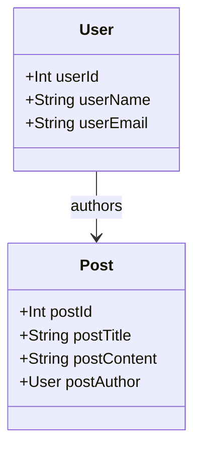

## 15.6. Domain Modeling with Functional Programming

In the realm of software development, domain modeling is a critical practice that involves representing the key concepts and relationships within a specific problem domain. Functional programming offers a unique and powerful approach to domain modeling, leveraging its core principles such as immutability, pure functions, and algebraic data types. This section delves into how functional programming can be effectively used to model complex systems, ensuring robustness, maintainability, and clarity.

### Modeling Complex Systems Functionally

Functional programming provides a set of tools and techniques that are particularly well-suited for modeling complex domains. By using algebraic data types and pattern matching, developers can create clear and concise representations of domain entities and their behaviors.

#### Algebraic Data Types

Algebraic data types (ADTs) are a cornerstone of functional programming, allowing developers to define composite types that can represent a wide range of domain concepts. ADTs come in two main forms: sum types and product types.

- **Sum Types** (also known as tagged unions or variant types) allow a value to be one of several different types. This is useful for representing entities that can exist in multiple states.
- **Product Types** combine multiple values into a single entity, akin to a record or a struct in other programming paradigms.

#### Pattern Matching

Pattern matching is a powerful feature in functional programming that allows developers to deconstruct data structures and execute code based on their shape and content. This is particularly useful for handling the different cases of sum types, enabling clear and concise logic for domain operations.

### Applying Functional Concepts to Real-World Problems

Functional programming concepts such as immutability, pure functions, and function composition are invaluable in solving real-world modeling challenges.

#### Immutability

Immutability ensures that once a data structure is created, it cannot be altered. This leads to more predictable and reliable code, as data cannot be inadvertently changed by other parts of the system. In domain modeling, immutability helps maintain the integrity of domain entities.

#### Pure Functions

Pure functions, which have no side effects and always produce the same output for the same input, are ideal for implementing domain logic. They enhance testability and maintainability, as they are easier to reason about and verify.

#### Function Composition

Function composition allows developers to build complex operations by combining simpler functions. This modular approach promotes code reuse and clarity, making it easier to implement and understand domain logic.

### Visual Aids

To illustrate how these concepts come together in a functional context, consider the following domain model diagram created using Mermaid.js:



This diagram represents a simple domain model with `User` and `Post` entities, where a `User` can author multiple `Post` objects.

### Code Snippets

Let's explore how this domain model can be implemented in different functional programming languages.

#### Haskell Domain Model Example

```haskell
data User = User { userId :: Int, userName :: String, userEmail :: String }
data Post = Post { postId :: Int, postTitle :: String, postContent :: String, postAuthor :: User }

validateEmail :: String -> Bool
validateEmail email = "@" `elem` email

createUser :: Int -> String -> String -> Either String User
createUser id name email =
  if validateEmail email 
  then Right (User id name email)
  else Left "Invalid email address"
```

In Haskell, we define `User` and `Post` as product types using record syntax. The `createUser` function demonstrates how to use pattern matching and the `Either` type for error handling.

#### Scala Domain Model Example

```scala
case class User(id: Int, name: String, email: String)
case class Post(id: Int, title: String, content: String, author: User)

def validateEmail(email: String): Boolean = email.contains("@")

def createUser(id: Int, name: String, email: String): Either[String, User] =
  if (validateEmail(email)) Right(User(id, name, email))
  else Left("Invalid email address")
```

Scala's case classes provide a concise way to define immutable data structures. The `createUser` function uses Scala's `Either` type to handle validation logic.

#### JavaScript Example

```javascript
const { Either } = require('folktale/data/either');

const validateEmail = (email) => email.includes('@');

const createUser = (id, name, email) => {
  if (validateEmail(email)) {
    return Either.Right({ id, name, email });
  }
  return Either.Left("Invalid email address");
};

const user = createUser(1, "Alice", "alice@example.com");
const invalidUser = createUser(2, "Bob", "bobexample.com");

console.log(user); // Right({ id: 1, name: 'Alice', email: 'alice@example.com' })
console.log(invalidUser); // Left("Invalid email address")
```

In JavaScript, libraries like Folktale provide functional constructs such as `Either` to facilitate functional domain modeling. The `createUser` function illustrates how to apply these concepts in a JavaScript context.

### Practical Exercises

To reinforce these concepts, try the following exercises:

1. **Extend the Domain Model:**
   - Add a `Comment` entity to the domain model, where each comment is associated with a `Post` and a `User`.
   - Implement the necessary data structures and functions in Haskell, Scala, and JavaScript.

2. **Implement Business Logic:**
   - Write a function to retrieve all posts authored by a specific user.
   - Ensure the function is pure and handles potential errors gracefully.

3. **Validate Domain Constraints:**
   - Implement additional validation logic for the `Post` entity, such as ensuring the title is not empty.
   - Use pattern matching and algebraic data types to handle validation results.

### References

- "Domain-Driven Design: Tackling Complexity in the Heart of Software" by Eric Evans.
- "Functional Domain Modeling" by Simon Thompson.

These resources provide further insights into domain modeling and functional programming, offering a deeper understanding of how to apply these concepts effectively.

## Quiz Time!



### What is an algebraic data type in functional programming?

- [x] A composite type that can represent multiple forms of data, such as sum and product types.
- [ ] A type that only allows for integer values.
- [ ] A type that is mutable and can change state.
- [ ] A type used exclusively for error handling.

> **Explanation:** Algebraic data types are used to define composite types that can represent various forms of data, such as sum and product types.

### How does immutability benefit domain modeling in functional programming?

- [x] It ensures data integrity by preventing unintended changes.
- [ ] It allows for faster data processing.
- [ ] It makes the code harder to understand.
- [ ] It requires more memory usage.

> **Explanation:** Immutability ensures data integrity by preventing unintended changes, making the code more predictable and reliable.

### What is the purpose of pattern matching in functional programming?

- [x] To deconstruct data structures and execute code based on their shape and content.
- [ ] To increase the speed of program execution.
- [ ] To allow for mutable state changes.
- [ ] To simplify the syntax of loops.

> **Explanation:** Pattern matching allows developers to deconstruct data structures and execute code based on their shape and content, which is especially useful for handling sum types.

### Which of the following is a characteristic of pure functions?

- [x] They have no side effects and always produce the same output for the same input.
- [ ] They can modify global variables.
- [ ] They depend on external state.
- [ ] They can produce different outputs for the same input.

> **Explanation:** Pure functions have no side effects and always produce the same output for the same input, enhancing testability and maintainability.

### What is the `Either` type used for in functional programming?

- [x] Representing computations that can result in a success or failure.
- [ ] Storing multiple values of different types.
- [ ] Iterating over collections.
- [ ] Performing arithmetic operations.

> **Explanation:** The `Either` type is used to represent computations that can result in a success or failure, providing a way to handle errors without exceptions.

### In the provided Haskell example, what does the `createUser` function return if the email is invalid?

- [x] `Left "Invalid email address"`
- [ ] `Right (User id name email)`
- [ ] `Nothing`
- [ ] `Just (User id name email)`

> **Explanation:** If the email is invalid, the `createUser` function returns `Left "Invalid email address"` to indicate an error.

### How does function composition benefit domain modeling?

- [x] It allows complex operations to be built from simpler functions, promoting code reuse and clarity.
- [ ] It increases the complexity of the code.
- [ ] It makes debugging more difficult.
- [ ] It requires more computational resources.

> **Explanation:** Function composition allows complex operations to be built from simpler functions, promoting code reuse and clarity.

### What is the role of the `validateEmail` function in the domain model examples?

- [x] To check if an email address contains an "@" symbol.
- [ ] To send an email to the user.
- [ ] To store the email in a database.
- [ ] To encrypt the email address.

> **Explanation:** The `validateEmail` function checks if an email address contains an "@" symbol, ensuring basic email validity.

### Which language feature is used in Scala to define immutable data structures?

- [x] Case classes
- [ ] Mutable variables
- [ ] Loops
- [ ] Arrays

> **Explanation:** Scala's case classes provide a concise way to define immutable data structures.

### True or False: In functional programming, domain models are typically mutable to allow for easy updates.

- [ ] True
- [x] False

> **Explanation:** In functional programming, domain models are typically immutable to ensure data integrity and predictability.


