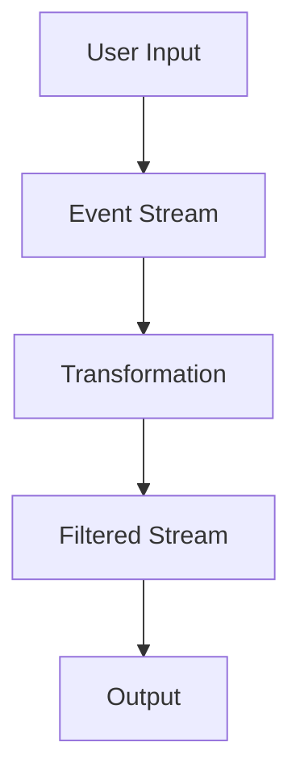

## 15.7. Introduction to Reactive and Functional Reactive Programming (FRP)

In the ever-evolving landscape of software development, the ability to handle dynamic data flows and asynchronous events efficiently is crucial. Reactive Programming and Functional Reactive Programming (FRP) offer powerful paradigms to address these challenges. This section delves into the basics of reactive programming concepts, explores how FRP integrates with functional programming, and provides practical examples in Haskell and Scala.

### Basics of Reactive Programming Concepts

Reactive Programming is an asynchronous programming paradigm centered around data streams and the propagation of change. It enables developers to build systems that react to changes in data over time, making it particularly useful for applications that require real-time updates, such as user interfaces, data processing pipelines, and networked applications.

#### Key Concepts of Reactive Programming

1. **Data Streams:** At the core of reactive programming are data streams, which represent sequences of ongoing events ordered in time. These streams can be anything from user inputs to network requests.

2. **Propagation of Change:** Reactive systems automatically propagate changes through the data streams. When a source stream changes, all dependent computations are updated accordingly.

3. **Asynchronous Event Handling:** Reactive programming excels at handling asynchronous events, allowing systems to remain responsive under varying loads and conditions.

4. **Declarative Nature:** Reactive programming emphasizes a declarative style, where the focus is on what the system should do, rather than how to do it.

### How FRP Relates to Functional Programming

Functional Reactive Programming (FRP) is a paradigm that combines the principles of functional programming with reactive programming. It allows developers to handle dynamic data flows and time-based operations in a declarative manner, leveraging the benefits of both paradigms.

#### Integration of FP and Reactive Programming

- **Immutability and Pure Functions:** FRP leverages immutability and pure functions to ensure that data flows are predictable and side-effect-free. This makes reasoning about the system's behavior easier and more reliable.

- **Declarative Data Flow:** In FRP, data flows are expressed declaratively, allowing developers to specify the relationships between different parts of the system without worrying about the underlying implementation details.

- **Time as a First-Class Citizen:** FRP treats time as a first-class concept, enabling developers to model time-varying values and behaviors directly within the programming language.

- **Event Streams and Behaviors:** FRP introduces the concepts of event streams and behaviors. Event streams represent discrete events over time, while behaviors represent continuous, time-varying values.

### Visual Aids

To better understand the principles of reactive programming and FRP, let's visualize a simple reactive stream using Mermaid.js:



In this diagram, a user input generates an event stream, which is then transformed and filtered before producing an output. This illustrates the flow of data through a reactive system.

### Code Snippets

Let's explore how these concepts are implemented in Haskell and Scala, two languages known for their strong support of functional programming.

#### Haskell with Reactive-banana

Reactive-banana is a library for functional reactive programming in Haskell. Here's a simple example demonstrating how to create a reactive network that increments a counter each time an event is fired:

```haskell
import Reactive.Banana
import Reactive.Banana.Frameworks

main :: IO ()
main = do
  (addHandler, fire) <- newAddHandler
  let networkDescription :: MomentIO ()
      networkDescription = do
        eAdd <- fromAddHandler addHandler
        let eIncrement = () <$ eAdd
        bCount <- accumB 0 (const (+1) <$> eIncrement)
        reactimate $ fmap (putStrLn . show) $ changes bCount
  network <- compile networkDescription
  actuate network
  fire ()
  fire ()
  fire ()
```

In this example, we define an event stream `eAdd` that triggers an increment operation on a behavior `bCount`. The `reactimate` function is used to output the current count each time it changes.

#### Scala with Akka Streams

Akka Streams is a powerful library for building reactive streams in Scala. Here's an example of a simple stream that doubles each number from 1 to 10 and prints the result:

```scala
import akka.actor.ActorSystem
import akka.stream.scaladsl.{Flow, Sink, Source}
import akka.stream.ActorMaterializer

import scala.concurrent.ExecutionContext.Implicits.global

object AkkaStreamExample extends App {
  implicit val system = ActorSystem("AkkaStreamExample")
  implicit val materializer = ActorMaterializer()
  
  val source = Source(1 to 10)
  val flow = Flow[Int].map(_ * 2)
  val sink = Sink.foreach[Int](println)
  
  source.via(flow).runWith(sink)
}
```

This Scala example demonstrates how to create a source of integers, apply a transformation to double each number, and then print the results to the console.

### References

- "Reactive Programming with Scala and Akka" by Rúnar Bjarnason.
- "Functional Reactive Programming" by Stephen Blackheath and Anthony Jones.

These resources provide further insights into the principles and applications of reactive programming and FRP.

## Quiz Time!



### What is the core concept of reactive programming?

- [x] Data streams and the propagation of change
- [ ] Object-oriented design patterns
- [ ] Synchronous data processing
- [ ] Procedural programming techniques

> **Explanation:** Reactive programming focuses on data streams and the propagation of change, allowing systems to react to data updates dynamically.

### How does FRP integrate with functional programming?

- [x] By combining immutability and pure functions with reactive data flows
- [ ] By using object-oriented principles to manage state
- [ ] By focusing on synchronous operations
- [ ] By emphasizing procedural code structures

> **Explanation:** FRP integrates functional programming principles like immutability and pure functions with reactive data flows to handle dynamic data efficiently.

### What is an event stream in FRP?

- [x] A sequence of discrete events ordered in time
- [ ] A continuous flow of data without any events
- [ ] A static collection of data points
- [ ] A synchronous data processing pipeline

> **Explanation:** An event stream in FRP represents a sequence of discrete events ordered in time, which can be processed reactively.

### What role does time play in FRP?

- [x] Time is treated as a first-class citizen
- [ ] Time is ignored in FRP
- [ ] Time is only relevant for synchronous operations
- [ ] Time is managed through procedural code

> **Explanation:** In FRP, time is treated as a first-class citizen, allowing developers to model time-varying values and behaviors directly.

### Which library is used for FRP in Haskell?

- [x] Reactive-banana
- [ ] Akka Streams
- [ ] RxJava
- [ ] Angular

> **Explanation:** Reactive-banana is a library used for functional reactive programming in Haskell.

### What is the purpose of the `reactimate` function in Haskell's Reactive-banana?

- [x] To perform side effects in response to changes in behaviors
- [ ] To create new event streams
- [ ] To compile the reactive network
- [ ] To handle exceptions in the reactive network

> **Explanation:** The `reactimate` function in Reactive-banana is used to perform side effects in response to changes in behaviors.

### In Scala's Akka Streams, what does the `Flow` component represent?

- [x] A transformation applied to data streams
- [ ] A source of data
- [ ] A sink for data
- [ ] A static data structure

> **Explanation:** In Akka Streams, the `Flow` component represents a transformation applied to data streams.

### What is the primary benefit of using reactive programming?

- [x] Efficient handling of asynchronous events and data streams
- [ ] Simplified synchronous data processing
- [ ] Enhanced object-oriented design
- [ ] Reduced need for functional programming principles

> **Explanation:** Reactive programming efficiently handles asynchronous events and data streams, making it ideal for real-time applications.

### How does FRP handle side effects?

- [x] By isolating side effects from pure logic
- [ ] By integrating side effects directly into data flows
- [ ] By ignoring side effects altogether
- [ ] By using procedural code to manage side effects

> **Explanation:** FRP handles side effects by isolating them from pure logic, ensuring that data flows remain predictable and side-effect-free.

### True or False: Reactive programming is only applicable to user interface development.

- [ ] True
- [x] False

> **Explanation:** Reactive programming is applicable to a wide range of domains, including user interfaces, data processing pipelines, and networked applications.


