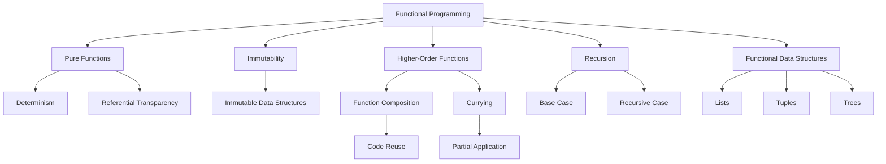

## 16.1. Recap of Key Concepts in Functional Programming

As we conclude our journey through the fundamentals of functional programming, it's essential to revisit the core principles and techniques that form the backbone of this paradigm. This recap will serve as a consolidation of your understanding and a springboard for further exploration and application of functional programming concepts.

### Reviewing Core Functional Principles

Functional programming (FP) is a paradigm that emphasizes the use of pure functions, immutability, and declarative programming to create robust and maintainable software. Let's revisit some of the foundational principles that have been discussed throughout this book:

#### Pure Functions

At the heart of functional programming lies the concept of pure functions. A pure function is one that, given the same input, will always produce the same output and has no side effects. This determinism and referential transparency make pure functions predictable and easy to test.

**Example:**

```haskell
-- A pure function in Haskell
add :: Int -> Int -> Int
add x y = x + y
```

In this example, the `add` function is pure because it consistently returns the same result for the same inputs and does not alter any external state.

#### Immutability

Immutability is a cornerstone of functional programming, where data structures are not modified after they are created. Instead, new data structures are produced with the desired changes. This approach prevents unintended side effects and makes concurrent programming safer and more straightforward.

**Example:**

```scala
// Immutable list in Scala
val numbers = List(1, 2, 3)
val newNumbers = numbers :+ 4 // Creates a new list with an additional element
```

Here, `numbers` remains unchanged, and `newNumbers` is a new list with the added element.

#### Higher-Order Functions

Higher-order functions are functions that can take other functions as arguments or return them as results. They enable powerful abstractions and code reuse.

**Example:**

```javascript
// A higher-order function in JavaScript
function applyOperation(arr, operation) {
  return arr.map(operation);
}

const result = applyOperation([1, 2, 3], x => x * 2); // [2, 4, 6]
```

In this example, `applyOperation` is a higher-order function that applies a given operation to each element of an array.

#### Recursion

Recursion is a technique where a function calls itself to solve smaller instances of a problem. It is a natural fit for functional programming, especially when dealing with immutable data structures.

**Example:**

```fsharp
// Recursive function in F#
let rec factorial n =
    if n <= 1 then 1
    else n * factorial (n - 1)
```

This recursive `factorial` function calculates the factorial of a number by calling itself with a decremented value.

#### Functional Data Structures

Functional programming often utilizes immutable data structures such as lists, tuples, and trees. These structures support operations that do not alter the original data, aligning with the principles of immutability.

**Example:**

```haskell
-- Immutable list operations in Haskell
let numbers = [1, 2, 3]
let newNumbers = 0 : numbers -- Prepending an element
```

### Highlighting Important Techniques and Practices

In addition to the core principles, several techniques and practices are crucial for building effective functional programs:

#### Function Composition

Function composition involves combining simple functions to build more complex ones. This technique promotes code reuse and modularity.

**Example:**

```haskell
-- Function composition in Haskell
let compose f g x = f (g x)
let addOne = (+1)
let double = (*2)
let addOneThenDouble = compose double addOne
```

Here, `addOneThenDouble` is a composed function that first adds one to a number and then doubles the result.

#### Currying

Currying is the process of transforming a function that takes multiple arguments into a series of functions that each take a single argument. It enables partial application and function reuse.

**Example:**

```javascript
// Currying in JavaScript
function multiply(a) {
  return function(b) {
    return a * b;
  };
}

const double = multiply(2);
console.log(double(5)); // 10
```

In this example, `multiply` is a curried function, and `double` is a partially applied function that multiplies its input by two.

#### Pattern Matching

Pattern matching is a technique used to destructure data and execute code based on its shape. It simplifies complex conditional logic and enhances code readability.

**Example:**

```scala
// Pattern matching in Scala
val number = 3
val result = number match {
  case 1 => "One"
  case 2 => "Two"
  case 3 => "Three"
  case _ => "Other"
}
```

This Scala example uses pattern matching to determine the string representation of a number.

#### Error Handling

Functional programming favors using types like `Option`/`Maybe` and `Either` to handle errors and represent computations that may fail, avoiding exceptions and promoting safer code.

**Example:**

```haskell
-- Using Maybe in Haskell
safeDivide :: Double -> Double -> Maybe Double
safeDivide _ 0 = Nothing
safeDivide x y = Just (x / y)
```

The `safeDivide` function returns `Nothing` for division by zero, representing an error without throwing an exception.

### Visual Aids

To encapsulate the key concepts covered in each chapter, let's use a Mermaid.js diagram to visualize the relationships and flow of these principles and techniques:



### References

Throughout this book, we have referenced several foundational texts and resources that provide deeper insights into functional programming:

- "Structure and Interpretation of Computer Programs" by Harold Abelson and Gerald Jay Sussman
- "Functional Programming in Scala" by Paul Chiusano and Runar Bjarnason
- "Learn You a Haskell for Great Good!" by Miran Lipovača
- "Real World Haskell" by Bryan O'Sullivan, Don Stewart, and John Goerzen

These resources are invaluable for anyone looking to deepen their understanding of functional programming concepts and practices.

## Quiz Time!



### What is a pure function?

- [x] A function that always produces the same output for the same input and has no side effects
- [ ] A function that can modify global variables
- [ ] A function that relies on external state
- [ ] A function that produces random results

> **Explanation:** A pure function is deterministic and does not cause side effects, making it predictable and easy to test.

### What is immutability in functional programming?

- [x] The concept that data structures cannot be modified after they are created
- [ ] The ability to change data structures freely
- [ ] The use of mutable variables
- [ ] The reliance on global state

> **Explanation:** Immutability ensures that data structures remain unchanged, which helps prevent side effects and makes concurrent programming safer.

### What is a higher-order function?

- [x] A function that takes other functions as arguments or returns them as results
- [ ] A function that only performs arithmetic operations
- [ ] A function that cannot be passed as an argument
- [ ] A function that modifies global state

> **Explanation:** Higher-order functions enable powerful abstractions by allowing functions to be used as arguments or return values.

### What is recursion?

- [x] A technique where a function calls itself to solve smaller instances of a problem
- [ ] A method of iterating over arrays
- [ ] A way to modify global variables
- [ ] A technique for creating mutable data structures

> **Explanation:** Recursion involves a function calling itself, often with a base case to terminate the recursive calls.

### What is function composition?

- [x] Combining simple functions to build more complex ones
- [ ] Writing functions that modify global variables
- [ ] Using loops to iterate over data
- [ ] Creating mutable data structures

> **Explanation:** Function composition allows for building complex functions by combining simpler ones, promoting code reuse and modularity.

### What is currying?

- [x] Transforming a function that takes multiple arguments into a series of functions that each take a single argument
- [ ] A method of iterating over arrays
- [ ] A way to modify global variables
- [ ] A technique for creating mutable data structures

> **Explanation:** Currying enables partial application and function reuse by breaking down functions into a series of single-argument functions.

### What is pattern matching?

- [x] A technique used to destructure data and execute code based on its shape
- [ ] A method of iterating over arrays
- [ ] A way to modify global variables
- [ ] A technique for creating mutable data structures

> **Explanation:** Pattern matching simplifies complex conditional logic by allowing code execution based on the structure of data.

### What is the purpose of using `Option`/`Maybe` types?

- [x] To handle errors and represent computations that may fail without using exceptions
- [ ] To modify global variables
- [ ] To iterate over arrays
- [ ] To create mutable data structures

> **Explanation:** `Option`/`Maybe` types represent computations that may fail, promoting safer error handling without exceptions.

### What is the benefit of using immutable data structures?

- [x] They prevent unintended side effects and make concurrent programming safer
- [ ] They allow for easy modification of data
- [ ] They rely on global state
- [ ] They produce random results

> **Explanation:** Immutable data structures do not change after creation, preventing side effects and making concurrent programming easier.

### True or False: Functional programming relies heavily on mutable state.

- [ ] True
- [x] False

> **Explanation:** Functional programming emphasizes immutability and avoids mutable state to prevent side effects and enhance code reliability.



This recap has provided a comprehensive overview of the key concepts and practices in functional programming. As you continue your journey, remember that mastering these principles will empower you to write more robust, maintainable, and efficient code.
