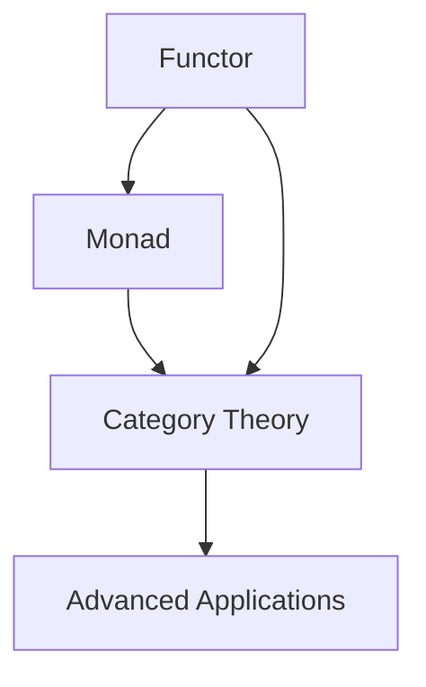

## 16.2. Preparing for Intermediate Functional Programming

As you reach the end of your foundational journey in functional programming, it's time to set your sights on more advanced concepts that will deepen your understanding and expand your capabilities. This section will introduce you to some of the key topics that form the backbone of intermediate and advanced functional programming, such as monads, functors, and category theory. These concepts are not only intellectually stimulating but also highly practical, enabling you to write more robust, maintainable, and expressive code.

### Introducing Advanced Topics: Monads, Functors, and Category Theory

#### Monads: The Programmers' Swiss Army Knife

Monads are a powerful abstraction that allows you to handle side effects, manage state, and perform computations in a functional way. They can be thought of as design patterns that encapsulate behavior and provide a way to chain operations together.

- **Definition and Purpose:** A monad is a type constructor paired with two operations, `bind` (often represented as `>>=`) and `return`, that follow specific laws (associativity, left identity, and right identity). These operations allow you to sequence computations while abstracting away the underlying complexity.

- **Practical Example in Haskell:**

  ```haskell
  -- Maybe Monad
  safeDivide :: Int -> Int -> Maybe Int
  safeDivide _ 0 = Nothing
  safeDivide x y = Just (x `div` y)
  
  -- Using Monad to chain operations
  result = do
    a <- safeDivide 10 2
    b <- safeDivide a 2
    return b
  -- result = Just 2
  ```

  In this example, the `Maybe` monad is used to handle division safely, avoiding division by zero errors by encapsulating the result in a `Maybe` type.

#### Functors: Mapping Over Contexts

Functors are a simpler abstraction compared to monads, focusing on the ability to apply a function over a wrapped value without altering the structure of the context.

- **Definition and Purpose:** A functor is a type class that implements the `map` function, allowing you to apply a function to a value wrapped in a context (like a list or a `Maybe`) without changing the context itself.

- **Practical Example in Scala (Using Cats):**

  ```scala
  import cats.Functor
  import cats.implicits._
  
  val listFunctor = Functor[List]
  val incremented = listFunctor.map(List(1, 2, 3))(x => x + 1) // List(2, 3, 4)
  ```

  Here, the `Functor` type class is used to increment each element in a list, demonstrating how functors allow you to work with values in a context.

#### Category Theory: The Mathematical Backbone

Category theory provides the theoretical foundation for many functional programming concepts, including monads and functors. It offers a high-level framework for understanding and formalizing the relationships between different types and operations.

- **Key Concepts:**
  - **Objects and Morphisms:** Objects represent types, while morphisms represent functions between these types.
  - **Composition:** The ability to combine morphisms to form new morphisms, akin to function composition in programming.
  - **Identity:** Each object has an identity morphism that acts as a neutral element in composition.

### Bridging Concepts to More Complex Functional Applications

The foundational concepts you've learned in this book—such as pure functions, higher-order functions, and immutability—are prerequisites for mastering more complex functional programming techniques. As you delve into intermediate topics, you'll see how these basic principles are applied in more sophisticated ways.

- **From Functors to Monads:** Understanding functors is a stepping stone to grasping monads. While functors allow you to map functions over wrapped values, monads provide a way to sequence operations that involve these wrapped values, handling side effects and state changes gracefully.

- **Real-World Applications:** Monads and functors are used extensively in real-world applications, from handling asynchronous operations in JavaScript with promises to managing state and side effects in Haskell and Scala. They enable developers to write cleaner, more modular code that is easier to reason about and maintain.

### Visual Aids

To better understand the relationships between these concepts, let's visualize them using a Mermaid.js diagram:



This diagram illustrates how functors and monads are related through category theory, forming the basis for more advanced functional programming applications.

### Code Snippets

Let's explore these concepts further with code snippets in Haskell and Scala:

- **Haskell Monad Example:**

  ```haskell
  -- Maybe Monad
  safeDivide :: Int -> Int -> Maybe Int
  safeDivide _ 0 = Nothing
  safeDivide x y = Just (x `div` y)
  
  -- Using Monad to chain operations
  result = do
    a <- safeDivide 10 2
    b <- safeDivide a 2
    return b
  -- result = Just 2
  ```

- **Scala Functor Example (Using Cats):**

  ```scala
  import cats.Functor
  import cats.implicits._
  
  val listFunctor = Functor[List]
  val incremented = listFunctor.map(List(1, 2, 3))(x => x + 1) // List(2, 3, 4)
  ```

These examples demonstrate the practical application of monads and functors in handling computations and transformations within a functional programming context.

### References

To further your understanding of these advanced topics, consider exploring the following resources:

- "Category Theory for Programmers" by Bartosz Milewski.
- "Functional Programming in Scala" by Paul Chiusano and Rúnar Bjarnason.

These texts provide in-depth explanations and examples that will help you master the intricacies of functional programming.

## Quiz Time!



### What is a monad in functional programming?

- [x] A type constructor paired with two operations, `bind` and `return`, that follow specific laws.
- [ ] A simple function that maps over a list.
- [ ] A data structure that holds multiple values.
- [ ] A programming language.

> **Explanation:** A monad is a type constructor with operations that allow for chaining computations, following specific laws.

### What is the primary purpose of a functor?

- [x] To apply a function to a value wrapped in a context without changing the context.
- [ ] To sequence operations that involve side effects.
- [ ] To handle asynchronous operations.
- [ ] To store multiple values in a single structure.

> **Explanation:** Functors allow you to map functions over values in a context, maintaining the context's structure.

### Which of the following is a key concept in category theory?

- [x] Objects and morphisms.
- [ ] Variables and loops.
- [ ] Classes and inheritance.
- [ ] Threads and processes.

> **Explanation:** Category theory involves objects and morphisms, which represent types and functions between types.

### How does a monad differ from a functor?

- [x] A monad allows for sequencing operations, while a functor allows for mapping functions over values.
- [ ] A monad stores values, while a functor does not.
- [ ] A monad is a type of functor that handles asynchronous operations.
- [ ] A monad is simpler than a functor.

> **Explanation:** Monads provide a way to sequence operations, whereas functors focus on mapping functions over values.

### What is the result of the Haskell monad example provided?

- [x] Just 2
- [ ] Nothing
- [ ] Just 5
- [ ] Just 10

> **Explanation:** The example chains safe division operations, resulting in `Just 2`.

### In the Scala functor example, what does the `incremented` variable contain?

- [x] List(2, 3, 4)
- [ ] List(1, 2, 3)
- [ ] List(3, 4, 5)
- [ ] List(0, 1, 2)

> **Explanation:** The functor maps an increment function over the list, resulting in `List(2, 3, 4)`.

### What is the role of category theory in functional programming?

- [x] It provides a theoretical foundation for concepts like monads and functors.
- [ ] It defines the syntax of functional programming languages.
- [ ] It describes how to optimize functional code.
- [ ] It is used for debugging functional programs.

> **Explanation:** Category theory offers a high-level framework for understanding relationships between types and operations.

### Which operation is commonly associated with monads?

- [x] Bind (>>=)
- [ ] Map
- [ ] Filter
- [ ] Reduce

> **Explanation:** The `bind` operation is used in monads to chain computations.

### What is the identity morphism in category theory?

- [x] A morphism that acts as a neutral element in composition.
- [ ] A function that maps a value to itself.
- [ ] A variable that holds a constant value.
- [ ] A loop that iterates over a list.

> **Explanation:** The identity morphism is a concept in category theory representing a neutral element in composition.

### True or False: Monads and functors are unrelated concepts in functional programming.

- [ ] True
- [x] False

> **Explanation:** Monads and functors are related concepts, both rooted in category theory, with functors being a simpler abstraction.



By exploring these advanced topics and engaging with the exercises, you are well on your way to mastering intermediate functional programming. Continue to build on your foundational knowledge and embrace the power of functional programming in tackling complex software challenges.
