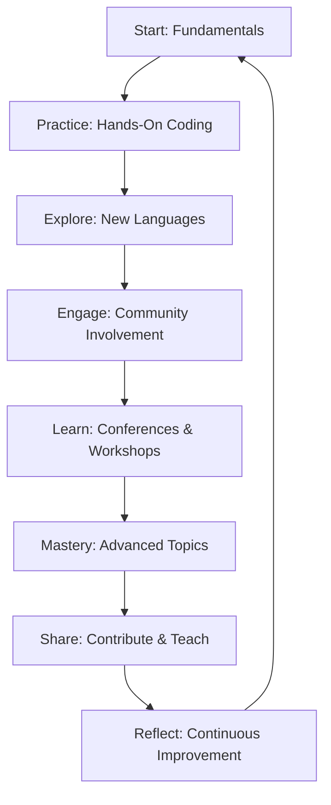

## 16.4. Final Thoughts and Encouragement

As we reach the conclusion of "Functional Programming Fundamentals: Building a Strong Foundation," it's essential to reflect on the journey you've embarked upon and the path that lies ahead. Functional programming (FP) is not just a set of techniques or a programming paradigm; it's a mindset that encourages clarity, precision, and elegance in software development. This section aims to inspire you to continue your exploration of FP, emphasizing the importance of practice and lifelong learning.

### Emphasizing the Importance of Practice

Mastering functional programming, like any other skill, requires consistent practice. The concepts you've learned throughout this book—from pure functions to recursion, and from lazy evaluation to error handling—are best solidified through hands-on coding. Here are a few reasons why practice is crucial:

- **Deepens Understanding:** Regular coding helps internalize FP concepts, allowing you to see how they interconnect and apply in various scenarios.
- **Builds Intuition:** With practice, you'll develop an intuition for identifying functional patterns and solutions, making it easier to tackle complex problems.
- **Enhances Problem-Solving Skills:** By applying FP principles to real-world problems, you'll improve your ability to devise efficient and elegant solutions.
- **Reinforces Learning:** Repeatedly implementing FP techniques reinforces your learning, making it second nature over time.

To facilitate your practice, consider setting aside dedicated time each week to work on FP projects, participate in coding challenges, or contribute to open-source projects that utilize functional programming.

### Encouraging Lifelong Learning in Functional Programming

Functional programming is a dynamic and evolving field. As new languages and tools emerge, staying updated with the latest developments is vital. Here are some ways to embrace lifelong learning in FP:

- **Explore New Languages:** Experiment with different functional languages like Haskell, Scala, or F#. Each language offers unique features and perspectives that can enrich your understanding of FP.
- **Engage with the Community:** Join FP communities online or in-person. Engaging with fellow enthusiasts can provide support, inspiration, and opportunities to learn from others' experiences.
- **Attend Conferences and Workshops:** Participate in FP conferences and workshops to learn from experts, discover new tools, and network with peers.
- **Read Books and Articles:** Continue reading books and articles on advanced FP topics. Authors often share insights and techniques that can deepen your knowledge.

### Visual Aids

To illustrate the journey of learning functional programming, consider the following motivational diagram:

This diagram represents the cyclical nature of learning FP, emphasizing that mastery is an ongoing process of practice, exploration, engagement, and reflection.

### References

Throughout this book, we've drawn inspiration from various sources. Here are a few quotes and lessons to motivate your continued learning:

- "The only way to learn a new programming language is by writing programs in it." — Dennis Ritchie
- "Simplicity is the ultimate sophistication." — Leonardo da Vinci
- "Programs must be written for people to read, and only incidentally for machines to execute." — Harold Abelson

These quotes remind us that programming is both an art and a science, and that clarity and simplicity are at the heart of effective software development.

### Closing Remarks

As you close this book, remember that the principles of functional programming you've learned are powerful tools that can transform the way you write code. Whether you're building small scripts or large-scale applications, applying FP concepts can lead to more robust, maintainable, and scalable solutions.

We encourage you to share your experiences and insights with the FP community. By teaching others and contributing to open-source projects, you not only reinforce your own understanding but also help advance the field of functional programming.

Thank you for embarking on this journey with us. We hope this book has equipped you with the knowledge and confidence to explore the vast possibilities of functional programming. Keep coding, keep learning, and most importantly, enjoy the process.

## Quiz Time!



### What is the primary benefit of consistent practice in functional programming?

- [x] It deepens understanding and builds intuition.
- [ ] It makes coding more difficult.
- [ ] It reduces the need for learning new concepts.
- [ ] It eliminates the need for community engagement.

> **Explanation:** Consistent practice helps internalize concepts, build intuition, and enhance problem-solving skills.

### How can engaging with the FP community benefit your learning?

- [x] It provides support and inspiration.
- [ ] It limits your exposure to new ideas.
- [ ] It discourages collaboration.
- [ ] It makes learning more solitary.

> **Explanation:** Engaging with the community offers support, inspiration, and opportunities to learn from others.

### Which of the following is NOT a recommended way to embrace lifelong learning in FP?

- [ ] Explore new languages.
- [ ] Engage with the community.
- [ ] Attend conferences and workshops.
- [x] Avoid reading books and articles.

> **Explanation:** Reading books and articles is a recommended way to deepen your knowledge.

### What does the motivational diagram illustrate?

- [x] The cyclical journey of learning functional programming.
- [ ] The linear path to mastering FP.
- [ ] The end of learning after mastering FP.
- [ ] The isolation of FP from other programming paradigms.

> **Explanation:** The diagram shows the ongoing process of practice, exploration, engagement, and reflection.

### What is a key takeaway from the quotes provided in the references?

- [x] Simplicity and clarity are crucial in programming.
- [ ] Complexity is the goal of programming.
- [ ] Machines are the primary audience for code.
- [ ] Learning new languages is unnecessary.

> **Explanation:** The quotes emphasize the importance of simplicity and clarity in programming.

### Why is it important to share your FP experiences with the community?

- [x] It reinforces your understanding and helps advance the field.
- [ ] It isolates you from other programmers.
- [ ] It discourages collaboration.
- [ ] It limits your learning opportunities.

> **Explanation:** Sharing experiences reinforces understanding and contributes to the advancement of FP.

### What is the ultimate goal of mastering functional programming?

- [x] To write more robust, maintainable, and scalable code.
- [ ] To make coding more complex.
- [ ] To avoid learning new concepts.
- [ ] To isolate from other programming paradigms.

> **Explanation:** Mastering FP aims to create robust, maintainable, and scalable solutions.

### How does attending conferences and workshops benefit FP learners?

- [x] It provides opportunities to learn from experts and network with peers.
- [ ] It limits exposure to new ideas.
- [ ] It discourages collaboration.
- [ ] It makes learning more solitary.

> **Explanation:** Conferences and workshops offer learning opportunities and networking with peers.

### What is the significance of the cyclical nature of the learning journey in FP?

- [x] It emphasizes continuous improvement and reflection.
- [ ] It suggests a finite end to learning.
- [ ] It discourages revisiting fundamental concepts.
- [ ] It isolates FP from other programming paradigms.

> **Explanation:** The cyclical nature highlights the importance of continuous improvement and reflection.

### True or False: Functional programming is a static field with little evolution.

- [ ] True
- [x] False

> **Explanation:** Functional programming is dynamic and evolving, with new languages and tools emerging regularly.


