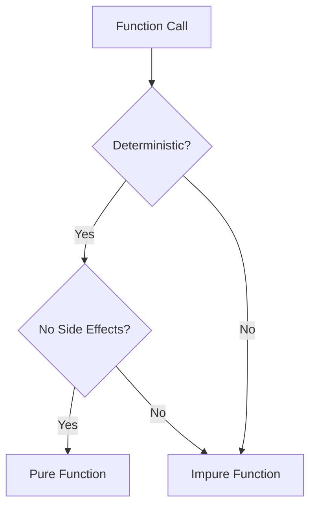

---

linkTitle: "2.1. Defining Pure Functions"
title: "Understanding Pure Functions in Functional Programming"
description: "Explore the core principles of pure functions in functional programming, including determinism and referential transparency, with practical examples and visual aids."
categories:
- Functional Programming
- Software Development
- Programming Concepts
tags:
- Pure Functions
- Functional Programming
- Determinism
- Referential Transparency
- Code Examples
date: 2024-10-25
type: docs
nav_weight: 210000
---

## 2.1. Defining Pure Functions

In the realm of functional programming, pure functions are a cornerstone concept that underpins the paradigm's emphasis on predictability, reliability, and ease of reasoning. Understanding pure functions is crucial for anyone looking to harness the full power of functional programming. This section delves into the defining characteristics of pure functions, explores the concepts of determinism and referential transparency, and provides practical examples to illustrate these ideas.

### Characteristics of Pure Functions

A pure function is defined by two primary characteristics:

1. **Determinism:** A pure function always produces the same output for the same input. This means that given a specific set of inputs, the function's behavior is entirely predictable, and it will consistently return the same result.

2. **No Observable Side Effects:** Pure functions do not alter any state outside their scope or interact with the outside world. They do not modify global variables, perform I/O operations, or change the input parameters. This lack of side effects ensures that pure functions are isolated and do not depend on or affect the program's state.

These characteristics make pure functions highly reliable and easy to test, as their behavior is consistent and independent of external factors.

### Determinism and Referential Transparency

#### Determinism

Determinism in the context of pure functions refers to the consistency of output. A deterministic function will always yield the same result when called with the same arguments. This property is crucial for debugging and testing, as it eliminates variability and ensures that the function's behavior is predictable.

#### Referential Transparency

Referential transparency is a concept closely related to determinism. It means that an expression can be replaced with its corresponding value without changing the program's behavior. In other words, if a function is referentially transparent, you can substitute the function call with its result, and the program will still function correctly.

Consider the following example in JavaScript:

```javascript
const add = (x, y) => x + y;
```

The function `add` is both deterministic and referentially transparent. If you call `add(2, 3)`, you can replace the call with `5` anywhere in the program, and the behavior will remain unchanged.

### Visual Aids

To better understand the distinction between pure and impure functions, let's examine a flowchart that illustrates their properties:



This flowchart demonstrates that for a function to be considered pure, it must be both deterministic and free of side effects.

### Code Snippets

Let's explore examples of pure and impure functions in JavaScript to solidify our understanding.

#### Impure Function in JavaScript

An impure function is one that either produces different outputs for the same inputs or has side effects. Consider the following example:

```javascript
let count = 0;
const increment = () => {
  count += 1;
  return count;
};
```

In this example, the `increment` function is impure because it modifies the `count` variable, which is outside its scope. Each call to `increment` will produce a different result, depending on the current value of `count`.

#### Pure Function in JavaScript

Now, let's look at a pure function:

```javascript
const add = (x, y) => x + y;
```

The `add` function is pure because it always returns the same result for the same inputs and does not modify any external state or variables.

### References

For further reading on pure functions and functional programming, consider the following resources:

- "Functional Programming in Scala" by Paul Chiusano and Rúnar Bjarnason.
- "Pure Functional Programming" by Noel Welsh and Dave Gurnell.

These texts provide deeper insights into the principles of functional programming and the role of pure functions within it.

## Quiz Time!



### What is a defining characteristic of a pure function?

- [x] It always produces the same output for the same input.
- [ ] It can modify global variables.
- [ ] It performs I/O operations.
- [ ] It can return different results for the same input.

> **Explanation:** A pure function is deterministic, meaning it always produces the same output for the same input.

### Which of the following is an example of a pure function?

- [ ] A function that writes to a file.
- [x] A function that adds two numbers.
- [ ] A function that modifies a global variable.
- [ ] A function that reads user input.

> **Explanation:** A function that adds two numbers is pure because it has no side effects and always returns the same result for the same inputs.

### What does referential transparency allow you to do?

- [x] Replace a function call with its result without changing the program's behavior.
- [ ] Modify a function's output based on external state.
- [ ] Perform side effects within a function.
- [ ] Change the function's input parameters.

> **Explanation:** Referential transparency allows expressions to be replaced with their values without affecting the program's behavior.

### Which property is NOT associated with pure functions?

- [ ] Determinism
- [ ] No side effects
- [x] Modifying external state
- [ ] Consistent output

> **Explanation:** Pure functions do not modify external state; they are deterministic and have no side effects.

### What is the result of calling a pure function with the same arguments multiple times?

- [x] The same result every time.
- [ ] Different results each time.
- [ ] It depends on the program's state.
- [ ] It may cause side effects.

> **Explanation:** A pure function always returns the same result for the same arguments, regardless of how many times it is called.

### Which of the following is NOT a benefit of pure functions?

- [ ] Easier to test
- [ ] Predictable behavior
- [ ] No side effects
- [x] Ability to modify global state

> **Explanation:** Pure functions do not modify global state, which is why they are easier to test and have predictable behavior.

### What does determinism in pure functions ensure?

- [x] Consistent output for the same input
- [ ] Ability to perform I/O operations
- [ ] Modification of external variables
- [ ] Variable output for the same input

> **Explanation:** Determinism ensures that a pure function consistently produces the same output for the same input.

### How can you identify a pure function in code?

- [x] It does not modify any external variables.
- [ ] It performs network requests.
- [ ] It changes the input parameters.
- [ ] It logs messages to the console.

> **Explanation:** A pure function does not modify external variables and has no side effects.

### What is a common pitfall when writing pure functions?

- [ ] Ensuring they have side effects
- [ ] Making them deterministic
- [x] Accidentally modifying external state
- [ ] Using consistent input parameters

> **Explanation:** A common pitfall is accidentally modifying external state, which would make the function impure.

### True or False: Pure functions can have side effects.

- [ ] True
- [x] False

> **Explanation:** Pure functions cannot have side effects; they are isolated and do not interact with the outside world.



This section has provided a comprehensive understanding of pure functions, their characteristics, and their significance in functional programming. By mastering these concepts, you can write more predictable, reliable, and maintainable code.
