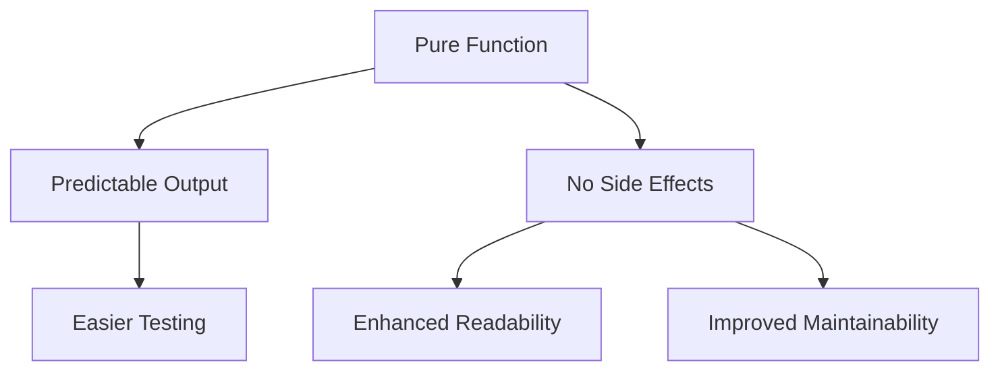

## 2.2. Advantages of Pure Functions

In the realm of functional programming, pure functions stand as a cornerstone, offering numerous advantages that enhance the quality and reliability of code. This section delves into the key benefits of pure functions, focusing on their predictability, ease of testing, and contribution to code readability and maintainability.

### Predictability and Easier Testing

One of the most significant advantages of pure functions is their predictability. A pure function is deterministic, meaning it will always produce the same output given the same input, regardless of external state or context. This predictability simplifies testing, as developers can write unit tests with confidence that the function's behavior will remain consistent.

#### Simplified Testing Process

Testing pure functions is straightforward because they do not depend on any external state or side effects. This isolation allows developers to test functions in isolation, ensuring that tests are both reliable and repeatable. Consider the following examples:

- **Haskell Example:**

  ```haskell
  -- Pure function definition
  add :: Int -> Int -> Int
  add x y = x + y

  -- Unit test for the pure function
  testAdd = add 2 3 == 5
  ```

- **JavaScript Example using Jest:**

  ```javascript
  // Pure function definition
  function add(x, y) {
    return x + y;
  }

  // Unit test for the pure function
  test('adds 2 + 3 to equal 5', () => {
    expect(add(2, 3)).toBe(5);
  });
  ```

In both examples, the tests are simple and direct, focusing solely on the function's input and output without concern for any external factors.

### Enhanced Readability and Maintainability

Pure functions contribute significantly to the readability and maintainability of codebases. By enforcing clear boundaries and reducing hidden dependencies, pure functions make it easier for developers to understand and modify code.

#### Clear Boundaries and Reduced Complexity

Pure functions have no side effects, meaning they do not alter any state outside their scope. This characteristic enforces a clear separation of concerns, allowing developers to reason about each function independently. As a result, code becomes more modular and easier to navigate.

- **Improved Code Readability:** With pure functions, the logic is self-contained, making it easier for developers to read and understand the code. Each function's purpose and behavior are explicit, reducing the cognitive load required to comprehend the codebase.

- **Easier Maintenance:** When changes are necessary, pure functions minimize the risk of unintended side effects, as their behavior is predictable and isolated. This isolation simplifies refactoring and enhances the overall maintainability of the code.

### Visual Aids

To further illustrate the advantages of pure functions, consider the following diagram created using Mermaid.js. This diagram highlights how pure functions facilitate easier testing and maintenance by isolating logic and reducing dependencies.



### Real-World Applications

In real-world applications, the benefits of pure functions are evident in various scenarios:

- **Data Processing Pipelines:** Pure functions are ideal for building data processing pipelines, where each stage of the pipeline can be tested independently, ensuring data integrity throughout the process.

- **Concurrent and Parallel Systems:** In systems where concurrency and parallelism are crucial, pure functions shine by eliminating race conditions and ensuring thread safety due to their immutable nature.

### Conclusion

Pure functions are a fundamental concept in functional programming, offering predictability, ease of testing, and enhanced readability and maintainability. By embracing pure functions, developers can create robust, reliable, and maintainable codebases that stand the test of time.

### References

- "Purely Functional Data Structures" by Chris Okasaki.
- "Functional Programming in Scala" by Paul Chiusano and Rúnar Bjarnason.

## Quiz Time!



### What is a key characteristic of pure functions?

- [x] They always produce the same output for the same input.
- [ ] They can modify external state.
- [ ] They rely on global variables.
- [ ] They produce different outputs for the same input.

> **Explanation:** Pure functions are deterministic, meaning they always produce the same output for the same input, without relying on external state.

### Why are pure functions easier to test?

- [x] They do not depend on external state.
- [ ] They require complex setup.
- [ ] They have side effects.
- [ ] They change global variables.

> **Explanation:** Pure functions are easier to test because they do not depend on external state or have side effects, allowing for isolated and reliable testing.

### How do pure functions enhance code readability?

- [x] By enforcing clear boundaries and reducing hidden dependencies.
- [ ] By using complex syntax.
- [ ] By relying on global state.
- [ ] By having side effects.

> **Explanation:** Pure functions enhance readability by having clear boundaries and reducing hidden dependencies, making the code easier to understand.

### What is a benefit of using pure functions in concurrent systems?

- [x] They eliminate race conditions.
- [ ] They increase the risk of deadlocks.
- [ ] They require locks for thread safety.
- [ ] They depend on mutable state.

> **Explanation:** Pure functions eliminate race conditions in concurrent systems because they do not rely on mutable state, ensuring thread safety.

### Which of the following is a real-world application of pure functions?

- [x] Data processing pipelines
- [ ] Modifying global state
- [ ] Complex UI rendering
- [ ] Direct database manipulation

> **Explanation:** Pure functions are ideal for data processing pipelines, where each stage can be tested independently, ensuring data integrity.

### What does the following Haskell code test?

```haskell
testAdd = add 2 3 == 5
```

- [x] It tests if the `add` function correctly adds 2 and 3 to equal 5.
- [ ] It modifies the global state.
- [ ] It tests for side effects.
- [ ] It checks for variable mutation.

> **Explanation:** The code tests if the `add` function correctly computes the sum of 2 and 3, verifying its output.

### In the context of pure functions, what does "no side effects" mean?

- [x] The function does not alter any state outside its scope.
- [ ] The function changes global variables.
- [ ] The function relies on external input.
- [ ] The function produces different outputs for the same input.

> **Explanation:** "No side effects" means the function does not alter any state outside its scope, maintaining predictability and isolation.

### How do pure functions contribute to maintainability?

- [x] By minimizing the risk of unintended side effects.
- [ ] By increasing code complexity.
- [ ] By relying on mutable state.
- [ ] By requiring extensive documentation.

> **Explanation:** Pure functions contribute to maintainability by minimizing the risk of unintended side effects, making refactoring safer and easier.

### What is the output of the following JavaScript function call?

```javascript
function add(x, y) {
  return x + y;
}
console.log(add(2, 3));
```

- [x] 5
- [ ] 23
- [ ] Undefined
- [ ] Error

> **Explanation:** The function `add` correctly computes the sum of 2 and 3, resulting in an output of 5.

### True or False: Pure functions can modify external state.

- [ ] True
- [x] False

> **Explanation:** Pure functions cannot modify external state, as they are designed to be deterministic and side-effect-free.


