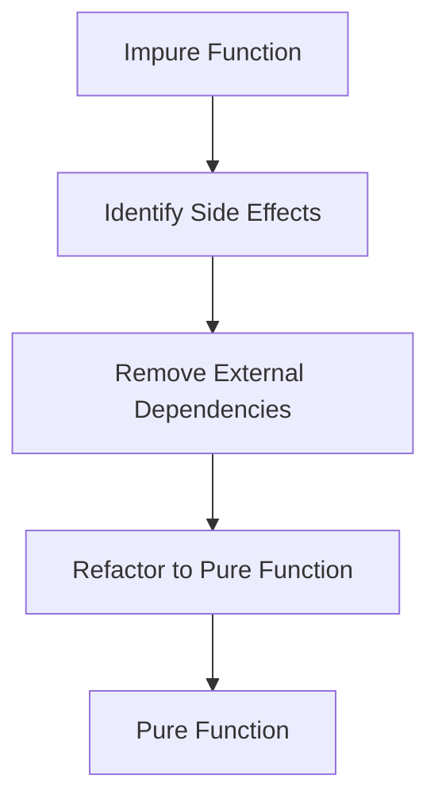

---

linkTitle: "2.3. Writing and Identifying Pure Functions"
title: "Pure Functions: Writing and Identifying Them in Functional Programming"
description: "Explore the essence of pure functions in functional programming, learn how to write and identify them, and understand their significance in creating predictable and maintainable code."
categories:
- Functional Programming
- Software Development
- Programming Concepts
tags:
- Pure Functions
- Functional Programming
- Code Purity
- JavaScript
- Haskell
date: 2024-10-25
type: docs
nav_weight: 2300

---

## 2.3. Writing and Identifying Pure Functions

In the realm of functional programming, pure functions stand as a cornerstone for writing predictable, testable, and maintainable code. Understanding how to write and identify pure functions is crucial for any developer aiming to harness the full power of functional programming paradigms. This section delves into the characteristics of pure functions, provides practical examples, and offers techniques to ensure your functions remain pure.

### Understanding Pure Functions

A pure function is a function where the output value is determined only by its input values, without observable side effects. This means that given the same input, a pure function will always return the same output. Let's explore the key characteristics that define pure functions:

- **Determinism:** The function consistently produces the same result when given the same input.
- **No Side Effects:** The function does not alter any external state or interact with the outside world (e.g., modifying a global variable or performing I/O operations).

### Examples of Pure vs. Impure Functions

To illustrate the differences between pure and impure functions, let's examine some examples in JavaScript:

#### Imperative JavaScript (Impure)

```javascript
let total = 0;
const addToTotal = (x) => {
  total += x; // Modifies external state
  return total;
};
```

In the above example, `addToTotal` is impure because it modifies the external variable `total`. This side effect makes the function's behavior dependent on the external state, violating the principles of purity.

#### Functional JavaScript (Pure)

```javascript
const add = (x, y) => x + y;
```

The `add` function is pure. It takes two arguments and returns their sum without altering any external state or relying on anything other than its inputs.

### Techniques for Ensuring Purity

Ensuring that your functions remain pure involves adhering to several best practices:

#### Avoiding Global State and Mutable Variables

Global state and mutable variables introduce dependencies that can lead to unpredictable behavior. By avoiding them, you ensure that your functions rely solely on their inputs.

```javascript
// Avoid this
let counter = 0;
const incrementCounter = () => counter++;

// Prefer this
const increment = (x) => x + 1;
```

#### Ensuring Functions Do Not Perform I/O Operations

I/O operations, such as reading from or writing to a file or database, introduce side effects. Pure functions should not perform these operations directly.

```javascript
// Impure: Reads from a file
const readFile = (filename) => fs.readFileSync(filename, 'utf8');

// Pure: Accepts content as an argument
const processContent = (content) => content.toUpperCase();
```

#### Using Higher-Order Functions and Composition

Higher-order functions and function composition allow you to build complex functionality from simple, pure functions. This approach helps maintain purity by isolating side effects.

```javascript
const double = (x) => x * 2;
const square = (x) => x * x;

const doubleAndSquare = (x) => square(double(x));
```

### Visual Aids

To better understand how to transform an impure function into a pure one, consider the following Mermaid.js diagram:



### Code Snippets in Multiple Languages

Let's see how pure functions can be implemented in different functional programming languages:

#### Haskell

```haskell
add :: Int -> Int -> Int
add x y = x + y
```

#### Scala

```scala
def add(x: Int, y: Int): Int = x + y
```

#### JavaScript with FP Libraries

```javascript
const add = (x, y) => x + y;
```

### Practical Exercises

To reinforce your understanding, try refactoring the following impure function into a pure one:

#### Impure Function

```javascript
let userCount = 0;
const incrementUserCount = () => {
  userCount++;
  return userCount;
};
```

#### Task

Refactor the above function to make it pure. Consider how you can achieve the same functionality without altering external state.

### References

- "JavaScript Allongé" by Reginald Braithwaite.
- "Real World Haskell" by Bryan O'Sullivan, John Goerzen, and Don Stewart.

### Summary

Pure functions are a fundamental concept in functional programming, offering predictability and ease of testing. By avoiding side effects and relying solely on input parameters, pure functions contribute to more reliable and maintainable codebases. Through examples and techniques, this section has provided you with the tools to write and identify pure functions effectively.

## Quiz Time!



### Which of the following is a characteristic of a pure function?

- [x] It always produces the same output for the same input.
- [ ] It can modify global variables.
- [ ] It can perform I/O operations.
- [ ] It relies on external state.

> **Explanation:** A pure function always produces the same output for the same input and does not rely on or modify external state.

### What makes the following function impure? `let total = 0; const addToTotal = (x) => { total += x; return total; };`

- [x] It modifies the external variable `total`.
- [ ] It does not return a value.
- [ ] It takes too many parameters.
- [ ] It uses arrow function syntax.

> **Explanation:** The function is impure because it modifies the external variable `total`, introducing a side effect.

### How can you ensure a function remains pure?

- [x] Avoid using global state.
- [x] Avoid performing I/O operations.
- [ ] Use mutable variables.
- [ ] Rely on external libraries.

> **Explanation:** Ensuring a function remains pure involves avoiding global state and I/O operations, which introduce side effects.

### Which of the following is a pure function in JavaScript?

- [x] `const add = (x, y) => x + y;`
- [ ] `let count = 0; const increment = () => count++;`
- [ ] `const logMessage = (msg) => console.log(msg);`
- [ ] `const fetchData = (url) => fetch(url);`

> **Explanation:** The function `add` is pure because it relies only on its input parameters and does not produce side effects.

### What is a common technique to maintain function purity?

- [x] Using higher-order functions.
- [ ] Performing database operations.
- [ ] Modifying DOM elements.
- [ ] Using global variables.

> **Explanation:** Using higher-order functions helps maintain purity by composing functions without side effects.

### Which of the following languages is known for emphasizing pure functions?

- [x] Haskell
- [ ] C++
- [ ] Java
- [ ] PHP

> **Explanation:** Haskell is a functional programming language that emphasizes pure functions and immutability.

### What is the benefit of using pure functions?

- [x] Easier testing and debugging.
- [ ] Faster execution time.
- [ ] Increased memory usage.
- [ ] More complex code.

> **Explanation:** Pure functions are easier to test and debug because they do not depend on external state or produce side effects.

### Which of the following is NOT a feature of pure functions?

- [ ] Determinism
- [ ] No side effects
- [x] Modifying external state
- [ ] Predictability

> **Explanation:** Modifying external state is not a feature of pure functions; they should not have side effects.

### How does function composition help in maintaining purity?

- [x] By combining simple functions to create complex behavior without side effects.
- [ ] By allowing functions to modify global variables.
- [ ] By enabling direct I/O operations.
- [ ] By increasing the number of parameters.

> **Explanation:** Function composition helps maintain purity by allowing complex behavior to be built from simple, pure functions without introducing side effects.

### True or False: A pure function can perform network requests.

- [ ] True
- [x] False

> **Explanation:** A pure function cannot perform network requests because they introduce side effects and rely on external state.


