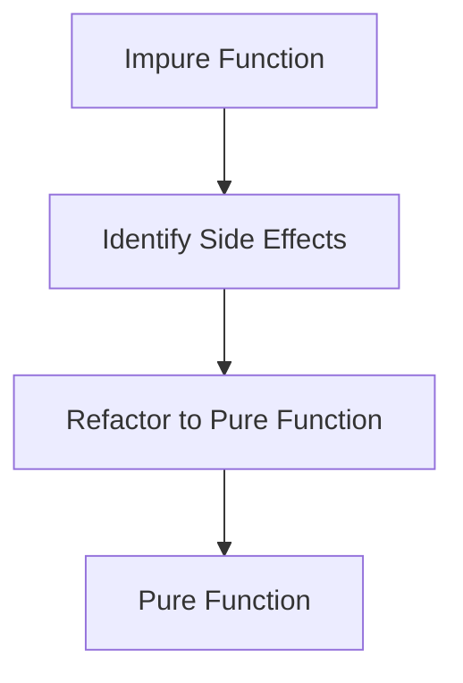

## 2.4. Practical Exercises for Mastering Pure Functions

In this section, we will delve into practical exercises designed to solidify your understanding of pure functions in functional programming. By engaging in these exercises, you will learn how to refactor impure functions into pure ones, identify purity in code snippets, and work with closures and lambdas effectively. These exercises are crucial for developing a strong foundation in functional programming.

### Refactoring Impure Functions to Pure

Refactoring impure functions to pure ones is a fundamental skill in functional programming. Pure functions are deterministic and have no side effects, making them easier to test and reason about. Let's explore some exercises to practice this transformation.

#### Exercise 1: Refactoring in JavaScript

Consider the following impure function in JavaScript:

```javascript
// Impure
let count = 0;
const increment = () => {
  count += 1;
  return count;
};
```

This function is impure because it modifies the external `count` variable, causing side effects. Let's refactor it into a pure function:

```javascript
// Pure
const incrementPure = (count) => count + 1;
```

**Explanation:** The pure version of the function takes `count` as an argument and returns a new value without modifying any external state.

#### Exercise 2: Refactoring in Haskell

Now, let's look at a similar example in Haskell:

```haskell
-- Impure
globalCount = 0
increment = do
  globalCount <- globalCount + 1
  return globalCount
```

This function is impure due to the use of a global variable. Here's how you can refactor it:

```haskell
-- Pure
incrementPure :: Int -> Int
incrementPure count = count + 1
```

**Explanation:** The pure function `incrementPure` takes an integer as input and returns a new integer, without relying on or altering any global state.

### Identifying Purity in Code Snippets

Being able to identify pure and impure functions is essential for writing clean and maintainable code. Let's practice this skill with some examples.

#### Example 1: JavaScript

```javascript
const add = (a, b) => a + b;
const logAndAdd = (a, b) => {
  console.log(a + b);
  return a + b;
};
```

- **Pure Function:** `add` is pure because it returns the sum of `a` and `b` without any side effects.
- **Impure Function:** `logAndAdd` is impure because it logs to the console, which is a side effect.

#### Example 2: Haskell

```haskell
multiply :: Int -> Int -> Int
multiply x y = x * y

printAndMultiply :: Int -> Int -> IO Int
printAndMultiply x y = do
  print (x * y)
  return (x * y)
```

- **Pure Function:** `multiply` is pure as it simply returns the product of `x` and `y`.
- **Impure Function:** `printAndMultiply` is impure due to the `print` operation, which involves I/O.

### Working with Closures and Lambdas

Closures and lambdas are powerful tools in functional programming. Let's explore how to use them in pure functional contexts.

#### Task: Creating and Utilizing Closures

Create a closure in JavaScript that captures a variable and returns a pure function:

```javascript
const createAdder = (x) => {
  return (y) => x + y;
};

const addFive = createAdder(5);
console.log(addFive(10)); // Outputs: 15
```

**Explanation:** The `createAdder` function returns a new function that adds `x` to its argument `y`. The returned function is pure because it doesn't modify any external state.

#### Task: Using Lambdas in Haskell

Use a lambda function in Haskell to filter a list:

```haskell
let numbers = [1, 2, 3, 4, 5]
let evenNumbers = filter (\x -> x `mod` 2 == 0) numbers
```

**Explanation:** The lambda function `(\x -> x `mod` 2 == 0)` is used to filter even numbers from the list. It is pure as it doesn't cause any side effects.

### Visual Aids

To better understand the transformation from impure to pure functions, let's visualize the process using Mermaid.js diagrams.



**Explanation:** This diagram illustrates the steps involved in refactoring an impure function to a pure one. Identifying side effects is the first step, followed by refactoring to eliminate those effects, resulting in a pure function.

### Conclusion

Through these exercises, you have practiced transforming impure functions into pure ones, identifying purity in code, and working with closures and lambdas. These skills are essential for writing clean, maintainable, and efficient functional code. As you continue your journey in functional programming, remember to apply these principles to enhance the quality of your code.

### References

- "Real World Haskell" by Bryan O'Sullivan, John Goerzen, and Don Stewart.
- "Learning Functional Programming" by Richard Eisenberg.

## Quiz Time!



### Which of the following is a characteristic of a pure function?

- [x] No side effects
- [ ] Modifies global variables
- [ ] Depends on external state
- [ ] Produces different outputs for the same inputs

> **Explanation:** Pure functions have no side effects and always produce the same output for the same inputs.

### What makes the following JavaScript function impure?
```javascript
let count = 0;
const increment = () => {
  count += 1;
  return count;
};
```

- [x] It modifies a global variable
- [ ] It returns a value
- [ ] It takes no arguments
- [ ] It uses an arrow function

> **Explanation:** The function is impure because it modifies the global variable `count`.

### How can you refactor an impure function to make it pure?

- [x] Remove side effects and external dependencies
- [ ] Use more global variables
- [ ] Add more console logs
- [ ] Make it return `undefined`

> **Explanation:** Refactoring to pure involves removing side effects and dependencies on external state.

### In Haskell, which function is pure?
```haskell
multiply :: Int -> Int -> Int
multiply x y = x * y
```

- [x] `multiply`
- [ ] `printAndMultiply`
- [ ] `readLine`
- [ ] `writeFile`

> **Explanation:** `multiply` is pure as it only returns the product of its inputs without side effects.

### What is a closure in JavaScript?

- [x] A function that captures variables from its surrounding scope
- [ ] A function that modifies global variables
- [ ] A function that logs to the console
- [ ] A function that returns `undefined`

> **Explanation:** A closure captures variables from its surrounding scope, allowing them to be used within the function.

### Which of the following is a lambda function in Haskell?

- [x] `(\x -> x + 1)`
- [ ] `let x = 5`
- [ ] `print "Hello"`
- [ ] `main = do`

> **Explanation:** `(\x -> x + 1)` is a lambda function, an anonymous function defined inline.

### What is the benefit of using pure functions?

- [x] Easier to test and reason about
- [ ] They modify external state
- [ ] They depend on global variables
- [ ] They produce random outputs

> **Explanation:** Pure functions are easier to test and reason about because they have no side effects.

### Which of the following is an example of a side effect?

- [x] Modifying a global variable
- [ ] Returning a value
- [ ] Taking an argument
- [ ] Using a local variable

> **Explanation:** Modifying a global variable is a side effect as it changes the state outside the function.

### How does a pure function handle state?

- [x] By taking state as an argument and returning a new state
- [ ] By modifying global state
- [ ] By using console logs
- [ ] By returning `undefined`

> **Explanation:** Pure functions handle state by taking it as an argument and returning a new state without modifying the original.

### True or False: Pure functions can have side effects.

- [ ] True
- [x] False

> **Explanation:** Pure functions cannot have side effects; they must be deterministic and free of external dependencies.


