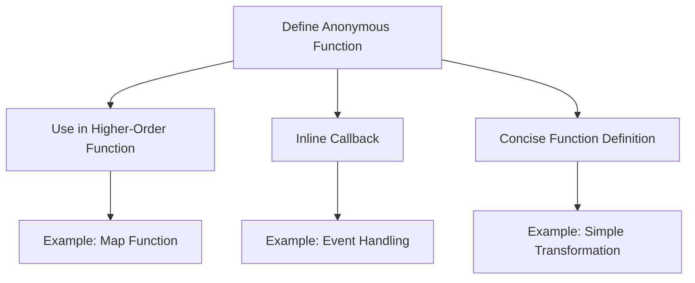

## 3.2. Creating Anonymous Functions (Lambdas)

Anonymous functions, often referred to as lambdas, are a cornerstone of functional programming. They allow developers to define functions without a name, making them ideal for short-lived operations and inline use. In this section, we will delve into the syntax and application of lambdas across different functional programming languages, explore their use cases, and provide practical examples to solidify your understanding.

### Definition and Syntax in Different Languages

Anonymous functions are expressions that define a function without assigning it to an identifier. They are particularly useful in scenarios where a function is used only once or passed as an argument to higher-order functions. Let's explore how anonymous functions are defined in Haskell, JavaScript, and Scala.

#### Haskell

In Haskell, anonymous functions are created using the `\` (backslash) symbol, followed by the parameters, an arrow (`->`), and the function body.

```haskell
let numbers = [1, 2, 3, 4, 5]
let doubled = map (\x -> x * 2) numbers
```

Here, `\x -> x * 2` is an anonymous function that takes a single argument `x` and returns `x * 2`.

#### JavaScript

JavaScript uses the arrow function syntax to create anonymous functions. This syntax is concise and widely used in modern JavaScript development.

```javascript
const numbers = [1, 2, 3, 4, 5];
const doubled = numbers.map(x => x * 2);
```

The `x => x * 2` is an anonymous function that doubles each element in the `numbers` array.

#### Scala

In Scala, anonymous functions are defined using the `=>` symbol, similar to JavaScript, but with a slightly different syntax.

```scala
val numbers = List(1, 2, 3, 4, 5)
val doubled = numbers.map(x => x * 2)
```

The `x => x * 2` is an anonymous function that maps over the `numbers` list to produce a new list of doubled values.

### Use Cases for Lambdas

Anonymous functions are versatile and can be used in various scenarios within functional programming. Here are some common use cases:

#### Inline Callbacks

Lambdas are often used as inline callbacks, especially in asynchronous programming or event handling. They provide a concise way to define behavior that should occur in response to an event.

#### Higher-Order Functions

Higher-order functions, which take other functions as arguments or return them as results, frequently utilize lambdas. This allows for flexible and reusable code patterns.

#### Concise Function Definitions

For simple operations that do not require a full function definition, lambdas offer a succinct alternative. They are ideal for operations like transformations, filtering, and reductions.

### Visual Aids

To better understand the creation and usage of anonymous functions, consider the following diagram illustrating their application in different scenarios:



### Code Snippets

Let's revisit the code snippets provided earlier, which demonstrate the use of anonymous functions in different languages:

#### JavaScript

```javascript
const numbers = [1, 2, 3, 4, 5];
const doubled = numbers.map(x => x * 2);
```

In this example, the `map` function applies the lambda `x => x * 2` to each element of the `numbers` array, resulting in a new array of doubled values.

#### Scala

```scala
val numbers = List(1, 2, 3, 4, 5)
val doubled = numbers.map(x => x * 2)
```

Similarly, Scala's `map` function uses the lambda `x => x * 2` to transform each element of the `numbers` list.

#### Haskell

```haskell
let numbers = [1, 2, 3, 4, 5]
let doubled = map (\x -> x * 2) numbers
```

In Haskell, the `map` function applies the anonymous function `\x -> x * 2` to each element of the `numbers` list.

### References

- "Functional Programming in Scala" by Paul Chiusano and Rúnar Bjarnason.
- "Learn You a Haskell for Great Good!" by Miran Lipovača.

These resources provide further insights into functional programming and the use of anonymous functions.

### Summary of Key Points

- Anonymous functions, or lambdas, are unnamed function expressions used for concise and temporary operations.
- They are defined differently across languages but serve similar purposes in functional programming.
- Common use cases include inline callbacks, higher-order functions, and concise function definitions.
- Understanding lambdas is crucial for mastering functional programming concepts and writing efficient, expressive code.

## Quiz Time!



### What is an anonymous function?

- [x] A function without a name
- [ ] A function that cannot be called
- [ ] A function that is always recursive
- [ ] A function that is only used in object-oriented programming

> **Explanation:** An anonymous function is a function defined without a name, often used for short-lived operations.

### How do you define an anonymous function in Haskell?

- [x] Using the backslash `\` followed by parameters and an arrow `->`
- [ ] Using the keyword `lambda`
- [ ] Using the `function` keyword
- [ ] Using curly braces `{}`

> **Explanation:** In Haskell, anonymous functions are defined using the backslash `\` followed by parameters and an arrow `->`.

### Which of the following is a use case for lambdas?

- [x] Inline callbacks
- [x] Higher-order functions
- [ ] Class inheritance
- [ ] Global variable declaration

> **Explanation:** Lambdas are commonly used for inline callbacks and higher-order functions.

### What is the syntax for an anonymous function in JavaScript?

- [x] `x => x * 2`
- [ ] `function(x) { return x * 2; }`
- [ ] `lambda x: x * 2`
- [ ] `def x(x): return x * 2`

> **Explanation:** In JavaScript, the arrow function syntax `x => x * 2` is used to define anonymous functions.

### In Scala, how do you apply a lambda to a list?

- [x] Using the `map` function
- [ ] Using the `filter` function
- [ ] Using the `reduce` function
- [ ] Using the `foreach` function

> **Explanation:** The `map` function in Scala applies a lambda to each element of a list.

### What is the purpose of using lambdas in higher-order functions?

- [x] To pass functions as arguments
- [ ] To define global variables
- [ ] To create classes
- [ ] To manage memory

> **Explanation:** Lambdas are used in higher-order functions to pass functions as arguments.

### Which language uses the syntax `\x -> x * 2` for lambdas?

- [x] Haskell
- [ ] JavaScript
- [ ] Scala
- [ ] Python

> **Explanation:** Haskell uses the syntax `\x -> x * 2` for defining anonymous functions.

### What is a common pitfall when using lambdas?

- [x] Overusing them for complex logic
- [ ] Using them for simple arithmetic
- [ ] Defining them with names
- [ ] Using them in object-oriented programming

> **Explanation:** A common pitfall is overusing lambdas for complex logic, which can reduce code readability.

### Which of the following is NOT a benefit of using lambdas?

- [ ] Conciseness
- [x] Improved global state management
- [ ] Flexibility
- [ ] Reusability in higher-order functions

> **Explanation:** Lambdas do not inherently improve global state management; they are used for concise and flexible function definitions.

### True or False: Lambdas can only be used in functional programming languages.

- [ ] True
- [x] False

> **Explanation:** Lambdas can be used in many programming paradigms, including functional, procedural, and object-oriented programming.


