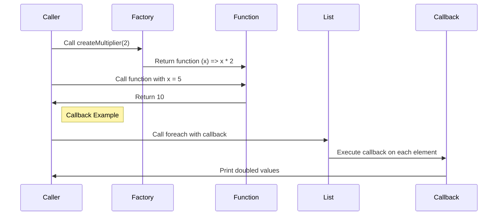

## 3.3. Practical Uses in Functional Programming

In the realm of functional programming, closures and anonymous functions (often referred to as lambdas) are powerful tools that enable developers to write concise, expressive, and flexible code. This section delves into the practical applications of these constructs, focusing on two primary use cases: function factories and callback functions. By understanding these applications, you can harness the full potential of functional programming paradigms in your projects.

### Function Factories

Function factories are a compelling use of closures and anonymous functions. They allow you to create functions dynamically, capturing specific variables within their scope to tailor their behavior. This technique is particularly useful when you need to generate functions with similar logic but different parameters.

#### How Function Factories Work

A function factory is essentially a higher-order function that returns a new function. The returned function "remembers" the environment in which it was created, thanks to closures. This means it can access variables from its parent scope, even after that scope has finished executing.

#### Example: JavaScript Function Factory

Consider a scenario where you need to create multiple multiplier functions. Instead of writing separate functions for each multiplier, you can use a function factory:

```javascript
const createMultiplier = (multiplier) => {
  return (x) => x * multiplier;
};

const double = createMultiplier(2);
console.log(double(5)); // Output: 10

const triple = createMultiplier(3);
console.log(triple(5)); // Output: 15
```

In this example, `createMultiplier` is a function factory. It takes a `multiplier` as an argument and returns a new function that multiplies its input by this multiplier. The returned function retains access to the `multiplier` variable, demonstrating the power of closures.

### Callback Functions

Anonymous functions are frequently used as callbacks, especially in asynchronous operations and higher-order functions. Callbacks are functions passed as arguments to other functions, which are then invoked within the outer function to complete some kind of routine or action.

#### Using Anonymous Functions as Callbacks

In functional programming, callbacks are often employed to handle asynchronous events, such as user interactions or data fetching. They allow you to define what should happen after a certain operation completes, without blocking the execution of your program.

#### Example: Scala Callback Function

Scala, a language that embraces both functional and object-oriented programming paradigms, provides elegant support for anonymous functions. Here's how you can use an anonymous function as a callback in Scala:

```scala
val numbers = List(1, 2, 3, 4, 5)
numbers.foreach(x => println(x * 2))
```

In this example, the `foreach` method takes an anonymous function `x => println(x * 2)` as a callback. This function is applied to each element of the list `numbers`, doubling and printing each value.

### Visual Aids

To better understand the flow of function factories and callback execution, let's look at a sequence diagram illustrating these concepts.



### Practical Exercises

To reinforce your understanding of closures and anonymous functions, try the following exercises:

1. **Create a Function Factory:**
   - Write a function factory in a language of your choice that generates functions to calculate the power of a number (e.g., square, cube).

2. **Implement a Callback:**
   - Use an anonymous function as a callback in an asynchronous operation, such as reading a file or making an HTTP request.

### Conclusion

Closures and anonymous functions are indispensable tools in functional programming, enabling the creation of flexible and reusable code. By mastering function factories and callbacks, you can write more expressive and efficient programs. These concepts are not only theoretical but have practical applications in real-world programming tasks.

### References

- "Functional Programming in JavaScript" by Luis Atencio.
- "Functional Programming in Scala" by Paul Chiusano and Rúnar Bjarnason.

## Quiz Time!



### What is a function factory in functional programming?

- [x] A higher-order function that returns a new function with specific behavior based on captured variables.
- [ ] A function that processes a list of items.
- [ ] A function that only performs arithmetic operations.
- [ ] A factory design pattern implementation.

> **Explanation:** A function factory is a higher-order function that returns a new function, capturing variables from its environment to define specific behavior.

### How do closures benefit function factories?

- [x] They allow the returned function to access variables from the parent scope.
- [ ] They make the function run faster.
- [ ] They prevent the function from accessing any variables.
- [ ] They ensure the function is only called once.

> **Explanation:** Closures enable the returned function to "remember" and access variables from its parent scope, even after the parent function has finished executing.

### What is a common use case for anonymous functions in functional programming?

- [x] As callbacks in asynchronous operations.
- [ ] As the main entry point of a program.
- [ ] For defining global constants.
- [ ] For creating complex data structures.

> **Explanation:** Anonymous functions are often used as callbacks in asynchronous operations, allowing for flexible and non-blocking code execution.

### In the JavaScript example, what does the `createMultiplier` function return?

- [x] A function that multiplies its input by a specified multiplier.
- [ ] A constant value.
- [ ] An array of numbers.
- [ ] A string representation of a number.

> **Explanation:** The `createMultiplier` function returns a new function that multiplies its input by the multiplier provided to `createMultiplier`.

### In Scala, what does the `foreach` method do?

- [x] It applies a given function to each element of a collection.
- [ ] It sorts the elements of a collection.
- [ ] It removes duplicates from a collection.
- [ ] It reverses the order of elements in a collection.

> **Explanation:** The `foreach` method in Scala applies a given function to each element of a collection, often used for side effects like printing.

### What is the output of the JavaScript code snippet when `double(5)` is called?

- [x] 10
- [ ] 5
- [ ] 15
- [ ] 20

> **Explanation:** The `double` function is created by `createMultiplier(2)`, so calling `double(5)` returns `5 * 2`, which is 10.

### Why are closures important in functional programming?

- [x] They allow functions to access variables from their creation context.
- [ ] They make functions run faster.
- [ ] They prevent functions from being reused.
- [ ] They ensure functions are always pure.

> **Explanation:** Closures allow functions to access and retain variables from their creation context, enabling more flexible and powerful function definitions.

### What is a key advantage of using anonymous functions as callbacks?

- [x] They allow for concise and inline function definitions.
- [ ] They always improve performance.
- [ ] They are easier to debug.
- [ ] They automatically handle errors.

> **Explanation:** Anonymous functions as callbacks allow for concise and inline function definitions, making code more readable and flexible.

### In the Scala example, what does the anonymous function `x => println(x * 2)` do?

- [x] It prints each element of the list doubled.
- [ ] It adds 2 to each element of the list.
- [ ] It removes elements less than 2.
- [ ] It reverses the list.

> **Explanation:** The anonymous function `x => println(x * 2)` doubles each element of the list and prints it.

### True or False: Closures can only be used in functional programming languages.

- [ ] True
- [x] False

> **Explanation:** False. Closures are a concept that can be used in many programming languages, not just those that are purely functional.


