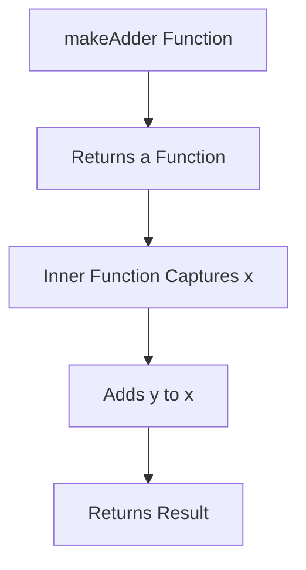
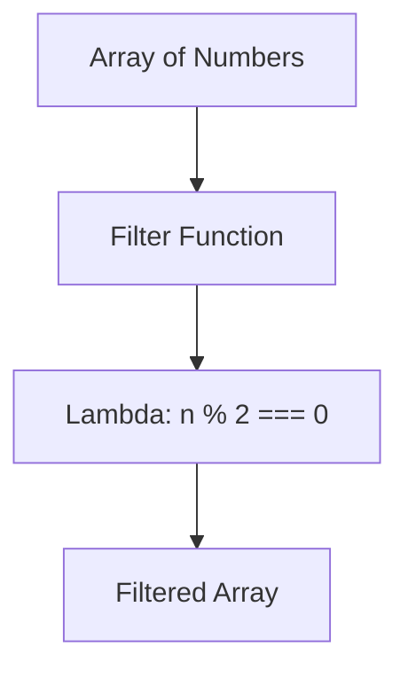

## 3.4. Practical Exercises

In this section, we will delve into practical exercises that will help you master closures and anonymous functions, two fundamental concepts in functional programming. These exercises are designed to reinforce your understanding by applying these concepts in real-world scenarios. We will explore how closures can encapsulate state and how anonymous functions, or lambdas, can be utilized effectively in functional programming.

### Creating and Utilizing Closures

Closures are a powerful feature in functional programming that allow functions to capture and remember the environment in which they were created. This capability is particularly useful for maintaining state across function calls without exposing it directly.

#### Exercise 1: JavaScript Closure for State Management

**Task:** Create a closure that returns a function to add a specific number.

```javascript
// Task: Create a closure that returns a function to add a specific number
const makeAdder = (x) => (y) => x + y;
const addFive = makeAdder(5);
console.log(addFive(10)); // 15
```

**Explanation:** In this exercise, `makeAdder` is a function that takes a number `x` and returns another function. This returned function takes a number `y` and adds it to `x`. The closure allows the inner function to "remember" the value of `x` even after `makeAdder` has finished executing.

#### Exercise 2: Scala Closure for State Retention

**Task:** Implement a closure in Scala that maintains a count of how many times a function has been called.

```scala
// Task: Implement a closure to count function calls
def makeCounter(): () => Int = {
  var count = 0
  () => {
    count += 1
    count
  }
}

val counter = makeCounter()
println(counter()) // 1
println(counter()) // 2
```

**Explanation:** Here, `makeCounter` returns a function that increments and returns a `count` variable. The variable `count` is enclosed within the returned function, allowing it to maintain state across multiple invocations.

### Developing and Using Lambdas in Examples

Anonymous functions, or lambdas, are concise ways to define functions without naming them. They are often used in higher-order functions like `map`, `filter`, and `reduce`.

#### Exercise 3: JavaScript Lambdas with Higher-Order Functions

**Task:** Use a lambda to filter out odd numbers from an array.

```javascript
// Task: Use a lambda to filter odd numbers
const numbers = [1, 2, 3, 4, 5, 6];
const evens = numbers.filter((n) => n % 2 === 0);
console.log(evens); // [2, 4, 6]
```

**Explanation:** The `filter` function takes a lambda that checks if a number is even. This lambda is applied to each element of the `numbers` array, returning a new array with only the even numbers.

#### Exercise 4: Scala Lambdas in Data Transformation

**Task:** Create a lambda to transform a list of strings to uppercase.

```scala
// Task: Transform strings to uppercase using a lambda
val words = List("hello", "world", "scala")
val uppercased = words.map(_.toUpperCase)
println(uppercased) // List("HELLO", "WORLD", "SCALA")
```

**Explanation:** The `map` function applies the lambda `_.toUpperCase` to each element in the `words` list, transforming each string to uppercase.

### Visual Aids

To better understand the flow and state retention in closures and lambda usage, let's visualize these concepts using Mermaid.js diagrams.

#### Closure Flow Diagram



**Explanation:** This diagram illustrates how the `makeAdder` function returns a new function that captures the variable `x` and uses it in subsequent calculations.

#### Lambda Usage in Higher-Order Functions



**Explanation:** This diagram shows the process of filtering an array using a lambda function to retain only even numbers.

### References

- "Real World Haskell" by Bryan O'Sullivan, John Goerzen, and Don Stewart.
- "Functional Programming in Scala" by Paul Chiusano and Rúnar Bjarnason.

These exercises and visual aids are designed to solidify your understanding of closures and anonymous functions. By practicing these concepts, you will gain a deeper appreciation for their power and versatility in functional programming.

## Quiz Time!



### What is a closure in functional programming?

- [x] A function that captures variables from its surrounding scope
- [ ] A function that does not return any value
- [ ] A function that only operates on global variables
- [ ] A function that is defined without a name

> **Explanation:** A closure is a function that captures variables from its surrounding scope, allowing it to maintain state across invocations.

### How does a lambda function differ from a named function?

- [x] A lambda function is anonymous and often used for short-lived operations
- [ ] A lambda function can only be used once
- [ ] A lambda function cannot take arguments
- [ ] A lambda function must always return a value

> **Explanation:** Lambda functions are anonymous and typically used for short-lived operations, often passed as arguments to higher-order functions.

### In JavaScript, what does the following code return: `const addFive = makeAdder(5); console.log(addFive(10));`?

- [x] 15
- [ ] 5
- [ ] 10
- [ ] 20

> **Explanation:** The `makeAdder` function creates a closure that adds 5 to its argument, so `addFive(10)` returns 15.

### What is the purpose of using closures in programming?

- [x] To encapsulate state and behavior
- [ ] To make code run faster
- [ ] To avoid using loops
- [ ] To simplify syntax

> **Explanation:** Closures encapsulate state and behavior, allowing functions to maintain state across calls without exposing it directly.

### Which of the following is a correct lambda expression in Scala to filter even numbers?

- [x] `numbers.filter(x => x % 2 == 0)`
- [ ] `numbers.filter(x => x % 2 != 0)`
- [ ] `numbers.map(x => x % 2 == 0)`
- [ ] `numbers.reduce(x => x % 2 == 0)`

> **Explanation:** The lambda `x => x % 2 == 0` correctly filters even numbers from a list.

### What does the following Scala code do: `val uppercased = words.map(_.toUpperCase)`?

- [x] Transforms each string in the list to uppercase
- [ ] Filters out lowercase strings
- [ ] Concatenates all strings into one
- [ ] Reverses each string in the list

> **Explanation:** The `map` function applies the lambda `_.toUpperCase` to each string, transforming them to uppercase.

### In JavaScript, which higher-order function would you use to apply a lambda to each element of an array?

- [x] `map`
- [ ] `filter`
- [ ] `reduce`
- [ ] `forEach`

> **Explanation:** The `map` function applies a lambda to each element of an array, transforming the elements.

### What is the output of the following JavaScript code: `const evens = numbers.filter((n) => n % 2 === 0); console.log(evens);` given `numbers = [1, 2, 3, 4, 5, 6]`?

- [x] `[2, 4, 6]`
- [ ] `[1, 3, 5]`
- [ ] `[1, 2, 3, 4, 5, 6]`
- [ ] `[]`

> **Explanation:** The lambda `(n) => n % 2 === 0` filters the array to include only even numbers.

### Which of the following best describes a higher-order function?

- [x] A function that takes other functions as arguments or returns a function
- [ ] A function that can only be used once
- [ ] A function that does not return any value
- [ ] A function that operates on global variables

> **Explanation:** A higher-order function is one that takes other functions as arguments or returns a function.

### True or False: Closures can only be used in functional programming languages.

- [x] False
- [ ] True

> **Explanation:** Closures are a concept available in many programming languages, not just functional ones.


