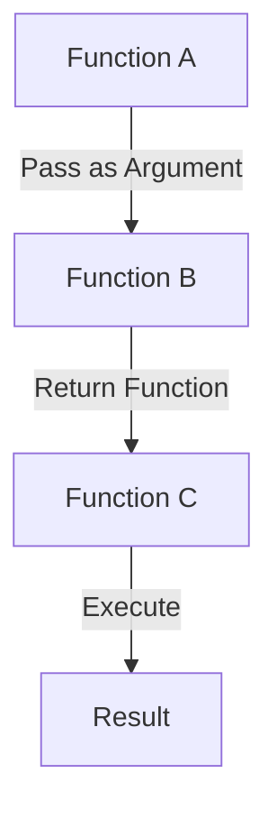

## 4.1. First-Class Functions Explained

In the realm of functional programming, the concept of first-class functions is a cornerstone that enables powerful abstractions and elegant code structures. Understanding first-class functions is crucial for leveraging the full potential of functional programming paradigms. This section delves into what it means for functions to be first-class citizens, how they can be assigned to variables, and their role in higher-order functions.

### Functions as First-Class Citizens

In functional programming, functions are treated as first-class citizens. This means that functions are not just blocks of code but are treated like any other data type. They can be:

- **Assigned to variables:** Functions can be stored in variables, allowing them to be passed around and manipulated just like integers, strings, or any other data type.
- **Passed as arguments:** Functions can be passed as parameters to other functions, enabling higher-order functions that can operate on or return other functions.
- **Returned from other functions:** Functions can be the return value of other functions, facilitating dynamic and flexible code structures.

This flexibility allows developers to write more abstract, reusable, and concise code.

### Assigning Functions to Variables

Assigning functions to variables is a fundamental aspect of treating functions as first-class citizens. This capability allows functions to be used interchangeably and stored for later use. Here's how it works in different functional programming languages:

#### Haskell Example

In Haskell, functions can be assigned to variables just like any other value:

```haskell
double :: Int -> Int
double x = x * 2

let myFunction = double
main = print (myFunction 5) -- Outputs: 10
```

#### JavaScript Example

JavaScript, a multi-paradigm language with functional capabilities, allows functions to be assigned to variables easily:

```javascript
const double = (x) => x * 2;

const myFunction = double;
console.log(myFunction(5)); // Outputs: 10
```

#### Scala Example

Scala, a language that blends object-oriented and functional programming, also supports function assignment:

```scala
def double(x: Int): Int = x * 2

val myFunction = double
println(myFunction(5)) // Outputs: 10
```

### Passing Functions as Arguments

One of the most powerful features of first-class functions is the ability to pass them as arguments to other functions. This capability is the foundation of higher-order functions, which are functions that take other functions as parameters or return them as results.

#### Haskell Example

In Haskell, you can pass functions as arguments to create flexible and reusable code:

```haskell
applyTwice :: (a -> a) -> a -> a
applyTwice f x = f (f x)

double :: Int -> Int
double x = x * 2

main = print (applyTwice double 5) -- Outputs: 20
```

#### JavaScript Example

JavaScript's functional capabilities allow for similar patterns:

```javascript
const applyTwice = (f, x) => f(f(x));

const double = (x) => x * 2;

console.log(applyTwice(double, 5)); // Outputs: 20
```

#### Scala Example

Scala also supports passing functions as arguments, enabling concise and expressive code:

```scala
def applyTwice[A](f: A => A, x: A): A = f(f(x))

def double(x: Int): Int = x * 2

println(applyTwice(double, 5)) // Outputs: 20
```

### Visual Aids

To better understand how functions can be passed as arguments and returned from other functions, consider the following diagram:



This diagram illustrates the flow where Function A is passed as an argument to Function B, which then returns Function C. Function C is executed to produce a result.

### Practical Applications

First-class functions are not just a theoretical concept; they have practical applications in real-world programming:

- **Event Handling:** In JavaScript, functions are often passed as arguments to handle events, such as clicks or key presses.
- **Callbacks:** Functions can be used as callbacks to execute code after a certain task is completed, such as reading a file or making an HTTP request.
- **Functional Libraries:** Libraries like Lodash and Ramda in JavaScript heavily utilize first-class functions to provide utility functions for data manipulation.

### Summary of Key Points

- **First-Class Functions:** Functions are treated as first-class citizens, allowing them to be assigned to variables, passed as arguments, and returned from other functions.
- **Code Reuse and Abstraction:** First-class functions enable higher-order functions, facilitating code reuse and abstraction.
- **Practical Applications:** They are widely used in event handling, callbacks, and functional libraries.

### Further Reading

To deepen your understanding of first-class functions and their applications, consider exploring the following resources:

- "JavaScript Allongé" by Reginald Braithwaite
- "Functional Programming in Scala" by Paul Chiusano and Rúnar Bjarnason

## Quiz Time!



### What does it mean for functions to be first-class citizens in functional programming?

- [x] Functions can be assigned to variables, passed as arguments, and returned from other functions.
- [ ] Functions can only be used within the scope they are defined.
- [ ] Functions cannot be passed as arguments.
- [ ] Functions are only used for mathematical operations.

> **Explanation:** First-class functions can be treated like any other data type, meaning they can be assigned to variables, passed as arguments, and returned from other functions.

### Which of the following is a benefit of first-class functions?

- [x] They enable higher-order functions.
- [ ] They restrict code reuse.
- [ ] They make code less readable.
- [ ] They prevent functions from being passed as arguments.

> **Explanation:** First-class functions enable higher-order functions, which allow for greater code reuse and abstraction.

### In JavaScript, how can you assign a function to a variable?

- [x] `const myFunction = (x) => x * 2;`
- [ ] `var myFunction = function() { return x * 2; };`
- [ ] `let myFunction = x => x * 2;`
- [ ] All of the above.

> **Explanation:** All the options are valid ways to assign a function to a variable in JavaScript.

### What is a higher-order function?

- [x] A function that takes other functions as arguments or returns a function.
- [ ] A function that can only be used once.
- [ ] A function that cannot be assigned to a variable.
- [ ] A function that performs mathematical operations.

> **Explanation:** A higher-order function is one that takes other functions as arguments or returns a function, enabling greater abstraction and code reuse.

### In Haskell, how do you pass a function as an argument?

- [x] `applyTwice :: (a -> a) -> a -> a`
- [ ] `applyTwice a -> a -> a`
- [ ] `applyTwice (a -> a) a`
- [ ] `applyTwice a -> (a -> a)`

> **Explanation:** The correct syntax in Haskell for passing a function as an argument is `applyTwice :: (a -> a) -> a -> a`.

### Which language feature allows functions to be passed as arguments?

- [x] First-class functions
- [ ] Object-oriented programming
- [ ] Procedural programming
- [ ] Static typing

> **Explanation:** First-class functions allow functions to be passed as arguments, enabling higher-order functions.

### What is the output of the following Scala code: `applyTwice(double, 5)`?

- [x] 20
- [ ] 10
- [ ] 15
- [ ] 25

> **Explanation:** The function `applyTwice` applies the `double` function twice to the number 5, resulting in 20.

### How do first-class functions contribute to code abstraction?

- [x] By allowing functions to be passed around and reused.
- [ ] By limiting the scope of functions.
- [ ] By making functions immutable.
- [ ] By preventing functions from being assigned to variables.

> **Explanation:** First-class functions allow for greater code abstraction by enabling functions to be passed around and reused in different contexts.

### Which of the following is NOT a characteristic of first-class functions?

- [ ] They can be assigned to variables.
- [ ] They can be passed as arguments.
- [ ] They can be returned from other functions.
- [x] They cannot be stored in data structures.

> **Explanation:** First-class functions can indeed be stored in data structures, just like any other data type.

### True or False: First-class functions are unique to functional programming languages.

- [ ] True
- [x] False

> **Explanation:** First-class functions are not unique to functional programming languages; they are also present in multi-paradigm languages like JavaScript and Python.


