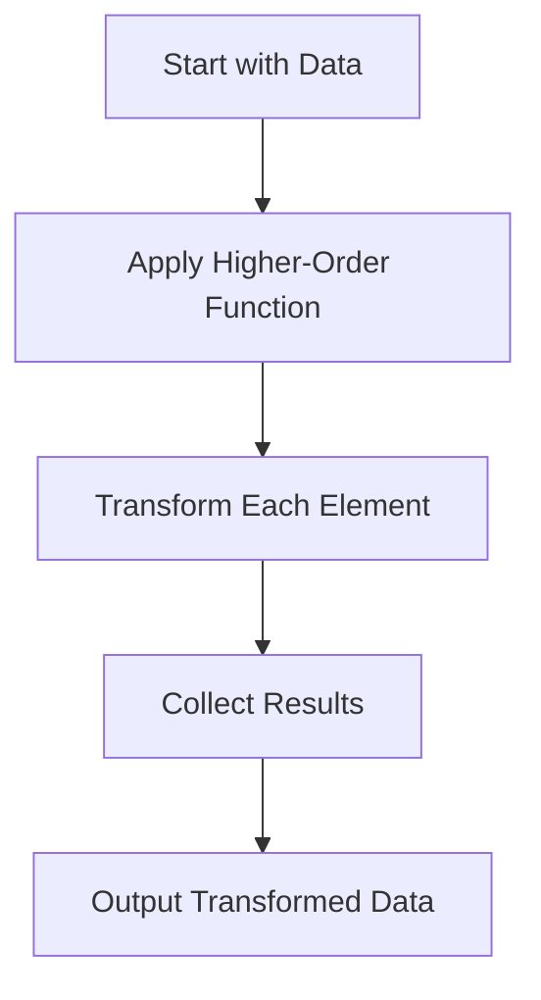

## 4.2. Higher-Order Functions and Their Uses

Higher-order functions are a cornerstone of functional programming, offering a powerful way to create more abstract, reusable, and expressive code. In this section, we will delve into what higher-order functions are, explore their benefits, and provide practical examples across different functional programming languages.

### Definition and Examples

**Higher-order functions** are functions that can take other functions as arguments or return them as results. This capability allows for a high degree of flexibility and abstraction in programming. Let's explore this concept with some examples.

#### JavaScript Example

In JavaScript, the `map` function is a classic example of a higher-order function. It takes a function as an argument and applies it to each element of an array.

```javascript
const numbers = [1, 2, 3, 4, 5];
const squared = numbers.map(x => x * x);
console.log(squared); // [1, 4, 9, 16, 25]
```

In this example, the `map` function takes an anonymous function `x => x * x` as an argument and applies it to each element of the `numbers` array, resulting in a new array of squared numbers.

#### Scala Example

Scala, with its strong functional programming capabilities, also provides a `map` function that behaves similarly.

```scala
val numbers = List(1, 2, 3, 4, 5)
val squared = numbers.map(x => x * x)
println(squared) // List(1, 4, 9, 16, 25)
```

Here, the `map` function is used to apply the squaring operation to each element of the `numbers` list, producing a new list of squared values.

#### Haskell Example

Haskell, a purely functional language, offers a concise syntax for higher-order functions.

```haskell
let numbers = [1, 2, 3, 4, 5]
let squared = map (^2) numbers
print squared -- [1,4,9,16,25]
```

In this Haskell example, the `map` function applies the `(^2)` operation to each element of the `numbers` list, resulting in a list of squared numbers.

### Benefits of Higher-Order Functions

Higher-order functions provide several significant benefits that enhance the power and expressiveness of functional programming:

1. **Abstraction**: By allowing functions to be passed as arguments, higher-order functions enable abstraction over behavior. This means you can write more generic and reusable code.

2. **Code Reuse**: Higher-order functions promote code reuse by encapsulating common patterns of computation. For instance, functions like `map`, `filter`, and `reduce` can be used across different contexts with different operations.

3. **Expressiveness**: Code written with higher-order functions is often more concise and expressive. It allows developers to focus on the "what" rather than the "how," leading to clearer and more maintainable code.

4. **Modularity**: Higher-order functions help in breaking down complex problems into smaller, manageable pieces. This modularity makes it easier to reason about and test individual components of a program.

### Visual Aids

To better understand how higher-order functions work, let's visualize the process of using a higher-order function to transform data.



In this flowchart, we start with a dataset, apply a higher-order function to transform each element, collect the results, and output the transformed data. This visual representation highlights the flow of data through a higher-order function.

### Practical Uses in Functional Programming

Higher-order functions are used extensively in functional programming for a variety of tasks:

- **Data Transformation**: Functions like `map` and `filter` are used to transform and filter data collections.
- **Event Handling**: In event-driven programming, higher-order functions can be used to define event handlers that are passed to event listeners.
- **Function Composition**: Higher-order functions enable the composition of functions, allowing complex operations to be built from simpler ones.

### Real-World Applications

In real-world applications, higher-order functions are used to:

- **Process Data Streams**: Transform and filter data streams in applications like data processing pipelines.
- **Build User Interfaces**: In frameworks like React, higher-order components are used to enhance and compose UI components.
- **Implement Middleware**: In web servers, middleware functions are often higher-order functions that wrap request handling logic.

### Summary of Key Points

- Higher-order functions are functions that take other functions as arguments or return them as results.
- They enable abstraction, code reuse, expressiveness, and modularity in functional programming.
- Practical examples in JavaScript, Scala, and Haskell demonstrate their usage.
- Higher-order functions are widely used in real-world applications for data processing, UI development, and more.

### Further Reading

For those interested in exploring higher-order functions further, consider the following resources:

- "Functional Programming in Scala" by Paul Chiusano and Rúnar Bjarnason.
- "Learn You a Haskell for Great Good!" by Miran Lipovača.

These books provide in-depth insights into functional programming concepts and their applications.

## Quiz Time!



### What is a higher-order function?

- [x] A function that takes other functions as arguments or returns them as results
- [ ] A function that only performs arithmetic operations
- [ ] A function that cannot be passed as an argument
- [ ] A function that only returns numbers

> **Explanation:** Higher-order functions are defined by their ability to take other functions as arguments or return them as results, enabling greater abstraction and flexibility in programming.

### Which of the following is a benefit of higher-order functions?

- [x] Code reuse
- [x] Abstraction
- [ ] Increased complexity
- [ ] Reduced readability

> **Explanation:** Higher-order functions promote code reuse and abstraction, making code more modular and expressive, while potentially reducing complexity and enhancing readability.

### In JavaScript, what does the `map` function do?

- [x] Applies a function to each element of an array and returns a new array
- [ ] Sorts the elements of an array
- [ ] Filters elements of an array based on a condition
- [ ] Mutates the original array

> **Explanation:** The `map` function in JavaScript applies a provided function to each element of an array, returning a new array with the results.

### How does the `map` function in Scala differ from JavaScript?

- [ ] It mutates the original list
- [x] It works on immutable lists
- [ ] It sorts the list
- [ ] It only works with numbers

> **Explanation:** In Scala, the `map` function operates on immutable lists, similar to JavaScript, but it does not mutate the original list, maintaining immutability.

### What is the output of the following Haskell code: `map (^2) [1, 2, 3]`?

- [x] [1, 4, 9]
- [ ] [2, 3, 4]
- [ ] [1, 2, 3]
- [ ] [1, 8, 27]

> **Explanation:** The `map (^2)` function applies the squaring operation to each element of the list `[1, 2, 3]`, resulting in `[1, 4, 9]`.

### Which of the following is NOT a use of higher-order functions?

- [ ] Data transformation
- [ ] Event handling
- [ ] Function composition
- [x] Direct hardware manipulation

> **Explanation:** Higher-order functions are used for data transformation, event handling, and function composition, but not for direct hardware manipulation, which is outside the scope of functional programming.

### What is a common pattern enabled by higher-order functions?

- [x] Function composition
- [ ] Direct memory access
- [ ] Hardware acceleration
- [ ] Low-level programming

> **Explanation:** Higher-order functions enable function composition, allowing developers to build complex operations from simpler functions.

### Which language is known for its purely functional nature and use of higher-order functions?

- [x] Haskell
- [ ] C++
- [ ] Java
- [ ] Python

> **Explanation:** Haskell is a purely functional programming language that extensively uses higher-order functions.

### What does the `filter` function do in functional programming?

- [x] Selects elements from a collection based on a predicate
- [ ] Sorts elements in a collection
- [ ] Maps elements to new values
- [ ] Mutates the original collection

> **Explanation:** The `filter` function selects elements from a collection that satisfy a given predicate, returning a new collection with those elements.

### True or False: Higher-order functions can only be used in functional programming languages.

- [ ] True
- [x] False

> **Explanation:** Higher-order functions can be used in many programming languages, not just functional ones, as long as the language supports functions as first-class citizens.


