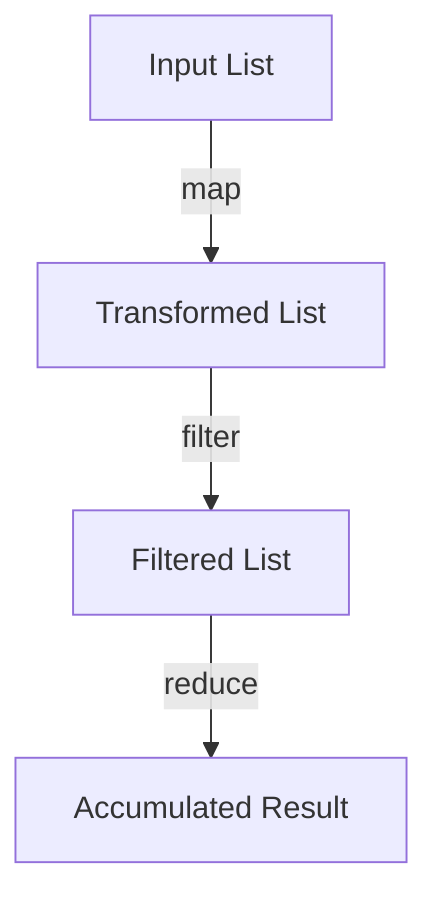

---

linkTitle: "4.3. Practical Examples"
title: "Practical Examples of Higher-Order Functions in Functional Programming"
description: "Explore practical examples of higher-order functions like map, filter, and reduce in functional programming with code snippets in Haskell, JavaScript, and Scala."
categories:
- Functional Programming
- Higher-Order Functions
- Programming Concepts
tags:
- Functional Programming
- Higher-Order Functions
- Map
- Filter
- Reduce
date: 2024-10-25
type: docs
nav_weight: 4300

---

## 4.3. Practical Examples of Higher-Order Functions in Functional Programming

Higher-order functions are a cornerstone of functional programming, allowing developers to write more abstract, concise, and reusable code. In this section, we will delve into practical examples of common higher-order functions such as `map`, `filter`, and `reduce`, and explore how to create custom higher-order functions. We will provide code snippets in Haskell, JavaScript, and Scala to illustrate these concepts across different functional languages.

### Implementing Common Higher-Order Functions

Higher-order functions are functions that can take other functions as arguments or return them as results. They are essential for creating flexible and powerful abstractions in code.

#### The `map` Function

The `map` function applies a given function to each element of a list, returning a new list with the results. This is useful for transforming data structures without mutating them.

- **Haskell:**

  ```haskell
  map :: (a -> b) -> [a] -> [b]
  map _ [] = []
  map f (x:xs) = f x : map f xs
  ```

  In Haskell, `map` is defined recursively. It applies the function `f` to the head of the list and then recursively maps `f` over the tail.

- **JavaScript:**

  ```javascript
  const map = (f, arr) => arr.map(f);
  ```

  JavaScript's `Array.prototype.map` method is used to apply the function `f` to each element of the array `arr`.

- **Scala:**

  ```scala
  val map = (f: Int => Int, arr: List[Int]) => arr.map(f)
  ```

  In Scala, the `map` method is called on a `List`, applying the function `f` to each element.

#### The `filter` Function

The `filter` function selects elements from a list that satisfy a given predicate function.

- **JavaScript:**

  ```javascript
  const filter = (f, arr) => arr.filter(f);
  ```

  Here, `Array.prototype.filter` is used to create a new array with elements that pass the test implemented by the function `f`.

- **Scala:**

  ```scala
  val filter = (f: Int => Boolean, arr: List[Int]) => arr.filter(f)
  ```

  Scala's `filter` method is used to retain elements that satisfy the predicate `f`.

#### The `reduce` Function

The `reduce` function processes elements in a list to produce a single accumulated result, using a binary function and an initial value.

- **JavaScript:**

  ```javascript
  const reduce = (f, initial, arr) => arr.reduce(f, initial);
  ```

  JavaScript's `Array.prototype.reduce` method is used to accumulate values in the array `arr` starting from `initial`.

- **Scala:**

  ```scala
  val reduce = (f: (Int, Int) => Int, initial: Int, arr: List[Int]) => arr.foldLeft(initial)(f)
  ```

  In Scala, `foldLeft` is used to reduce the list `arr` from the left, starting with `initial`.

### Creating Custom Higher-Order Functions

Custom higher-order functions can be tailored to specific problem domains, enhancing code modularity and reusability.

#### Example: A Custom `forEach` Function

A `forEach` function applies a given function to each element of a list, primarily for side effects.

- **JavaScript:**

  ```javascript
  const forEach = (f, arr) => {
    for (let i = 0; i < arr.length; i++) {
      f(arr[i]);
    }
  };
  ```

  This custom `forEach` iterates over `arr`, applying `f` to each element.

#### Example: A Custom `find` Function

A `find` function returns the first element in a list that satisfies a given predicate.

- **JavaScript:**

  ```javascript
  const find = (f, arr) => {
    for (let i = 0; i < arr.length; i++) {
      if (f(arr[i])) return arr[i];
    }
    return undefined;
  };
  ```

  This `find` function iterates over `arr` and returns the first element for which `f` returns `true`.

### Visualizing Higher-Order Functions

To better understand how higher-order functions like `map`, `filter`, and `reduce` process data, let's visualize their operation using a Mermaid.js diagram.



In this diagram, data flows through a series of transformations: first, each element is transformed by `map`, then filtered by `filter`, and finally reduced to a single result by `reduce`.

### Best Practices and Common Pitfalls

- **Avoid Side Effects:** Higher-order functions should ideally be pure, avoiding side effects to maintain predictability and testability.
- **Leverage Immutability:** Work with immutable data structures to prevent unintended modifications.
- **Optimize Performance:** Be mindful of performance implications, especially with large datasets. Lazy evaluation can be beneficial in some languages.

### Real-World Applications

Higher-order functions are widely used in data processing pipelines, UI rendering frameworks, and reactive programming. They enable developers to write concise and expressive code that is easier to reason about and maintain.

### Summary of Key Points

- Higher-order functions like `map`, `filter`, and `reduce` are fundamental tools in functional programming.
- These functions allow for powerful abstractions and transformations of data.
- Custom higher-order functions can be created to address specific needs, enhancing code modularity.
- Visual aids and diagrams can help conceptualize the flow of data through these functions.

### Further Reading

- "Learning Functional Programming" by Richard Eisenberg
- "Functional Programming in JavaScript" by Luis Atencio

## Quiz Time!



### What is a higher-order function?

- [x] A function that takes other functions as arguments or returns them as results
- [ ] A function that only performs arithmetic operations
- [ ] A function that is defined within another function
- [ ] A function that does not return any value

> **Explanation:** Higher-order functions are those that can take other functions as arguments or return them as results, enabling more abstract and flexible code.

### Which of the following is a common use of the `map` function?

- [x] Transforming each element of a list
- [ ] Filtering elements from a list
- [ ] Accumulating values into a single result
- [ ] Sorting elements in a list

> **Explanation:** The `map` function is used to apply a transformation to each element of a list, producing a new list with the transformed elements.

### In JavaScript, which method is used to implement the `filter` function?

- [ ] Array.prototype.map
- [x] Array.prototype.filter
- [ ] Array.prototype.reduce
- [ ] Array.prototype.forEach

> **Explanation:** The `Array.prototype.filter` method is used to create a new array with elements that pass a test implemented by a provided function.

### What does the `reduce` function do?

- [ ] It applies a function to each element of a list without returning a value
- [ ] It transforms each element of a list
- [x] It processes elements to produce a single accumulated result
- [ ] It removes elements from a list

> **Explanation:** The `reduce` function processes elements in a list to produce a single accumulated result, using a binary function and an initial value.

### Which of the following is a benefit of using higher-order functions?

- [x] They allow for more abstract and reusable code
- [ ] They make code execution faster
- [ ] They eliminate all side effects
- [ ] They automatically parallelize code execution

> **Explanation:** Higher-order functions enable more abstract and reusable code by allowing functions to be passed as arguments and returned as results.

### How does the `map` function in Haskell handle an empty list?

- [x] It returns an empty list
- [ ] It throws an error
- [ ] It returns `null`
- [ ] It returns the original list

> **Explanation:** In Haskell, the `map` function returns an empty list when applied to an empty list, as there are no elements to transform.

### What is a common pitfall when using higher-order functions?

- [ ] Using them with pure functions
- [ ] Applying them to immutable data structures
- [x] Introducing side effects
- [ ] Using them in data processing pipelines

> **Explanation:** A common pitfall is introducing side effects, which can make code less predictable and harder to test.

### Which of the following languages is not typically associated with functional programming?

- [ ] Haskell
- [ ] Scala
- [ ] JavaScript
- [x] C++

> **Explanation:** While C++ can support functional programming concepts, it is not typically associated with functional programming as its primary paradigm.

### What is the purpose of the `forEach` function?

- [ ] To transform each element of a list
- [ ] To accumulate values into a single result
- [x] To apply a function to each element for side effects
- [ ] To filter elements from a list

> **Explanation:** The `forEach` function is used to apply a function to each element of a list, primarily for side effects, without returning a new list.

### True or False: Higher-order functions can only be used in functional programming languages.

- [ ] True
- [x] False

> **Explanation:** Higher-order functions can be used in any language that supports functions as first-class citizens, not just functional programming languages.




